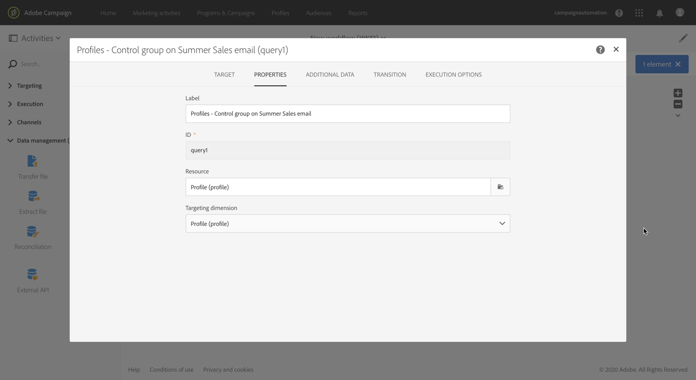

# 컨트롤 그룹 추가 {#adding-control-group}

캠페인 효과를 측정하기 위해 제어 그룹을 사용하여 대상의 일부에 메시지를 보내지 않아도 됩니다.

Adobe Campaign에서 이렇게 하려면 배달 대상을 정의할 때 <b>제어 그룹을</b> 만듭니다. 프로필은 임의, 필터링 또는 필터링 또는 기준에 따라 제어 그룹에 추가됩니다.

그러면 메시지를 받은 대상 모집단과 타깃팅되지 않은 연락처의 동작을 비교할 수 있습니다. 전송 로그를 기준으로 향후 캠페인에서 제어 그룹을 타깃팅할 수도 있습니다.

<!--The control group is built when the delivery is prepared.-->

## 개요 {#overview}

제어 그룹은 기본 대상에서 임의로 추출하거나 특정 모집단에서 선택할 수 있습니다. 따라서 제어 그룹을 정의하는 방법에는 두 가지가 있습니다.
* **기본** 타겟에서 많은 프로파일을 추출합니다.
* **쿼리에 정의된 기준을 기반으로 일부 프로필을 제외합니다** .

컨트롤 그룹을 정의할 때 두 가지 방법을 사용할 수 있습니다.

전달 준비 단계에서 제어 그룹에 속한 모든 프로필은 기본 대상에서 제거됩니다. 메시지가 전송되면 수신되지 않습니다.

## 대상 모집단에서 추출 {#extraction-target-population}

제어 그룹을 정의하려면, 임의로 또는 대상 모집단에서 정렬, 백분율 또는 고정된 수의 프로파일을 추출하도록 선택할 수 있습니다.

### Target 추출 {#target-extraction}

먼저 대상에서 프로파일을 추출하는 방법을 정의합니다. **임의로** 또는 **정렬을 기준으로 합니다**.

섹션에서 **[!UICONTROL Target extraction]** 다음 중 하나를 선택합니다.

* **[!UICONTROL Random sampling]**:배달을 준비할 때, Adobe Campaign은 백분율이나 [크기 제한으로 설정할 최대 수에 해당하는 여러 개의 프로파일을 임의로 추출합니다](#size-limit).

   예를 들어 섹션에서 임계값을 10으로 설정하면 **[!UICONTROL Limits]** 대상 모집단에서 무작위로 선택된 10%로 제어 그룹이 구성됩니다.<!--Change screenshot to match example)-->

   

* **[!UICONTROL Keep only the first records after sorting]**:이 옵션을 사용하면 하나 이상의 정렬 주문을 기준으로 제한을 정의할 수 있습니다.

   예제:

   * 필드를 **[!UICONTROL Age]** 정렬 기준으로 선택합니다.
   * 섹션에서 100을 임계값으로 **[!UICONTROL Limits]** 정의합니다( [크기 제한](#size-limit)참조).
   * 옵션을 **[!UICONTROL Descending sort]** 선택된 상태로 두십시오.

   그 결과 제어 그룹은 100명의 가장 오래된 수신자로 구성됩니다.<!--Change screenshot to match example)-->

   

   구매를 거의 하지 않거나 자주 하는 프로필이 포함된 제어 그룹을 정의하고, 이들의 행동을 대화 받은 수신자의 행동과 비교하는 것이 재미있을 수 있습니다.

>[!NOTE]
>
>옵션을 사용하지 **[!UICONTROL No extraction]** 않으려면 **[!UICONTROL Target extraction]** 선택합니다.

<!---->

### 크기 제한 {#size-limit}

선택한 항목 **[!UICONTROL Random sampling]** 또는 기본 대상 **[!UICONTROL Keep only the first records after sorting]**&#x200B;에서 추출하는 프로필 수를 제한하는 방법을 설정해야 합니다. 다음 중 하나를 수행합니다.

* 해당 프레임 **[!UICONTROL Size (as a % of the initial population)]** 을 선택하고 채웁니다.

   예를 들어 10을 설정한 경우 위에서 선택한 옵션에 따라 Adobe Campaign이 다음 중 하나를 수행합니다.
   * 대상 인구의 10%를 임의로 추출합니다.
   * 필드를 정렬 기준으로 선택한 경우 **[!UICONTROL Age]** 대상 모집단에서 가장 오래된 10% 프로파일을 추출합니다.

   >[!NOTE]
   >
   >이 옵션의 선택을 취소하면 10% 가장 작은 프로필 **[!UICONTROL Descending sort]** 이 추출됩니다.

* 해당 프레임 **[!UICONTROL Maximum size]** 을 선택하고 채웁니다.

   예를 들어 100을 설정하면 Adobe Campaign이 다음 중 하나를 수행합니다.
   * 대상 모집단에서 100개의 프로파일을 임의로 추출합니다.
   * 필드를 정렬 기준으로 선택한 경우 **[!UICONTROL Age]** 대상 모집단에서 가장 오래된 100개의 프로파일을 추출합니다.

   >[!NOTE]
   >
   >옵션의 선택을 취소하면 100개의 가장 어린 프로필이 추출됩니다. **[!UICONTROL Descending sort]**

## 특정 인구 제외 {#excluding-specific-population}

제어 그룹을 정의하는 또 다른 방법은 쿼리를 사용하여 특정 모집단을 대상에서 제외하는 것입니다.

방법은 다음과 같습니다.

1. From the **[!UICONTROL Target exclusion]** section, click **[!UICONTROL Define target exclusion]**.

   

1. 쿼리 편집기를 사용하여 [제외 기준을 정의합니다](../../automating/using/editing-queries.md). 이전에 만든 [대상을](../../audiences/using/about-audiences.md) 선택할 수도 있습니다.

   

1. **[!UICONTROL Confirm]**&#x200B;을(를) 클릭합니다.

쿼리 결과와 일치하는 프로필은 대상에서 제외됩니다.

<!--For more on using the query editor, see the [Editing queries](../../automating/using/editing-queries.md) section.-->

## 사용 사례:제어 그룹 설정 {#control-group-example}

다음은 두 가지 방법을 사용하여 제어 그룹을 정의하는 방법을 보여주는 예입니다.기본 대상에서 프로필 추출과 쿼리를 사용하여 특정 모집단 제외

1. 워크플로우 만들기. 워크플로우를 만드는 자세한 단계는 [워크플로우 작성](../../automating/using/building-a-workflow.md) 섹션에 나와 있습니다.
1. > **[!UICONTROL Activities]** 에서 **[!UICONTROL Targeting]**&#x200B;쿼리 활동을 끌어다 [놓습니다](../../automating/using/query.md) . 활동을 두 번 클릭하고 대상을 정의합니다. <!--For example, in **[!UICONTROL Shortcuts]**, drag and drop **[!UICONTROL Profile]**, select **[!UICONTROL Age]** with the operator **[!UICONTROL Greater than]** and type 25 in the **[!UICONTROL Value]** field.-->

1. > **[!UICONTROL Activities]** 에서 기본 대상 세그먼트 **[!UICONTROL Channels]**&#x200B;뒤에 [이메일 배달](../../automating/using/email-delivery.md) 활동을 드래그하여 놓고 편집합니다.
1. 배달 대시보드에서 **[!UICONTROL Audience]** 블록을 클릭합니다.

1. **[!UICONTROL Control group]** 탭을 선택합니다. 

   

1. 섹션에서 **[!UICONTROL Target extraction]** 선택합니다 **[!UICONTROL Keep only the first records after sorting]**.
1. 날짜를 정렬하고 **[!UICONTROL Descending]** 정렬 옵션을 선택된 상태로 둡니다.

   

1. 최대 크기로 100을 설정합니다. 타겟에서 가장 오래된 프로파일 100개가 추출됩니다.

1. 섹션에서 **[!UICONTROL Target exclusion]** 쿼리 편집기 [를 사용하여 선택한 기준에 따라 대상에서 제외할 프로파일을](../../automating/using/editing-queries.md)정의합니다. 예를 들어 &quot;Age is less than 20&quot;

   

   20세 미만인 프로필은 제외됩니다.

1. 배달 준비 [를](../../sending/using/preparing-the-send.md) 시작하고 전송을 [확인합니다](../../sending/using/confirming-the-send.md).

추출된 프로필(가장 오래된 프로필 100개)과 쿼리를 기반으로 정의된 프로필(20개 미만의 프로필)은 기본 대상에서 제거됩니다. 메시지를 받지 않습니다.

## 결과 비교 {#delivery-logs}

이제 배달을 보내셨으니, 제어 그룹을 어떻게 하실 수 있습니까?

전송 로그를 **추출하여 커뮤니케이션을 받지 않은 제어 그룹이 효과적인 대상과 비교하여 어떻게 행동했는지 비교할** 수 있습니다. 배달 로그를 사용하여 다른 타깃팅을 **빌드할 수도 있습니다**.

>[!IMPORTANT]
>
>Adobe Campaign에 연결할 수 있으려면 [관리자 역할](../../administration/using/users-management.md#functional-administrators) 과 **[!UICONTROL All]** 조직 구성 [조직의](../../administration/using/organizational-units.md) 일부가있어야 합니다. 특정 사용자 또는 사용자 그룹에 대한 액세스를 제한하려면 배달 로그에 액세스할 수 있도록 **[!UICONTROL All]** 장치에 연결하지 마십시오.

### 배달 로그 확인 {#checking-logs}

메시지가 전송된 후 타겟에서 제거된 프로파일을 보려면 를 확인하십시오 **[!UICONTROL Delivery logs]**. 배달 로그와 액세스 방법에 대한 자세한 내용은 [이 섹션을 참조하십시오](../../sending/using/monitoring-a-delivery.md#delivery-logs).

* 이 **[!UICONTROL Sending logs]** 탭에서 추출된 프로파일과 제외된 프로파일을 볼 수 있습니다. 그들은 **[!UICONTROL Ignored]** 지위와 실패 **[!UICONTROL Control group]** 원인입니다.

   

* 전달에 포함되지 않은 프로필 수를 확인하려면 **[!UICONTROL Exclusion causes]** 탭을 확인하십시오.

   

### 제어 그룹 로그 사용 {#using-logs}

배달이 전송되면 배달 로그를 사용하여 메시지를 받지 못한 프로필을 필터링할 수 있습니다. 아래 단계를 따르십시오.

1. 워크플로우 만들기. 워크플로우를 만드는 자세한 단계는 [워크플로우 작성](../../automating/using/building-a-workflow.md) 섹션에 나와 있습니다.
1. > **[!UICONTROL Activities]** 에서 **[!UICONTROL Targeting]**&#x200B;쿼리 활동을 끌어다 [놓습니다](../../automating/using/query.md) .
1. 탭에서 **[!UICONTROL Properties]** 를 **[!UICONTROL Delivery logs]** 로 **[!UICONTROL Resource]** 설정하고 **[!UICONTROL Profile]** 을 로 **[!UICONTROL Targeting dimension]**&#x200B;설정합니다.

   

1. **[!UICONTROL Target]** 탭에서 **[!UICONTROL Delivery logs]**&#x200B;을(를) 클릭합니다 .
1. 드래그 앤 드롭 **[!UICONTROL Status]** 을 통해 필터 조건 **[!UICONTROL Ignored]** 으로 선택합니다.

   

1. **[!UICONTROL Confirm]**&#x200B;을(를) 클릭합니다.

1. 여전히 **[!UICONTROL Target]** 탭에서 드래그하여 **[!UICONTROL Nature of failure]** 놓고 필터 **[!UICONTROL Control group]** 조건으로 선택합니다.

   

1. **[!UICONTROL Confirm]**&#x200B;을(를) 클릭합니다.

   

그런 다음 Extract 파일 **활동 뒤에 파일** 전송 **** 작업을 사용하여 로그 데이터를 내보낼 수 있습니다. 이렇게 하면 자체 보고 도구에서 제어 그룹과 비교하여 효과적인 대상에 대한 캠페인 결과를 분석할 수 있습니다. For more on exporting logs, see [this section](../../automating/using/exporting-logs.md).

### 제어 그룹 타깃팅 {#targeting-control-group}

메시지를 받지 못한 프로필을 기반으로 타깃팅을 수행하려면 배달 로그를 사용할 수도 있습니다. 아래 단계를 따르십시오.

1. 워크플로우 만들기. 워크플로우를 만드는 자세한 단계는 [워크플로우 작성](../../automating/using/building-a-workflow.md) 섹션에 나와 있습니다.
1. > **[!UICONTROL Activities]** 에서 첫 번째 **[!UICONTROL Targeting]**&#x200B;쿼리  활동을 드래그하여 놓습니다.
1. 탭에서 리소스 **[!UICONTROL Properties]** 가 및 **[!UICONTROL Profile]** 으로 선택되었는지 **[!UICONTROL Resource]** 확인합니다 **[!UICONTROL Targeting dimension]**.

   

1. 탭에서 **[!UICONTROL Target]** 확장 **[!UICONTROL Delivery]** 및 드래그하여 놓습니다 **[!UICONTROL Delivery logs]**.

   

1. 창에서 **[!UICONTROL Add a rule]** 드래그하여 놓습니다 **[!UICONTROL Delivery]**.

   

1. 필터 조건으로 보낸 이메일을 선택합니다. **[!UICONTROL Confirm]**&#x200B;을(를) 클릭합니다.

   

1. 다시 **[!UICONTROL Add a rule]** 창으로 드래그하여 **[!UICONTROL Status]** 놓고 필터 **[!UICONTROL Ignored]** 조건으로 선택합니다. **[!UICONTROL Confirm]**&#x200B;을(를) 클릭합니다.

   

1. 드래그 앤 드롭 **[!UICONTROL Nature of failure]** 을 통해 필터 조건 **[!UICONTROL Control group]** 으로 선택합니다. **[!UICONTROL Confirm]**&#x200B;을(를) 클릭합니다.

   

1. 조건이 모두 AND **부울 연산자와** 정렬되었는지 확인합니다.

   

1. **[!UICONTROL Confirm]**&#x200B;을(를) 클릭합니다.

이제 제어 그룹의 일부이므로 첫 번째 메시지를 받지 못한 프로필을 대상으로 하여 다른 이메일을 보낼 수 있습니다.

동일한 워크플로우에서 이메일을 받은 프로필을 대상으로 다른 쿼리를 만들어 다른 메시지를 보낼 수도 있습니다.

