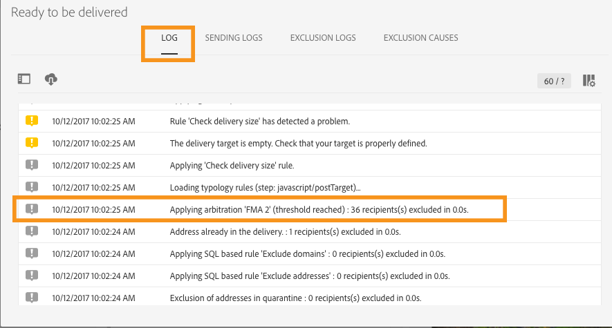

# 피로도 규칙{#fatigue-rules}

## 피로 규칙 정보 {#about-fatigue-rules}

유무 규칙을 사용하면 캠페인에서 과도한 요청된 프로필을 자동으로 제외하는 글로벌 크로스채널 비즈니스 규칙을 설정할 수 있습니다.

피로 규칙을 구현하려면 프로필당 최대 메시지 수를 정의하고 규칙이 적용되는 기간을 선택합니다. 배달 준비 과정에서 이미 보낸 메시지 수에 따라 프로필이 해당되는 경우 전달에서 제외됩니다.

>[!NOTE]
>
>피로 규칙이 적용되려면 배달에 대한 연락처 날짜를 정의해야 합니다. 메시지를 즉시 보내도록 선택하면 피로 규칙이 적용되지 않습니다.

관련 항목:

* [준비](../../administration/using/configuring-email-channel.md#preparation)
* [유형화 관리](../../sending/using/managing-typologies.md)
* [분류 규칙](../../sending/using/managing-typology-rules.md)
* [연락처 피로를 방지하기 위해 커뮤니케이션 빈도 최적화](https://helpx.adobe.com/campaign/kb/simplify-campaign-management.html#Engageyourcustomersateverystep)

## 피로 규칙 만들기 {#creating-a-fatigue-rule}

분류 규칙을 만들고 구성하려면 다음 단계를 **[!UICONTROL Fatigue]** 수행하십시오.

1. 인터페이스 왼쪽 상단 모서리에서 Adobe Campaign 로고를 클릭한 다음 **[!UICONTROL Administration]** > **[!UICONTROL Channels]** > **[!UICONTROL Typologies]** > **[!UICONTROL Typology rules]**&#x200B;를 선택합니다.

   

1. 분류 규칙 목록에서 을 클릭합니다 **[!UICONTROL Create]**.

   

1. 필드에서 **[!UICONTROL Rule type]** 를 선택합니다 **[!UICONTROL Fatigue]**.

   

1. 필드에서 **[!UICONTROL Channel]** 규칙이 적용될 채널을 선택합니다. 단일 채널(이메일, SMS, DM, 모바일 애플리케이션)을 선택하거나 선택할 수 있습니다 **[!UICONTROL All channels]**. 채널 [선택을 참조하십시오](#choosing-the-channel).

   

1. 탭에서 **[!UICONTROL General]** 프로필당 최대 메시지 수를 계산하는 방법을 정의합니다. 고정 임계값 또는 변수를 선택할 수 있습니다. 프로파일과 게재에서 임계값을 조정할 수도 있습니다. 자세한 내용은 임계값 [정의를 참조하십시오](#defining-the-threshold).

   

1. 유형 규칙 **[!UICONTROL Sliding period]** 을 적용할 유형을 선택합니다. 자세한 내용은 슬라이딩 기간 [설정을 참조하십시오](#setting-the-sliding-period).

   

   이 예제(이전 스크린샷 참조)에서는 슬라이딩 기간 15일 동안 최대 4개의 메시지를 보내도록 선택합니다.

1. 탭에서 이 규칙을 모든 게재에 적용하거나 전송할 메시지에 따라 규칙의 적용 가능성을 제한하도록 선택할 수 있습니다. **[!UICONTROL Application criteria]** 응용 프로그램 조건이 충족되는 경우에만 규칙이 실행됩니다. 예를 들어 주어진 단어로 시작하거나 특정 문자가 포함된 ID를 가진 레이블의 메시지에만 규칙을 적용할 수 있습니다. 필터링 규칙 [의 적용 가능성 제한을 참조하십시오](../../sending/using/filtering-rules.md#restricting-the-applicability-of-a-filtering-rule).

   

1. 탭을 **[!UICONTROL Typologies]** 선택하고 분류 규칙을 게재에 사용된 유형과 연결합니다. 유형 [및 유형](../../sending/using/managing-typologies.md) 규칙 [관리를 참조하십시오](../../sending/using/managing-typology-rules.md).

   

   >[!NOTE]
   >
   >이 템플릿을 사용하여 만든 모든 게재에 자동으로 적용되도록 배달 템플릿에서 유형을 정의할 수 있습니다.

배달 준비 과정에서 이미 발송한 배달 수에 따라, 해당되는 경우 프로필은 전달에서 제외됩니다. 배달 로그에서 피로 규칙 실행 결과를 볼 수 있습니다. 피로 [결과 보기를 참조하십시오](#viewing-the-fatigue-results).

>[!IMPORTANT]
>
>피로 규칙이 작동하려면 배달에 대한 연락처 날짜를 정의해야 합니다. 메시지를 즉시 보내도록 선택하면 피로 규칙이 적용되지 않습니다.

## 채널 선택 {#choosing-the-channel}

여러 채널에서 피로 규칙이 사용 가능합니다. 채널은 분류 규칙 설정의 **[!UICONTROL Channel]** 필드에 정의됩니다. 단일 채널을 선택하거나 선택할 수 있습니다 **[!UICONTROL All channels]**.

**사용 가능한 채널**

다음 채널을 사용할 수 있습니다.

* 이메일
* 모바일(SMS)
* DM
* 모바일 애플리케이션: 이 채널을 사용하면 프로필 또는 앱 구독자에게 푸시 알림을 전송할 수 있습니다. 프로필로 알림을 보내도록 선택하면 다중 채널 사용 유무 규칙과 호환됩니다.

   >[!IMPORTANT]
   >
   >피로 규칙은 앱 구독자에게 전송된 푸시 알림과 호환되지 않습니다. 앱 구독자에게 메시지를 보내는 경우 피로 규칙이 적용되지 않습니다.

* 모든 채널: 이 옵션을 사용하면 모든 채널에 규칙을 적용할 수 있습니다. 예를 들어 모든 채널에서 매월 최대 3개의 메시지를 전송하기로 결정할 수 있습니다. 지난 주에 2개의 이메일을 프로필에 보냈는데 오늘 푸시 알림을 전송하려고 하면 동일한 프로필이 제외됩니다.

**배달 유형**

피로 규칙은 모든 배달 유형과 호환됩니다. 한 번의 샷 전달, 반복 전달, 워크플로우 전달 및 트랜잭션 메시지

**트랜잭션 메시지** (rtEvent)와 마케팅 메시지(타깃팅 프로필)를 대상으로 하는 서비스 메시지(예: 리마케팅 메시지)를 보내는 데 사용할 수 있습니다. 피로 규칙은 마케팅 메시지만 호환합니다(타깃팅 프로필). 트랜잭션 메시지에 프로필 정보가 포함되어 있지 않으므로 피로 규칙과 호환되지 않습니다(프로필 정보가 부족한 경우에도). 트랜잭션 메시징에서 마케팅 메시지를 지원하므로 마케팅 트랜잭션 메시지를 비롯한 모든 채널에 피로 규칙을 **적용할 수 있습니다**.

## 임계값 정의 {#defining-the-threshold}

각 피로 규칙은 주어진 기간 동안 하나의 프로필에 보낼 수 있는 최대 메시지 수를 나타내는 임계값을 정의합니다. 이 임계값에 도달하면, 고려된 기간이 끝날 때까지 더 이상 배달할 수 없습니다. 이 프로세스를 사용하면 메시지가 설정된 임계값을 초과하는 경우 전달 시 프로파일을 자동으로 제외하여 과도한 요청을 방지할 수 있습니다.

임계값은 상수 또는 변수일 수 있습니다. 즉, 주어진 기간 동안 임계값은 한 프로파일에서 다른 프로파일로 또는 동일한 프로파일에 따라 다를 수 있습니다.

**수정 임계값 사용**

임계값은 해당 기간 동안 프로필에 보낼 수 있는 최대 메시지 수를 나타냅니다.

기본적으로 임계값은 일정하며 규칙에서 인증한 최대 메시지 수를 표시해야 합니다.

**변수 임계값 사용**

변수 임계값을 정의하려면 필드에서 **[!UICONTROL Depends on the recipient]** 값을 **[!UICONTROL Threshold type]** 선택합니다.

두 가지 옵션이 있습니다.

* 프로필 필드 선택: 임계값은 선택한 필드에 따라 각 프로필에 따라 달라집니다. 예를 들어 &#39;통신 빈도&#39; 필드로 프로필 리소스를 확장한 경우 필드 오른쪽의 단추를 클릭하고 필드를 **[!UICONTROL Threshold computation formula]** 선택합니다. 각 프로필에 대해 임계값은 &#39;통신 빈도&#39; 필드의 값을 가져옵니다.

   

* 공식 정의: 필드 오른쪽에 있는 두 번째 단추를 클릭하여 고급 임계값 계산 공식을 **[!UICONTROL Threshold computation formula]** 정의합니다. 예를 들어, 프로파일이 속한 세그먼트에 따라 허가된 메시지 수를 인덱싱할 수 있습니다. 즉, &#39;웹&#39; 세그먼트에 속하는 프로필은 다른 프로필보다 더 많은 메시지를 받을 수 있습니다. 유형 공식 **[!UICONTROL Iif (@origin='Web', 5, 3)]** 은 5개의 메시지를 웹 세그먼트의 프로필에 제공하고 다른 세그먼트의 경우 3개의 메시지를 전달하도록 허용합니다.

   

**프로파일 및 게재의 임계값 다듬기**

기본적으로 모든 메시지는 임계값 계산에 고려됩니다. 배달 준비 시 카운트할 프로필 및 배달을 필터링하려면 **[!UICONTROL Refine Threshold on profiles and deliveries]** 확인란을 선택합니다.

다음 예에서는 남성 프로파일만 계산되며 Newsletter로 시작하는 레이블이 있는 배달만 **계산됩니다** .

게재에서 임계값을 조정하는 것은 전체 규칙의 적용 가능성을 제한하는 것과 다릅니다( **[!UICONTROL Application criteria]** 탭).

* **[!UICONTROL Application criteria]**: 규칙을 실행하거나 특정 기준에 따르지 않도록 선택할 수 있습니다. 예를 들어 애플리케이션 조건이 &#39;Label started with Newsletter&#39;인 경우 이 조건을 준수하는 게재에만 규칙이 적용됩니다. 배달 레이블이 &#39;홍보&#39;로 시작하는 경우 규칙이 전혀 실행되지 않습니다.
* **[!UICONTROL Refine threshold on profiles and deliveries > Deliveries to count]**: 이 분류 규칙을 사용하는 모든 배달은 규칙을 실행하지만, 계산하려는 과거 및 예약된 배달 중에서 결정합니다. 예를 들어 &#39;Label started with Newsletter&#39;가 제한되면 배달 레이블이 &#39;Promo&#39;로 시작하는 경우에도 규칙이 실행됩니다. 선택한 슬라이딩 기간 동안 레이블이 &#39;Newsletter&#39;로 시작하는 배달 수를 계산합니다.

## 슬라이딩 기간 설정 {#setting-the-sliding-period}

피로 규칙은 n일 연속 기간에 정의됩니다. 기간은 2주, 7일 또는 5시간 등 **[!UICONTROL Sliding period]** 섹션에 구성됩니다.

규칙이 실행되면 과거 배달과 예약된 배달이 모두 고려됩니다. 따라서 주어진 슬라이딩 기간 동안 임계값이 절대 초과되지 않습니다.

예를 들어 48시간 기간을 정의하는 경우 시스템은 연락처 날짜 **48시간** 전에, 연락처 날짜 ****&#x200B;이후 48시간후에 표시됩니다. 따라서 선택한 기간이 두 배로 증가하여 이전 기간뿐만 아니라 미래 배달도 통합할 수 있습니다.

2주 기간 동안 발생한 납품을 제한하려면 **기간****에서 일** , **7** 또는 1주를입력합니다. 배달 일자 전 최대 7일까지 발송된 게재와 규칙이 적용되는 배달 일자 이후 최대 7일 후에 계획된 게재는 계산에 고려됩니다.

## 피로 결과 보기 {#viewing-the-fatigue-results}

배달 준비 과정에서 이미 발송한 배달 수에 따라, 해당되는 경우 프로필은 전달에서 제외됩니다. 피로 규칙 실행 결과를 보려면 **[!UICONTROL Deployment]** 블록의 오른쪽 하단에 있는 단추를 클릭합니다.

적용된 규칙의 이름을 비롯하여 피로 실행 결과의 세부 사항을 보여주는 세 개의 탭이 있습니다.

* 배달 로그:

   

* 제외 로그:

   

* 제외 원인:

   

## 피로 규칙 요약 보고서 보기 {#viewing-the-fatigue-rule-summary-report}

Adobe Campaign은 유무 규칙이 캠페인에 어떻게 적용되는지 이해하는 데 도움이 되는 피로 규칙에 대한 전용 보고서를 제공합니다. 따라서 캠페인이 서로 어떤 영향을 미치는지 파악하고 적절하게 조정할 수 있습니다.

각 프로그램, 캠페인 및 메시지 **[!UICONTROL Fatigue rules summary]** 의 오른쪽 상단 **[!UICONTROL Reports]** 단추에서 보고서에 액세스할 수 있습니다.

화면의 왼쪽 부분에서 배달의 연락처 날짜에 대한 보고서 데이터를 필터링할 수 있습니다. 기본적으로 선택한 기간은 현재 날짜보다 15일 전에 시작되고 15일 후에 종료됩니다. 특정 피로 규칙을 필터링할 수도 있습니다.

파이 차트에는 선택한 기간에 대한 다음 정보가 표시됩니다.

* **[!UICONTROL Total targeted]**: 메시지 준비 전 총 목표
* **[!UICONTROL Excluded]**: 피로 규칙 애플리케이션으로 인한 총 제외 수
* **[!UICONTROL Other exclusions]**: 다른 유형 규칙으로 인한 총 제외 수
* **[!UICONTROL To deliver]**: 메시지 준비( **[!UICONTROL To deliver]** = **[!UICONTROL Total targeted]** - **[!UICONTROL Excluded]** - **[!UICONTROL Other exclusions]** ) 후 배달될 총 메시지 수

차트 오른쪽에는 피로 규칙으로 분류된 제외 수가 표시됩니다.

아래 표에는 선택한 기간 내의 모든 배달이 표시됩니다. 각 게재에 대해 적용되는 피로 규칙 및 해당 제외를 볼 수 있습니다. 연락처 날짜가 없는 배달도 표에 표시됩니다.

* **[!UICONTROL 0]** 피로 규칙이 적용되었지만 제외가 없음을 의미합니다.
* **[!UICONTROL -N]** 은 N 제외가 발생했음을 의미합니다.
* 빈 필드는 피로 규칙이 적용되지 않았음을 의미합니다.

>[!NOTE]
>
>표시된 데이터는 보고서에 액세스하는 프로그램, 메시지 또는 캠페인과 컨텍스트에 맞지 않습니다. 이 보고서에는 모든 조직 단위에 대한 모든 유무 규칙 및 배달이 표시됩니다. 이렇게 하면 캠페인이 다른 사람의 영향을 받는 방식을 이해할 수 있도록 모든 게재에 대한 전체 보기를 얻을 수 있습니다.

## 예제 {#examples}

피로 관리 구현에는 많은 가능성이 있다. 다음은 수행할 수 있는 작업의 예입니다.

* **모든 채널에 적용되는** 고정 임계값을 **사용하여 피로 규칙을 만듭니다**.

   슬라이딩 기간 7일 동안 고정 임계값이 3인 다중 채널 규칙을 만든다고 가정합니다.

   지난 주 프리미엄 프로필에서 프로모션 이메일과 트랜잭션 리마케팅 이메일을 수신했습니다. 다음 주에 발송될 SMS도 예약했습니다. 이제 모든 프로필을 대상으로 하는 푸시 알림을 전송하기로 결심했습니다. 2주 기간 동안 최대 메시지 수에 도달했기 때문에 프리미엄 프로필은 오늘 푸시에서 제외됩니다.

   

* 프로필 필드를 기반으로 **변수 임계값을** 사용하여 피로 규칙을 **만듭니다**.

   프로필 리소스를 &#39;통신 제한&#39; 필드로 확장하여 각 프로필에 대해 다른 임계값을 정의했습니다. 피로 규칙에서 이 필드를 기반으로 변수 임계값을 정의하고 슬라이딩 기간을 2일로 선택합니다. 두 가지 프로필 예를 살펴보겠습니다. 존은 통신량이 1이고 데이빗은 2이다. 어제 두 사람 모두 이미 뉴스레터 이메일을 받았다. 오늘 다른 이메일을 보내기로 결정하셨습니다. 요한이 표적에서 제외되었기 때문에, 오직 다윗만이 그것을 받을 것이다.

   

* 임계값 계산 공식을 사용하여 **피로 규칙을 생성합니다**.

   프로파일 연령을 따라 임계값을 변경하려는 경우 프로필이 40세 미만이면 4개 및 이전 프로필의 제한을 2개로 정의하려고 합니다. 확장된 필드가 있는 각 프로필에 대해 이 임계값을 정의하는 대신, 피로 규칙에서 직접 공식을 만들어 프로필 나이에 따라 임계값을 계산할 수 있습니다. 이 예에서는 공식이 될 것입니다 **[!UICONTROL Iif (@age<40, 4, 2)]**.

   

   >[!NOTE]
   >
   >이 섹션에는 임계값 계산 공식을 사용하는 피로 규칙의 단계별 예도 포함되어 있습니다.

* 프로필 및 전달에 대한 임계값 **을** 재정의하는 피로 규칙을 만듭니다.

   프로필 리소스를 &#39;점수&#39; 필드로 확장했으며 &#39;유형&#39; 필드로 배달 리소스를 확장한 경우도 있습니다. 고정 임계값이 3임을 정의하려고 하지만 &#39;Alert&#39; 또는 &#39;Black Friday&#39; 유형의 모든 전달 횟수와 점수가 10보다 큰 모든 프로필의 수에서 제외하려고 합니다. 규칙이 실행되면 과거 및 예약된 배달 중에서 &#39;경고&#39; 또는 &#39;검은 금요일&#39; 유형이 아닌 모든 배달이 점수가 10보다 작은 프로필에 전송됩니다.

   

다음은 임계값 계산 공식을 사용하는 피로 규칙의 단계별 예입니다.

이 경우, Adobe는 Typical 규칙을 만들어 매주 2개 이상의 메시지를 프리미엄 프로파일에 전달하거나 표준 프로파일에 매주 2개의 메시지를 전달하지 않도록 하려고 합니다.

고객 및 잠재 고객을 식별하기 위해 프로필 리소스를 프리미엄 프로필의 경우 0이고 표준 프로필의 경우 1인 **[!UICONTROL Status]** 필드로 확장했습니다.

규칙을 만들려면 다음 단계를 적용합니다.

1. 새로운 피로 **유형 분류** 규칙을 만듭니다.
1. 섹션에서 **[!UICONTROL Threshold]** 각 프로필에 따라 임계값을 계산하는 공식을 생성하려고 합니다. 필드에서 **[!UICONTROL Depends on the recipient]** 값을 **[!UICONTROL Threshold type]** 선택한 다음 필드 오른쪽의 두 번째 단추 아이콘을 **[!UICONTROL Threshold computation formula]** 클릭합니다.

   

1. 섹션에서 **[!UICONTROL List of functions]** 노드에서 **Iif** 함수를 두 번 **[!UICONTROL Others]** 클릭합니다.

   

1. 그런 다음 섹션에서 프로필 **상태** 를 **[!UICONTROL Available fields]** 선택합니다.

   

1. 다음 공식을 만들려면 원하는 값을 입력합니다. **Iif(@status=0,2,4)**

   

   이 공식을 사용하면 상태가 0인 경우 값 2를 지정하고 다른 모든 상태에 대해 값 4를 지정할 수 있습니다.

1. 공식 **[!UICONTROL Confirm]** 을 승인하려면 을 클릭합니다.
1. 규칙이 적용될 **[!UICONTROL Sliding period]** 영역을 지정합니다. 이 경우 7일 - 2주 기간으로 발생한 납품을 제한합니다.

   

1. 이제 방금 만든 규칙을 캠페인에 적용하기 위해 유형에 연결합니다. 이렇게 하려면 **[!UICONTROL Typologies]** 탭을 선택하고 을 클릭한 다음 게재에 사용되는 유형 **[!UICONTROL Create element]** 을 선택합니다.

   

1. 규칙을 저장하여 만들기를 승인합니다.

이 규칙은 유형 분석에 따라 모든 게재에 적용됩니다.
