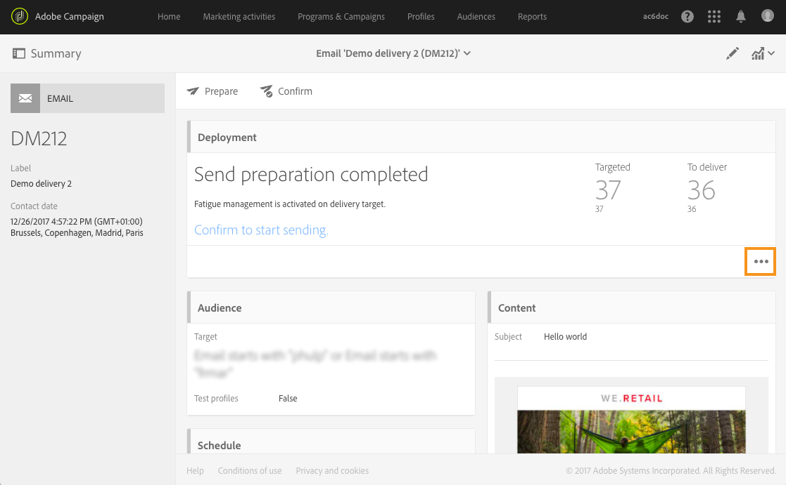

# 피로도 규칙{#fatigue-rules}

## 피로도 규칙 기본 정보 {#about-fatigue-rules}

피로도 규칙을 사용하면 마케터는 캠페인에서 과도하게 요청된 프로필을 자동으로 제외하는 글로벌 크로스 채널 비즈니스 규칙을 설정할 수 있습니다.

피로도 규칙을 구현하려면 프로필당 최대 메시지 수를 정의하고 규칙을 적용할 기간을 선택합니다. 게재를 준비하는 동안 이미 보낸 메시지 수에 따라 해당되는 경우 프로필이 게재에서 제외됩니다.

>[!NOTE]
>
>피로도 규칙을 적용하려면 게재에 대한 연락 날짜를 정의해야 합니다. 메시지를 즉시 보내도록 선택하면 피로도 규칙이 적용되지 않습니다.

관련 항목:

* [준비](../../administration/using/configuring-email-channel.md#preparation)
* [유형화 관리](../../sending/using/managing-typologies.md)
* [유형화 규칙](../../sending/using/managing-typology-rules.md)
* [연락 피로를 방지하기 위해 커뮤니케이션 빈도 최적화](https://helpx.adobe.com/kr/campaign/kb/simplify-campaign-management.html#Engageyourcustomersateverystep)

## 피로도 규칙 만들기 {#creating-a-fatigue-rule}

**[!UICONTROL Fatigue]** 유형화 규칙을 만들고 구성하려면 다음 단계를 수행합니다.

1. 인터페이스 왼쪽 상단 모서리에서 Adobe Campaign 로고를 클릭한 다음 **[!UICONTROL Administration]** > **[!UICONTROL Channels]** > **[!UICONTROL Typologies]** > **[!UICONTROL Typology rules]**&#x200B;을(를) 선택합니다.

   

1. 유형화 규칙 목록에서 **[!UICONTROL Create]**&#x200B;을(를) 클릭합니다.

   

1. **[!UICONTROL Rule type]** 필드에서 **[!UICONTROL Fatigue]**&#x200B;을(를) 선택합니다.

   

1. **[!UICONTROL Channel]** 필드에서 규칙이 적용될 채널을 선택합니다. 단일 채널(이메일, SMS, DM, 모바일 애플리케이션)을 선택하거나 **[!UICONTROL All channels]**&#x200B;을(를) 선택할 수 있습니다. [채널 선택](#choosing-the-channel)을 참조하십시오.

   

1. **[!UICONTROL General]** 탭에서 프로필당 최대 메시지 수를 계산하는 방법을 정의합니다. 상수 임계값 또는 변수를 선택할 수 있습니다. 프로필 및 게재에 대한 임계값을 구체화할 수도 있습니다. 자세한 내용은 [임계값 정의](#defining-the-threshold)를 참조하십시오.

   

1. 유형화 규칙을 적용할 **[!UICONTROL Sliding period]**&#x200B;을(를) 선택합니다. 자세한 내용은 [슬라이딩 기간 설정](#setting-the-sliding-period)을 참조하십시오.

   

   이 예제(이전 스크린샷 참조)에서는 슬라이딩 기간 15일 동안 최대 4개의 메시지를 보내도록 선택합니다.

1. **[!UICONTROL Application criteria]** 탭에서 이 규칙을 모든 게재에 적용하도록 선택하거나 전송할 메시지에 따라 규칙의 적용을 제한하도록 선택할 수 있습니다. 적용 조건이 충족되는 경우에만 규칙이 실행됩니다. 예를 들어 특정 단어로 시작하거나 특정 문자가 포함된 ID를 가진 레이블의 메시지에만 규칙을 적용할 수 있습니다. [필터링 규칙의 적용 제한](../../sending/using/filtering-rules.md#restricting-the-applicability-of-a-filtering-rule)을 참조하십시오.

   

1. **[!UICONTROL Typologies]** 탭을 선택하고 유형화 규칙을 게재에 사용된 유형화에 연결합니다. [유형화 관리](../../sending/using/managing-typologies.md) 및 [유형화 규칙](../../sending/using/managing-typology-rules.md)을 참조하십시오.

   

   >[!NOTE]
   >
   >이 템플릿을 사용하여 만든 모든 게재에 자동으로 적용되도록 게재 템플릿에서 유형화를 정의할 수 있습니다.

게재를 준비하는 동안 이미 보낸 게재 수에 따라 해당되는 경우 프로필이 게재에서 제외됩니다. 게재 로그에서 피로도 규칙 실행 결과를 볼 수 있습니다. [피로도 결과 보기](#viewing-the-fatigue-results)를 참조하십시오.

>[!IMPORTANT]
>
>피로도 규칙이 작동하려면 게재에 대한 연락 날짜를 정의해야 합니다. 메시지를 즉시 보내도록 선택하면 피로도 규칙이 적용되지 않습니다.

## 채널 선택 {#choosing-the-channel}

피로도 규칙은 여러 채널에 사용 가능합니다. 채널은 유형화 규칙 설정의 **[!UICONTROL Channel]** 필드에서 정의됩니다. 단일 채널을 선택하거나 **[!UICONTROL All channels]**&#x200B;을(를) 선택할 수 있습니다.

**사용 가능한 채널**

사용 가능한 채널은 다음과 같습니다.

* 이메일
* 모바일(SMS)
* DM
* 모바일 애플리케이션: 이 채널을 사용하면 프로필 또는 앱 구독자에게 푸시 알림을 전송할 수 있습니다. 프로필로 알림을 전송하도록 선택하면 다중 채널 피로도 규칙과 호환됩니다.

   >[!IMPORTANT]
   >
   >피로도 규칙은 앱 구독자에게 전송된 푸시 알림과 호환되지 않습니다. 앱 구독자에게 메시지를 보내는 경우 피로도 규칙이 적용되지 않습니다.

* 모든 채널: 이 옵션을 사용하면 모든 채널에 규칙을 적용할 수 있습니다. 예를 들어 모든 채널에서 매월 최대 3개의 메시지를 전송하도록 결정할 수 있습니다. 지난 주에 2개의 이메일을 프로필에 보냈고 오늘 푸시 알림을 전송하려고 하면 동일한 프로필이 제외됩니다.

**게재 유형**

피로도 규칙은 일회성 게재, 반복 게재, 워크플로우 게재 및 트랜잭션 메시지와 같은 모든 게재 유형과 호환됩니다. 

**트랜잭션 메시지**&#x200B;는 리마케팅 메시지와 같은 마케팅 메시지(타겟팅 프로필)뿐만 아니라 이벤트(rtEvent)를 타겟팅하는 서비스 메시지를 전송하는 데 사용할 수 있습니다. 피로도 규칙은 마케팅 메시지(타겟팅 프로필)와만 호환됩니다. 이벤트 트랜잭션 메시지는 프로필 정보를 포함하지 않으므로 (프로필이 보강이 된 경우에도) 피로도 규칙과 호환되지 않습니다. 트랜잭션 메시지에서 마케팅 메시지를 지원하면 **마케팅 트랜잭션 메시지를 포함한 모든 채널에 피로도 규칙을 적용**&#x200B;할 수 있습니다.

## 임계값 정의 {#defining-the-threshold}

각 피로도 규칙은 특정 기간 동안 하나의 프로필에 보낼 수 있는 최대 메시지 수를 나타내는 임계값을 정의합니다. 이 임계값에 도달하면, 고려된 기간이 끝날 때까지 더 이상 게재할 수 없습니다. 이 프로세스를 사용하면 메시지가 설정된 임계값을 초과하는 경우 게재 시 프로필을 자동으로 제외하여 과도한 요청을 방지할 수 있습니다.

임계값은 상수 또는 변수일 수 있습니다. 즉, 특정 기간 동안 임계값은 프로필마다 또는 심지어 동일한 프로필에 대해서도 다를 수 있습니다.

**고정 임계값 사용**

임계값은 관련 기간 동안 프로필에 보낼 수 있는 최대 메시지 수를 나타냅니다.

기본적으로 임계값은 일정하며 규칙에서 허가한 최대 메시지 수를 표시해야 합니다.

**변수 임계값 사용**

변수 임계값을 정의하려면 **[!UICONTROL Threshold type]** 필드에서 **[!UICONTROL Depends on the recipient]** 값을 선택합니다.

그런 다음 두 가지 옵션이 있습니다.

* 프로필 필드 선택: 임계값은 선택한 필드에 따라 각 프로필에 대해 달라집니다. 예를 들어 &#39;Communication frequency&#39; 필드로 프로필 리소스를 확장한 경우 **[!UICONTROL Threshold computation formula]** 필드 오른쪽의 버튼을 클릭하여 필드를 선택합니다. 각 프로필에 대해 임계값은 &#39;Communication frequency&#39; 필드의 값을 가져옵니다.

   

* 수식 정의: **[!UICONTROL Threshold computation formula]** 필드 오른쪽에 있는 두 번째 버튼을 클릭하여 고급 임계값 계산 공식을 정의합니다. 예를 들어 프로필이 속한 세그먼트에 따라 허용된 메시지 수를 인덱싱할 수 있습니다. 즉, &#39;Web&#39; 세그먼트에 속하는 프로필은 다른 프로필보다 더 많은 메시지를 받을 수 있습니다. **[!UICONTROL Iif (@origin='Web', 5, 3)]** 유형 수식은 웹 세그먼트의 프로필에 5개의 메시지를 게재하고 다른 세그먼트의 경우 3개의 메시지를 게재하도록 허용합니다.

   

**프로필 및 게재의 임계값 구체화**

기본적으로 모든 메시지는 임계값 계산에 고려됩니다. 게재 준비 시 계산할 프로필 및 게재를 필터링하려면 **[!UICONTROL Refine Threshold on profiles and deliveries]** 상자를 체크합니다.

다음 예제에서는 남성 프로필만 계산되고 **Newsletters**&#x200B;로 시작하는 레이블이 있는 게재만 계산됩니다.

게재의 임계값을 구체화하는 것은 전체 규칙(**[!UICONTROL Application criteria]** 탭)의 적용을 제한하는 것과는 다릅니다.

* **[!UICONTROL Application criteria]**: 특정 기준에 따라 규칙을 실행하거나 실행하지 않도록 선택합니다. 예를 들어 적용 조건이 &#39;Newsletter로 시작하는 레이블&#39;인 경우 이 조건을 준수하는 게재에만 규칙이 적용됩니다. 게재 레이블이 &#39;Promotion&#39;으로 시작하는 경우 규칙이 전혀 실행되지 않습니다.
* **[!UICONTROL Refine threshold on profiles and deliveries > Deliveries to count]**: 이 유형화 규칙을 사용하는 모든 게재는 규칙을 실행하지만, 과거 및 예약된 게재 중에서 어떤 것을 계산할지 결정합니다. 예를 들어 제한이 &#39;Newsletter로 시작하는 레이블&#39;인 경우 게재 레이블이 &#39;Promo&#39;로 시작하는 경우에도 규칙이 실행됩니다. 선택한 슬라이딩 기간 동안 레이블이 &#39;Newsletter&#39;로 시작하는 게재 수를 계산합니다.

## 슬라이딩 기간 설정 {#setting-the-sliding-period}

피로도 규칙은 n일 연속 기간으로 정의됩니다. 기간은 2주, 7일 또는 5시간 등 **[!UICONTROL Sliding period]** 섹션에서 구성됩니다.

규칙이 실행되면 과거 게재 및 예약된 게재 모두 고려됩니다. 따라서 특정 슬라이딩 기간 동안 임계값이 절대 초과되지 않도록 보장합니다.

예를 들어 48시간 기간을 정의하는 경우 시스템은 **연락 날짜 이전** 48시간 및 **연락 날짜 이후** 48시간을 찾습니다. 따라서 선택한 기간이 두 배로 증가하여 이전 게재뿐만 아니라 미래 게재도 통합할 수 있습니다.

2주 기간을 고려하여 게재를 제한하려면 **슬라이딩 기간** 섹션에 **일**, **7**&#x200B;또는 1주를 입력합니다. 규칙이 적용되는 게재 일자 이전 최대 7일까지 전송된 게재 및 게재 일자 이후 최대 7일까지 예약된 게재가 계산에 고려됩니다.

## 피로도 결과 보기 {#viewing-the-fatigue-results}

게재를 준비하는 동안 이미 보낸 게재 수에 따라 해당되는 경우 프로필이 게재에서 제외됩니다. 피로도 규칙 실행 결과를 보려면 **[!UICONTROL Deployment]** 블록의 오른쪽 하단 모서리에 있는 버튼을 클릭합니다.

적용된 규칙의 이름을 비롯하여 피로도 실행 결과의 세부 사항을 보여주는 세 개의 탭을 사용할 수 있습니다.

* 게재 로그:

   

* 제외 로그:

   

* 제외 원인:

   

## 피로도 규칙 요약 보고서 보기 {#viewing-the-fatigue-rule-summary-report}

Adobe Campaign은 피로도 규칙이 캠페인에 어떻게 적용되는지 파악하는 데 도움이 되는 피로도 규칙에 대한 전용 보고서를 제공합니다. 이를 통해 캠페인이 서로 어떤 영향을 미치는지 배우고 올바르게 조정할 수 있습니다.

각 프로그램, 캠페인 및 메시지의 오른쪽 상단 모서리에 있는 **[!UICONTROL Reports]** 버튼을 통해 **[!UICONTROL Fatigue rules summary]** 보고서에 액세스할 수 있습니다.

화면의 왼쪽 부분에서 게재의 연락 날짜에 대한 보고서 데이터를 필터링할 수 있습니다. 기본적으로 선택한 기간은 현재 날짜보다 15일 전에 시작되고 15일 후에 종료됩니다. 특정 피로도 규칙을 필터링할 수도 있습니다.

파이 차트에는 선택한 기간에 대한 다음 정보가 표시됩니다.

* **[!UICONTROL Total targeted]**: 메시지 준비 전 총 타겟
* **[!UICONTROL Excluded]**: 피로도 규칙 적용으로 인한 총 제외 수
* **[!UICONTROL Other exclusions]**: 기타 유형화 규칙으로 인한 총 제외 수
* **[!UICONTROL To deliver]**: 메시지 준비 후 게재될 총 메시지 수( **[!UICONTROL To deliver]** = **[!UICONTROL Total targeted]** - **[!UICONTROL Excluded]** - **[!UICONTROL Other exclusions]** )

차트 오른쪽에는 피로도 규칙에 따라 분류된 제외 수가 표시됩니다.

아래 테이블에는 선택한 기간 내의 모든 게재가 표시됩니다. 각 게재에 대해 적용되는 피로도 규칙 및 해당 제외를 확인할 수 있습니다. 연락 날짜가 없는 게재 또한 테이블에 표시됩니다.

* **[!UICONTROL 0]**&#x200B;은(는) 피로도 규칙이 적용되었지만 제외가 없음을 의미합니다.
* **[!UICONTROL -N]**&#x200B;은(는) N 제외가 발생했음을 의미합니다.
* 빈 필드는 피로도 규칙이 적용되지 않았음을 의미합니다.

>[!NOTE]
>
>표시된 데이터는 보고서에 액세스하는 프로그램, 메시지 또는 캠페인과 컨텍스트가 맞지 않습니다. 이 보고서에는 모든 조직 단위에 대한 모든 피로도 규칙 및 게재가 표시됩니다. 이를 통해 캠페인이 다른 사람에 의해 어떻게 영향을 받는지 이해하기 위해 모든 게재를 전체적으로 볼 수 있습니다.

## 예제 {#examples}

피로도 관리 구현 측면에는 많은 가능성이 있습니다. 다음은 수행할 수 있는 작업의 예입니다.

* **모든 채널**&#x200B;에 적용되는 **상수 임계값**&#x200B;을 사용하여 피로도 규칙을 만듭니다.

   슬라이딩 기간 7일 동안 상수 임계값이 3인 다중 채널 규칙을 만든다고 가정합니다.

   지난 주 프리미엄 프로필은 프로모션 이메일과 트랜잭션 리마케팅 이메일을 받았습니다. 다음 주에 발송될 SMS도 예약했습니다. 오늘은 모든 프로필을 타겟팅하는 푸시 알림을 전송하기로 합니다. 2주 기간 동안 최대 메시지 수에 도달했기 때문에 프리미엄 프로필은 오늘 푸시에서 제외됩니다.

   

* **프로필 필드**&#x200B;를 기반으로 **변수 임계값**&#x200B;을 사용하여 피로도 규칙을 만듭니다.

   각 프로필에 대해 다른 임계값을 정의하기 위해 프로필 리소스를 &#39;Communication limit&#39; 필드로 확장했습니다. 피로도 규칙에서 이 필드를 기반으로 변수 임계값을 정의하고 슬라이딩 기간을 2일로 선택합니다. 두 가지 프로필 예를 살펴보겠습니다. John은 커뮤니케이션 제한이 1이고 David는 2입니다. 두 사람 모두 어제 이미 뉴스레터 이메일을 받았습니다. 오늘은 다른 이메일을 보내려고 합니다. John이 타겟에서 제외되었기 때문에, David만 받게 됩니다.

   

* **임계값 계산 수식**&#x200B;을 사용하여 피로도 규칙을 만듭니다.

   프로필의 나이에 따라 임계값을 변경하려고 합니다. 프로필이 40세 미만이면 제한을 4로 정의하고 40세 이상인 프로필의 제한을 2로 정의하려고 합니다. 확장된 필드가 있는 각 프로필에 대해 이 임계값을 정의하는 대신, 피로도 규칙에서 직접 수식을 만들어 프로필 나이에 따라 임계값을 계산할 수 있습니다. 이 예제에서 수식은 **[!UICONTROL Iif (@age<40, 4, 2)]**&#x200B;입니다.

   

   >[!NOTE]
   >
   >이 섹션에는 임계값 계산 수식을 사용하는 피로도 규칙의 단계별 예제도 포함되어 있습니다.

* 프로필 및 게재에 대한 **임계값을 구체화**&#x200B;하는 피로도 규칙을 만듭니다.

   &#39;Score&#39; 필드로 프로필 리소스를 확장했으며 &#39;Type&#39; 필드로 게재 리소스도 확장했습니다. 상수 임계값을 3으로 정의하려고 하지만 &#39;Alert&#39; 또는 &#39;Black Friday&#39; 유형의 모든 게재 및 점수가 10보다 큰 모든 프로필을 계산에서 제외하려고 합니다. 규칙이 실행되면 과거 및 예약된 게재 중에서 점수가 10보다 작은 프로필로 전송된 &#39;Alert&#39; 또는 &#39;Black Friday&#39; 유형이 아닌 모든 게재가 계산됩니다.

   

다음은 임계값 계산 수식을 사용하는 피로도 규칙의 단계별 예입니다.

이 사용 사례에서는 프리미엄 프로필에 매주 2개 이상, 표준 프로필에 매주 2개 이상의 메시지를 게재하지 않도록 유형화 규칙을 만들려고 합니다.

고객 및 잠재 고객을 식별하기 위해 **[!UICONTROL Status]** 필드로 프로필 리소스를 확장했으며 여기에는 프리미엄 프로필의 경우 0, 표준 프로필의 경우 1이 포함됩니다.

규칙을 만들려면 다음 단계를 적용합니다.

1. 새로운 **피로도** 유형 유형화 규칙을 만듭니다.
1. **[!UICONTROL Threshold]** 섹션에서 각 프로필에 따라 임계값을 계산하는 수식을 생성하려고 합니다. **[!UICONTROL Threshold type]** 필드에서 **[!UICONTROL Depends on the recipient]** 값을 선택한 다음 **[!UICONTROL Threshold computation formula]** 필드의 오른쪽에 있는 두 번째 버튼 아이콘을 클릭합니다.

   

1. **[!UICONTROL List of functions]** 섹션에서 **[!UICONTROL Others]** 노드의 **Iif** 함수를 두 번 클릭합니다.

   

1. 그런 다음 **[!UICONTROL Available fields]** 섹션에서 프로필 **상태**&#x200B;를 선택합니다.

   

1. 수식 **Iif(@status=0,2,4)**&#x200B;를 만들려면 원하는 값을 입력합니다.

   

   이 수식을 사용하면 상태가 0인 경우 값 2를 할당하고 다른 모든 상태에 대해 값 4를 할당할 수 있습니다.

1. 수식을 승인하려면 **[!UICONTROL Confirm]**&#x200B;을(를) 클릭합니다.
1. 규칙을 적용할 **[!UICONTROL Sliding period]**&#x200B;을(를) 지정합니다. 이 경우 7일이며, 2주 기간으로 간주되는 게재를 제한합니다.

   

1. 이제 방금 만든 규칙을 게재에 적용하기 위해 유형화에 연결합니다. 이렇게 하려면 **[!UICONTROL Typologies]** 탭을 선택하고 **[!UICONTROL Create element]**&#x200B;을(를) 클릭한 다음 게재에 사용되는 유형화를 선택합니다.

   

1. 규칙을 저장하여 생성을 승인합니다.

이 규칙은 유형화에 따라 모든 게재에 적용됩니다.
