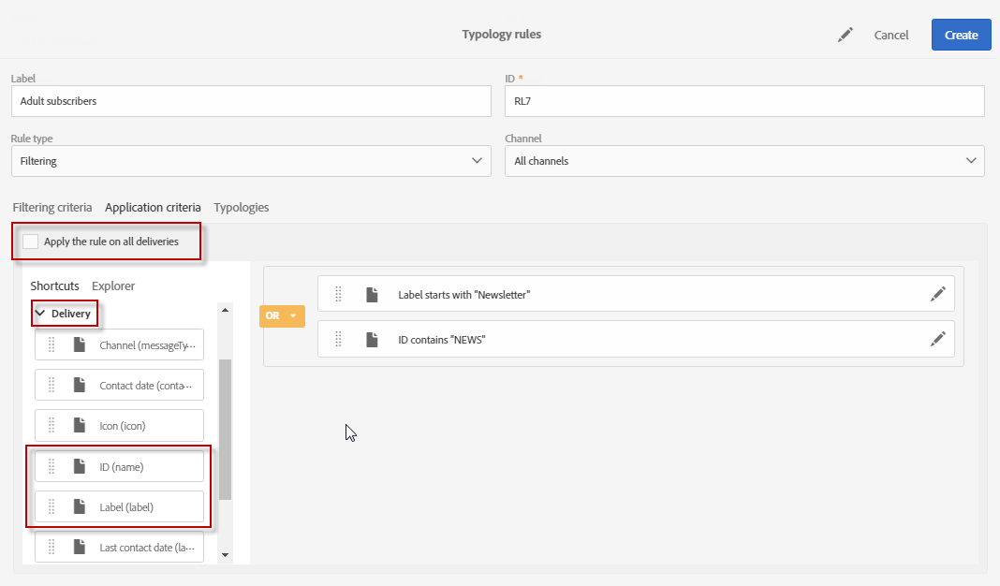

# 필터링 규칙 {#filtering-rules}

필터링 규칙을 사용하면 격리된 프로필 또는 특정 수의 이메일을 이미 보낸 프로필과 같이 쿼리에 정의된 기준에 따라 메시지 대상의 한 부분을 제외할 수 있습니다.

## 기본 필터링 유형 규칙 {#default-filtering-typology-rules}

아래 표는 기본 필터링 규칙 및 관련 채널에 대한 정보를 제공합니다.

| 레이블 | 채널 | 설명 |
---------|----------|---------|---------
| **[!UICONTROL Address not specified]** | 모두 | 지정된 주소(이메일, 우편 주소 등)가 없는 대상 모집단을 제외합니다. 를 선택한 채널에 따라). |
| **[!UICONTROL Blacklisted address]** | 모두 | 차단된 주소를 제외합니다. |
| **[!UICONTROL Duplicate]** | 모두 | 타겟 모집단 **[!UICONTROL Address]** 필드를 기반으로 중복 항목을 제외합니다. |
| **[!UICONTROL Exclude mobile applications]** | 모바일 애플리케이션 | 메시지에 정의된 모바일 애플리케이션과 일치하지 않는 앱 구독을 제외합니다. |
| **[!UICONTROL Exclude mobile applications for In-App]** | 인앱 | 메시지에 정의된 모바일 응용 프로그램(인앱 템플릿)과 일치하지 않는 앱 구독을 제외합니다. |
| **[!UICONTROL Exclude mobile applications for In-App broadcast]** | 인앱 | 메시지에 정의된 모바일 응용 프로그램과 일치하지 않는 앱 구독 제외(인앱 브로드캐스트 템플릿) |
| **[!UICONTROL Exclude mobile applications for Push]** | 모바일 애플리케이션 | 메시지에 정의된 모바일 응용 프로그램과 일치하지 않는 앱 구독 제외(푸시) |
| **[!UICONTROL Quarantined address]** | 모두 | 격리된 주소를 제외합니다. |
| **[!UICONTROL Target limited in size]** | 모두 | 대상에 대한 최대 배달 크기에 도달했는지 확인합니다. &quot;배달 제한&quot; 옵션이 활성화된 DM 게재에 적용됩니다. |

또한 이러한 기본 필터링 규칙으로 두 개의 제외 규칙을 사용할 수 있습니다.

* **[!UICONTROL Exclusion of addresses]** ( **[!UICONTROL addressExclusions]** )
* **[!UICONTROL Exclusion of domains]** ( **[!UICONTROL domainExclusions]** ).

이메일 분석 중에 이러한 규칙은 받는 사람 이메일 주소와 배달 가능성 인스턴스에서 관리되는 암호화된 전역 억제 목록에 포함된 금지된 주소 또는 도메인 이름을 비교합니다. 일치하는 메시지가 있으면 해당 받는 사람에게 메시지가 전송되지 않습니다.

이는 악성 활동, 특히 Spamtrap 사용으로 인해 블랙리스트에 추가되지 않도록 하기 위한 것입니다. 예를 들어 웹 양식 중 하나를 통해 구독하는 데 Spamtrap을 사용하는 경우 확인 이메일이 자동으로 해당 Spamtrap으로 전송되어 사용자의 주소가 자동으로 블랙리스트에 추가됩니다.

>[!NOTE]
>
>글로벌 억제 목록에 포함된 주소 및 도메인 이름은 숨겨집니다. 제외된 받는 사람 수만 배달 분석 로그에 표시됩니다.

## 필터링 규칙 만들기 {#creating-a-filtering-rule}

필요에 따라 고유한 필터링 규칙을 만들 수 있습니다. 예를 들어 18세 미만의 구독자가 통신을 받지 않도록 뉴스레터의 타겟 모집단을 필터링할 수 있습니다.

필터링 유형 규칙을 만들려면 다음 단계를 수행합니다.

1. 새로운 유형 규칙을 만듭니다. 유형 규칙을 만드는 주요 단계는 [이 섹션에](../../sending/using/managing-typology-rules.md)자세히 설명되어 있습니다.

1. 규칙 유형을 **[!UICONTROL Filtering]** 선택한 다음 원하는 채널을 지정합니다.

1. sL **[!UICONTRO필터링 기준]** 탭에서 **[!UICONTROL Subscription]** 카테고리의 가입을 선택합니다.

   

1. 쿼리 편집기의 **[!UICONTROL Explorer]** 탭에서 **[!UICONTROL Subscriber]** 노드를 화면 주 부분으로 드래그하여 놓습니다.

   

1. 가입자의 나이가 18 이상이 되도록 **[!UICONTROL Age]** 필드를 선택하고 필터링 조건을 정의합니다.

   

1. 탭에서 이 규칙을 **[!UICONTROL Typologies]** 유형 분석에 연결합니다.

   

1. 사용할 배달 또는 배달 템플릿에서 TypeLogics가 선택되어 있는지 확인합니다. For more on this, refer to [this section](../../sending/using/managing-typologies.md#applying-typologies-to-messages).

   

이 규칙이 메시지에 사용될 때마다 미성년자로 간주되는 가입자는 자동으로 제외됩니다.

## 필터링 규칙의 타깃팅 컨텍스트 구성 {#configuring-filtering-rules-targeting-context}

Campaign Standard를 사용하면 타깃팅할 **데이터에** 따라 **사용할 타깃팅 및 필터링** 차원을 구성할 수 있습니다.

이렇게 하려면 Typical 규칙의 속성을 연 다음 **[!UICONTROL Advanced information]** 섹션에 액세스합니다.

기본적으로 필터링은 에서 수행됩니다 **[!UICONTROL Profiles]**. 예를 들어, 규칙이 모바일 응용 프로그램을 대상으로 하는 경우, 규칙을 **[!UICONTROL Filtering dimension]** 로 변경할 수 **[!UICONTROL Subscriptions to an application]**&#x200B;있습니다.

## 필터링 규칙의 적용 가능성 제한 {#restricting-the-applicability-of-a-filtering-rule}

보낼 메시지에 따라 필터링 규칙의 적용 가능성을 제한할 수 있습니다.

1. 분류 규칙의 **[!UICONTROL Application criteria]** 탭에서 기본적으로 활성화되는 **[!UICONTROL Apply the rule on all deliveries]** 옵션을 선택 해제합니다.

   

1. 쿼리 편집기를 사용하여 필터를 정의합니다. 예를 들어 레이블이 지정된 단어로 시작하거나 ID에 특정 문자가 포함된 메시지만 적용할 수 있습니다.

   

이 경우 규칙은 정의된 기준에 해당하는 메시지만 적용됩니다.
