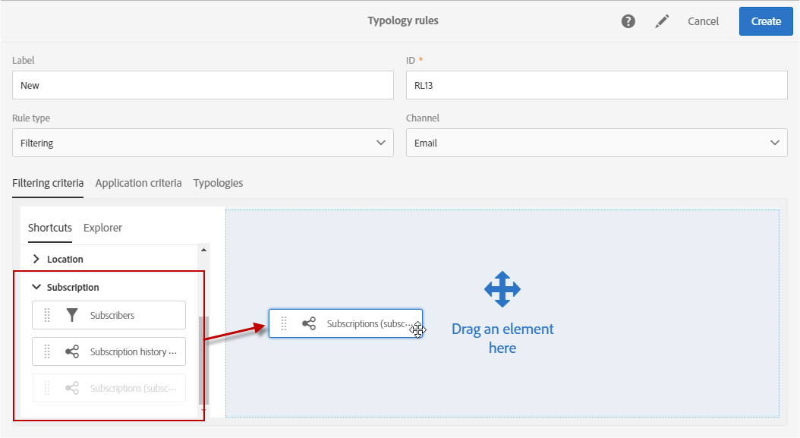

# 필터링 규칙 {#filtering-rules}

필터링 규칙을 사용하면 격리된 프로필 또는 특정 수의 이메일을 이미 보낸 프로필과 같은 쿼리에 정의된 기준에 따라 메시지 대상의 한 부분을 제외할 수 있습니다.

## 기본 필터링 유형화 규칙 {#default-filtering-typology-rules}

아래 표는 기본 필터링 규칙과 관련 채널에 대한 정보를 제공합니다.

| 레이블 | 채널 | 설명 |
| ---------|----------|---------|
| **[!UICONTROL Address not specified]** | 모두 | 지정된 주소(이메일, 우편 주소 등)가 없는 대상 모집단은 제외합니다. 을(를) 선택합니다. |
| **[!UICONTROL Address on denylist]** | 모두 | 차단 목록에 있는 주소는 제외합니다. |
| **[!UICONTROL Duplicate]** | 모두 | 대상 모집단을 기반으로 중복 항목 제외 **[!UICONTROL Address]** 필드. |
| **[!UICONTROL Exclude mobile applications]** | 모바일 애플리케이션 | 메시지에 정의된 모바일 애플리케이션과 일치하지 않는 앱 구독을 제외합니다. |
| **[!UICONTROL Exclude mobile applications for In-App]** | 인앱 | 메시지에 정의된 모바일 애플리케이션(인앱 템플릿)과 일치하지 않는 앱 구독을 제외합니다. |
| **[!UICONTROL Exclude mobile applications for In-App broadcast]** | 인앱 | 메시지에 정의된 모바일 애플리케이션(인앱 브로드캐스트 템플릿)과 일치하지 않는 앱 구독을 제외합니다 |
| **[!UICONTROL Exclude mobile applications for Push]** | 모바일 애플리케이션 | 메시지에 정의된 모바일 애플리케이션과 일치하지 않는 앱 구독(푸시용)을 제외합니다 |
| **[!UICONTROL Quarantined address]** | 모두 | 격리된 주소는 제외합니다. |
| **[!UICONTROL Target limited in size]** | 모두 | 대상의 최대 게재 크기에 도달했는지 확인합니다. &quot;게재 제한&quot; 옵션이 활성화된 DM 게재에 적용됩니다. |

이러한 기본 필터링 규칙 외에도 두 가지 제외 규칙을 사용할 수 있습니다.

* **[!UICONTROL Exclusion of addresses]** ( **[!UICONTROL addressExclusions]** )
* **[!UICONTROL Exclusion of domains]** ( **[!UICONTROL domainExclusions]** ).

전자 메일 분석 중에 이러한 규칙은 수신자 전자 메일 주소를 게재 가능성 인스턴스에서 관리되는 암호화된 전역 제외 목록에 포함된 금지된 주소 또는 도메인 이름과 비교합니다. 일치하는 항목이 있으면 메시지가 해당 수신자에게 전송되지 않습니다.

이는 악성 활동, 특히 Spamtrap 사용으로 인해 차단 목록에 추가되는 것을 피하기 위한 것입니다. 예를 들어 웹 양식 중 하나를 통해 구독하는 데 Spamtrap을 사용하는 경우 확인 이메일이 해당 Spamtrap으로 자동 전송되며, 이렇게 되면 주소가 자동으로 차단 목록에 추가됩니다.

>[!NOTE]
>
>전역 제외 목록에 포함된 주소 및 도메인 이름은 숨겨집니다. 제외된 수신자 수만 게재 분석 로그에 표시됩니다.

## 필터링 규칙 만들기 {#creating-a-filtering-rule}

필요에 따라 고유한 필터링 규칙을 만들 수 있습니다. 예를 들어 18세 미만의 구독자가 통신을 수신하지 않도록 뉴스레터의 대상 모집단을 필터링할 수 있습니다.

필터링 유형화 규칙을 만들려면 다음 단계를 수행합니다.

1. 새 유형화 규칙을 만듭니다. 유형화 규칙을 만드는 주요 단계는에 자세히 설명되어 있습니다. [이 섹션](../../sending/using/managing-typology-rules.md).

1. 다음 항목 선택 **[!UICONTROL Filtering]** 규칙 유형을 선택한 다음 원하는 채널을 지정합니다.

1. 다음에서 **[!UICONTROL Filtering criteria]** 탭에서 가입 을 선택합니다. **[!UICONTROL Subscription]** 범주.

   

1. 다음에서 **[!UICONTROL Explorer]** 쿼리 편집기의 탭에서 **[!UICONTROL Subscriber]** 를 화면에 표시할 수 있습니다.

   

1. 다음 항목 선택 **[!UICONTROL Age]** 필드를 만들고 구독자의 연령이 18세 미만이 되도록 필터링 조건을 정의합니다.

   

1. 다음에서 **[!UICONTROL Typologies]** 탭에서 이 규칙을 유형화에 연결합니다.

   

1. 사용할 게재 또는 게재 템플릿에서 유형화를 선택해야 합니다. 이 작업에 대한 자세한 정보는 [이 섹션](../../sending/using/managing-typologies.md#applying-typologies-to-messages)을 참조하십시오.

   

이 규칙이 메시지에 사용될 때마다 미성년자로 간주되는 구독자는 자동으로 제외됩니다.

## 필터링 규칙의 타겟팅 컨텍스트 구성 {#configuring-filtering-rules-targeting-context}

Campaign Standard을 사용하여 다음을 구성할 수 있습니다.  **타겟팅** 및 **필터링** 타겟팅하려는 데이터에 따라 사용할 차원입니다.

이렇게 하려면 유형화 규칙의 속성을 연 다음 **[!UICONTROL Advanced information]** 섹션.

기본적으로 필터링은 **[!UICONTROL Profiles]**. 예를 들어 규칙이 모바일 애플리케이션을 대상으로 하는 경우 **[!UICONTROL Filtering dimension]** 을(를) (으)로 변경할 수 있음 **[!UICONTROL Subscriptions to an application]**.

## 필터링 규칙의 적용 제한 {#restricting-the-applicability-of-a-filtering-rule}

보낼 메시지에 따라 필터링 규칙의 적용을 제한할 수 있습니다.

1. 의 유형화 규칙에서 **[!UICONTROL Application criteria]** 탭에서 선택을 취소합니다. **[!UICONTROL Apply the rule on all deliveries]** 기본적으로 활성화되어 있는 옵션입니다.

   

1. 쿼리 편집기를 사용하여 필터를 정의합니다. 예를 들어, 레이블이 지정된 단어로 시작하거나 ID에 특정 문자가 포함된 메시지에만 규칙을 적용할 수 있습니다.

   

이 경우 규칙은 정의된 기준에 해당하는 메시지에만 적용됩니다.
