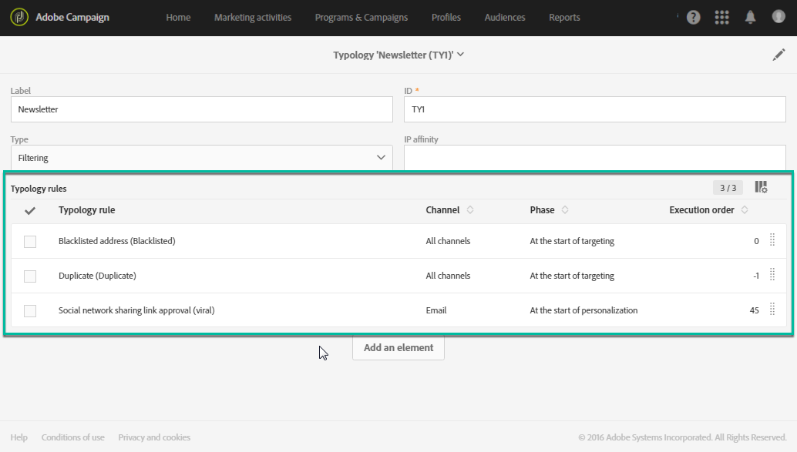

# 유형 관리 {#managing-typologies}

## 유형 정보 {#about-typologies}

유형 분류는 메시지를 보내기 전에 메시지의 유효성을 확인할 수 있는 규칙 세트입니다. 예:메시지 컨텐츠가 비어 있지 않거나, 구독이 없거나, 중복이 제외되는 등.

유형 유형은 **[!UICONTROL Administration]** > **[!UICONTROL Channels]** > **[!UICONTROL Typologies]** 메뉴를 통해 액세스할 수 있습니다. 기본적으로 애플리케이션에서 기본 유형을 사용할 수 있습니다. 필요에 따라 고유한 유형을 만들거나 기존 유형을 수정할 수 있습니다.

각 유형의 경우, **[!UICONTROL Typology rules]** 섹션에는 메시지와 함께 Typical을 사용할 때 실행되는 규칙 집합이 나열됩니다.

>[!NOTE]
>
>유형 규칙 중 하나에 대한 자세한 내용을 보려면 두 번 클릭합니다. 규칙은 읽기 전용 모드로 표시됩니다.

## 유형 만들기 {#creating-a-typology}

새 유형을 만들려면 다음 단계를 따르십시오.

1. > **[!UICONTROL Administration]** > **[!UICONTROL Channels]** > **[!UICONTROL Typologies]** 메뉴를 액세스합니다.

1. 유형 목록이 표시됩니다. 단추를 **[!UICONTROL Create]** 클릭합니다.

   

1. 유형을 **[!UICONTROL Label]**&#x200B;정의한 다음 **[!UICONTROL Add an element]** 단추를 클릭하여 포함할 유형 규칙을 선택합니다. For more on typology rules, refer to [this section](../../sending/using/managing-typology-rules.md).

   

   >[!NOTE]
   >
   >이 **[!UICONTROL IP affinity]** 필드를 사용하면 구성에 따라 친화성을 관리할 수 있습니다. 인스턴스의 구성 파일에 정의됩니다. 해당 기능을 사용하려면 관리자에게 문의하십시오.

1. 을 **[!UICONTROL Create]** 클릭하여 선택을 확인합니다. 이제 유형학을 메시지에 사용할 수 있습니다.

## 메시지에 유형 지정 적용 {#applying-typologies-to-messages}

메시지 또는 메시지 템플릿과 유형 분석을 연결할 때 유형 분석에 포함된 유형 규칙이 실행되어 메시지 유효성을 검사합니다.

>[!NOTE]
>
>각 메시지 또는 메시지 템플릿에는 단일 유형만 할당할 수 있습니다.

메시지에 유형 분석을 연결하려면 다음 단계를 따르십시오.

1. 메시지 속성에 액세스합니다. 메시지 템플릿은 **[!UICONTROL Resources]** > **[!UICONTROL Templates]** 탐색 메뉴에서 액세스할 수 있습니다.

1. > **[!UICONTROL Advanced parameters]** 섹션에서 메시지에 연결할 유형을 **[!UICONTROL Prearation]** 선택합니다.

   

1. 클릭 **[!UICONTROL Confirm]**.

   선택한 유형이 이제 메시지에 연결됩니다. 연결된 모든 유형 규칙이 실행되어 메시지 유효성을 검사합니다.
