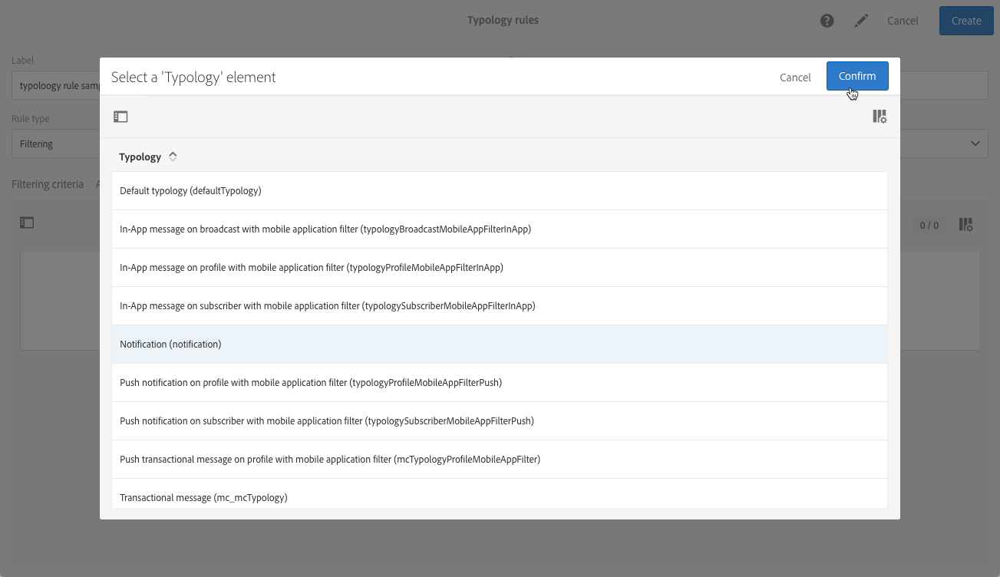

# 유형 규칙 관리 {#managing-typology-rules}

## 유형화 규칙 기본 정보 {#about-typology-rules}

유형 규칙은 메시지를 보내기 전에 메시지를 확인하고 필터링할 수 있도록 해주는 비즈니스 규칙입니다. 사용 가능한 유형 규칙 유형은 다음과 같습니다.

* **필터링** 규칙:이 유형의 규칙을 사용하면 격리된 프로필 또는 특정 수의 이메일을 이미 보낸 프로필과 같이 쿼리에 정의된 기준에 따라 메시지 대상의 한 부분을 제외할 수 있습니다. For more on this, refer to [this section](../../sending/using/filtering-rules.md).

* **피로** 규칙:이러한 유형의 규칙을 사용하면 프로필당 최대 메시지 수를 정의하여 과도한 구매를 방지할 수 있습니다. For more on this, refer to [this section](../../sending/using/fatigue-rules.md).

* **제어** 규칙:이 유형의 규칙을 사용하면 문자 표시, SMS 메시지 크기, 주소 형식 등과 같이 메시지를 보내기 전에 메시지의 유효성 및 품질을 확인할 수 있습니다. For more on this, refer to [this section](../../sending/using/control-rules.md).

분류 규칙은 **[!UICONTROL Administration]** > **[!UICONTROL Channels]** > **[!UICONTROL Typologies]** > **[!UICONTROL Typology rules]** 메뉴에서 사용할 수 있습니다.

기본적으로 몇 가지 특별 **필터링** 및 **제어 유형** 규칙을 사용할 수 있습니다. 필터링 규칙 및 [제어 규칙](../../sending/using/fatigue-rules.md) 섹션에서 [자세히 설명합니다](../../sending/using/control-rules.md) .

필요에 따라, 읽기 전용이며 수정할 수 없는 **[!UICONTROL Control]** 규칙을 제외하고, 기존 유형 규칙을 수정하거나 새 유형을 만들 수 있습니다.

## 유형 규칙 만들기 {#creating-a-typology-rule}

유형 규칙을 만드는 주요 단계는 다음과 같습니다.

1. / **[!UICONTROL Administration]** / **[!UICONTROL Channels]** / **[!UICONTROL Typologies]** / **[!UICONTROL Typology rules]** 메뉴를 클릭한 다음 **[!UICONTROL Create]**&#x200B;을 클릭합니다.

   

1. 유형을 **[!UICONTROL Label]**&#x200B;입력한 다음 규칙을 적용할 유형을 **[!UICONTROL Channel]** 지정합니다.

   

1. 유형 규칙을 **[!UICONTROL Type]**&#x200B;지정한 다음 필요에 따라 구성합니다. 유형 규칙 구성은 유형에 따라 다릅니다. 자세한 내용은 필터링 규칙 및 **[피로 규칙](../../sending/using/filtering-rules.md)**섹션을**[&#x200B;참조하십시오](../../sending/using/fatigue-rules.md)** .

1. 새 규칙을 포함할 유형을 선택합니다. 이렇게 하려면 **[!UICONTROL Typologies]** 탭을 선택한 다음 **[!UICONTROL Create element]** 단추를 클릭합니다.

   

1. 원하는 유형을 선택한 다음 을 **[!UICONTROL Confirm]**&#x200B;클릭합니다.

   

1. 모든 유형 유형을 선택한 후 을 클릭하여 유형 규칙 생성을 **[!UICONTROL Create]** 확인합니다.

## 유형 규칙 실행 순서 {#typology-rules-execution-order}

유형 지정 규칙은 타깃팅, 분석 및 메시지 개인화 단계 동안 지정된 순서로 실행됩니다.

표준 작업 모드에서는 규칙이 다음 시퀀스에 적용됩니다.

1. 타깃팅 시작 시 적용되는 경우 규칙을 제어합니다.
1. 필터링 규칙:

   * 주소 자격에 대한 기본 응용 프로그램 규칙:정의된 주소/확인되지 않은 주소/차단된 주소/격리된 주소/주소 품질
   * 사용자가 정의한 필터링 규칙.

1. 규칙이 타깃팅 끝에 적용되는 경우 규칙을 제어합니다.
1. 규칙이 개인화를 시작할 때 적용되는 경우 규칙을 제어할 수 있습니다.
1. 규칙이 개인화 종료 시 적용되는 경우 규칙을 제어할 수 있습니다.

그러나 각 유형에서 동일한 유형의 규칙의 실행 순서를 조정할 수 있습니다. 실제로 동일한 메시지 처리 단계 동안 여러 규칙이 실행될 때 규칙이 적용되는 순서를 선택할 수 있습니다.

예를 들어 실행 순서가 20에 위치하는 필터링 규칙은 실행 순서가 30에 위치하는 필터링 규칙 이전에 실행됩니다.

유형 **[!UICONTROL Properties]** 규칙 유형에서 실행 순서를 설정할 수 있습니다. 여러 규칙을 적용해야 하는 경우 각 규칙의 실행 순서에 따라 먼저 처리할 규칙이 결정됩니다. 이에 대한 자세한 내용은 Typical [규칙 실행 순서](#typology-rules-execution-order) 섹션을 참조하십시오.

규칙이 관련된 메시지를 분석할 때 규칙을 적용하지 않으려는 **[!UICONTROL Properties]** 경우 유형 규칙을 통해 비활성화할 수 있습니다.

