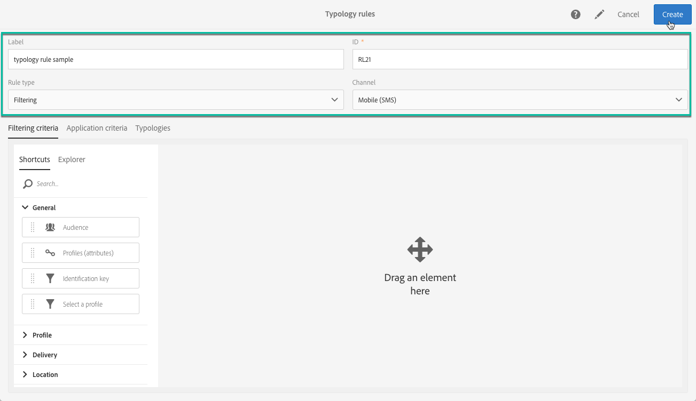
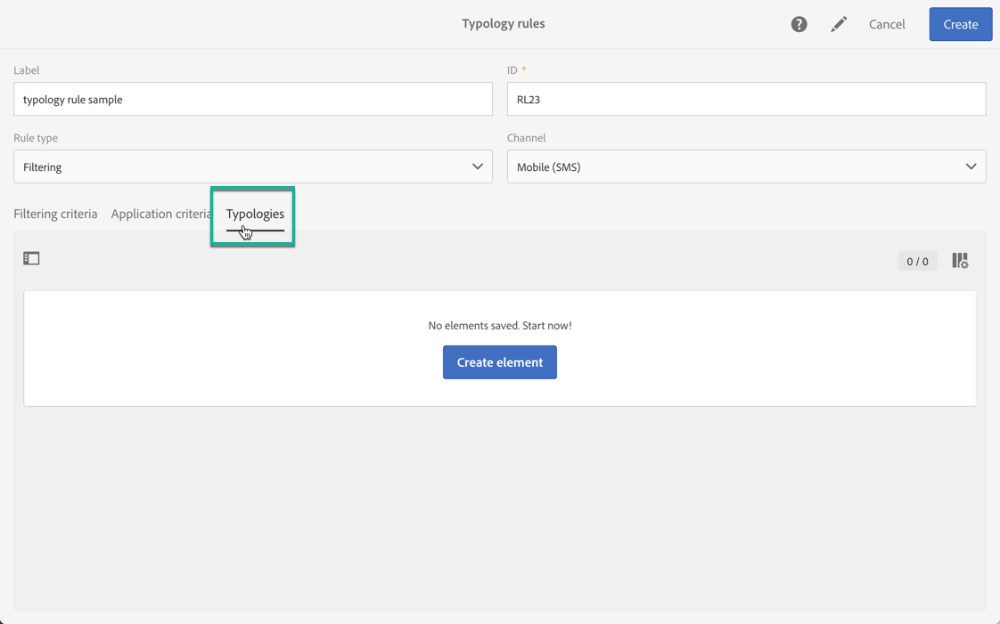

# 유형화 규칙 관리 {#managing-typology-rules}

## 유형화 규칙 기본 정보 {#about-typology-rules}

유형화 규칙은 메시지를 보내기 전에 메시지를 확인하고 필터링할 수 있는 비즈니스 규칙입니다. 사용 가능한 유형화 규칙 유형은 다음과 같습니다.

* **필터링** 규칙: 이 유형의 규칙을 사용하면 격리된 프로필 또는 특정 수의 메시지를 이미 보낸 프로필과 같은 쿼리에 정의된 기준에 따라 메시지 대상의 한 부분을 제외할 수 있습니다. 자세한 정보는 [이 섹션](../../sending/using/filtering-rules.md)을 참조하십시오.

* **피로** 규칙: 이 유형의 규칙을 사용하면 프로필당 최대 메시지 수를 정의하여 과도한 요청을 방지할 수 있습니다. 자세한 정보는 [이 섹션](../../sending/using/fatigue-rules.md)을 참조하십시오.

* **제어** 규칙: 이 유형의 규칙을 사용하면 메시지를 보내기 전에 문자 표시, SMS 메시지 크기, 주소 형식 등과 같은 메시지의 유효성 및 품질을 확인할 수 있습니다. 자세한 정보는 [이 섹션](../../sending/using/control-rules.md)을 참조하십시오.

유형화 규칙은 **[!UICONTROL Administration]** > **[!UICONTROL Channels]** > **[!UICONTROL Typologies]** > **[!UICONTROL Typology rules]** 메뉴에서 사용할 수 있습니다.

기본적으로 몇 가지 기본 **필터링** 및 **제어** 유형 규칙을 사용할 수 있습니다. [필터링 규칙](../../sending/using/fatigue-rules.md) 및 [제어 규칙](../../sending/using/control-rules.md) 섹션에 자세히 설명되어 있습니다.

필요에 따라, 읽기 전용이며 수정할 수 없는 **[!UICONTROL Control]** 규칙을 제외하고 기존 유형 분류 규칙을 수정하거나 새 유형을 만들 수 있습니다. 

## 유형화 규칙 만들기 {#creating-a-typology-rule}

유형화 규칙을 만드는 주요 단계는 다음과 같습니다.

1. **[!UICONTROL Administration]** / **[!UICONTROL Channels]** / **[!UICONTROL Typologies]** / **[!UICONTROL Typology rules]** 메뉴에 액세스한 다음 **[!UICONTROL Create]**&#x200B;을 클릭합니다.

   

1. **[!UICONTROL Label]** 유형을 입력한 다음 규칙을 적용할 **[!UICONTROL Channel]**&#x200B;를 지정합니다.

   

1. **[!UICONTROL Type]** 유형화 규칙을 지정하고 필요에 따라 구성합니다. 유형화 규칙의 구성은 유형에 따라 달라지는 점을 참조하십시오. 자세한 내용은 **[필터링 규칙](../../sending/using/filtering-rules.md)** 및 **[피로 규칙](../../sending/using/fatigue-rules.md)** 섹션을 참조하십시오.

1. 새 규칙을 포함할 유형을 선택합니다. 이렇게 하려면 **[!UICONTROL Typologies]** 탭을 선택한 다음 **[!UICONTROL Create element]** 버튼을 클릭합니다.

   

1. 원하는 유형을 선택한 다음 **[!UICONTROL Confirm]**&#x200B;을 클릭합니다.

   

1. 모든 유형을 선택한 다음 **[!UICONTROL Create]**&#x200B;을 클릭하여 유형 규칙을 만들기를 확인합니다.

## 유형화 규칙 실행 순서 {#typology-rules-execution-order}

유형화 규칙은 타겟팅, 분석 및 메시지 개인화 단계 동안 지정된 순서로 실행됩니다.

표준 작업 모드에서는 규칙은 다음 순서로 적용됩니다.

1. 타겟팅 시작 시 적용되는 경우에는 규칙을 제어합니다.
1. 필터링 규칙:

   * 주소 자격에 대한 기본 응용 프로그램 규칙:차단 목록/격리된 주소/주소 품질에 정의된 주소/확인되지 않은 주소/주소
   * 사용자가 정의한 필터링 규칙.

1. 타겟팅 끝에 적용되는 경우에는 규칙을 제어합니다.
1. 규칙이 개인화 시작 시 적용되는 경우 규칙을 제어합니다.
1. 규칙이 개인화 끝에 적용되는 경우 규칙을 제어합니다.

하지만 각 유형에서 동일한 유형의 규칙의 실행 순서를 조정할 수 있습니다. 실제로 동일한 메시지 처리 단계 동안 여러 규칙이 실행될 때 규칙이 적용되는 순서를 선택할 수 있습니다.

예를 들어 실행 순서가 20번인 필터링 규칙은 실행 순서가 30번에 위치하는 필터링 규칙 이전에 실행됩니다.

**[!UICONTROL Properties]**&#x200B;의 유형화 규칙에서 실행 순서를 설정할 수 있습니다. 여러 규칙을 적용해야 하는 경우 각 규칙의 실행 순서에 따라 먼저 처리할 규칙이 결정됩니다. 이에 대한 자세한 내용은 [유형화 규칙 실행 순서](#typology-rules-execution-order) 섹션을 참조하십시오.

규칙에 관련된 메시지를 분석 시 규칙을 적용하지 않으려는 경우, **[!UICONTROL Properties]**&#x200B;을(를) 통해 유형화 규칙을 비활성화할 수 있습니다.

