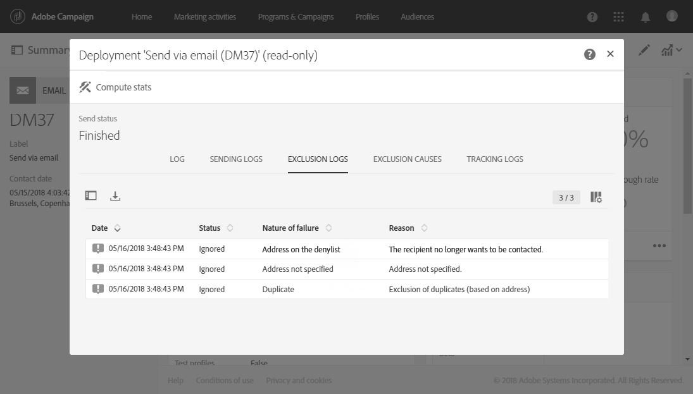

# 게재 모니터링{#monitoring-a-delivery}

배송을 모니터링하고 배송의 영향을 측정하는 방법에는 여러 가지가 있습니다. 기능 관리자는 메시지 로그 및 배달 로그에 액세스할 수 있습니다.
>[!CAUTION]
>
>**[!UICONTROL Administration]** 역할 및 **에 대한 액세스 권한이 있는 [관리자](../../administration/using/users-management.md#functional-administrators)만 전송 로그, 메시지 로그, 추적 로그, 제외 또는 구독 로그에 액세스할 수 있습니다.** 관리자가 아닌 사용자는 이러한 로그를 타깃팅할 수 있지만 연결된 테이블(프로필, 배달)부터 시작합니다.

* **메시지 로그**: 메시지 대시보드에서 로그에 직접 액세스할 수 있습니다. 여기에는 전송 세부 사항과 제외된 타겟 및 그 이유와 함께 오픈과 클릭 등의 추적 정보가 표시됩니다.

   메시지 로그를 보려면 **[!UICONTROL Deployment]** 블록의 오른쪽 하단에 있는 아이콘을 클릭합니다.

   몇 개의 탭에 **[!UICONTROL Sending logs]**, **[!UICONTROL Exclusion logs]**, **[!UICONTROL Exclusion causes]**, **[!UICONTROL Tracking logs]** 및 **[!UICONTROL Tracked URLs]**&#x200B;와(과) 관련된 정보가 포함됩니다(있는 경우). [게재 로그](#delivery-logs)를 참조하십시오.

   

   로그에는 게재 및 증명과 관련된 모든 메시지가 포함되어 있습니다. 특정 아이콘을 통해 오류나 경고를 확인할 수 있습니다. 자세한 내용은 [메시지 승인](../../sending/using/previewing-messages.md)을 참조하십시오.

   **[!UICONTROL Export list]** 버튼을 클릭하여 로그를 내보낼 수 있습니다.

   

* **게재 경고**: Adobe Campaign은 게재 성공 또는 실패를 추적하기 위한 이메일 알림 시스템을 제공합니다. 이 시스템은 사용자에게 중요한 시스템 활동에 대한 알림을 보냅니다.
* **보고서**: 메시지 대시보드에서 특정 메시지에 대한 여러 보고서에 액세스할 수 있습니다. 또한 **[!UICONTROL Reports]** 메뉴를 통해 기본 제공 또는 사용자 정의 보고서 전체 목록에 액세스할 수 있습니다. 보고서를 통해 메시지 또는 캠페인과 관련된 특정 지표를 전체적으로 확인할 수 있습니다.
* 또한 관리자는 로그를 별도의 파일로 내보내 자체 보고 또는 BI 도구에서 처리할 수 있습니다. 자세한 내용은 [로그 내보내기](../../automating/using/exporting-logs.md)를 참조하십시오.

**관련 항목:**

* [게재 실패 시 경고 받기](../../sending/using/receiving-alerts-when-failures-happen.md)
* [보고서](../../reporting/using/about-dynamic-reports.md)

## 게재 로그 {#delivery-logs}

### 전송 로그 {#sending-logs}

**[!UICONTROL Sending logs]** 탭에는 이 게재의 모든 발생 내역이 표시됩니다. 보낸 메시지 및 상태 목록이 여기에 저장됩니다. 여기에서 각 수신자에 대한 게재 상태를 볼 수 있습니다.

**[!UICONTROL Sent]** 상태인 각 프로필의 경우 **[!UICONTROL Date]** 열에 메시지 전송 시점이 표시됩니다.

특정 전송 로그의 세부 정보에 액세스하려면 해당 행 오른쪽에 있는 연필 아이콘을 클릭합니다.

모든 전송 로그 세부 사항은 읽기 전용입니다. 미러 페이지의 미리 보기를 확인할 수도 있습니다.

>[!NOTE]
>
>Campaign 사용자 인터페이스에 미러 페이지 렌더링을 표시하려면 미러 페이지 서버 URL의 보안이 유지되어야 합니다. 이 경우, [브랜드를 구성](../../administration/using/branding.md#configuring-and-using-brands)할 때 http://가 아닌 https://를 사용하여 이 URL을 설정합니다.

### 제외 로그 {#exclusion-logs}

**[!UICONTROL Exclusion logs]** 탭에는 전송 타겟에서 제외한 모든 메시지가 나열되며, 전송 실패 이유를 설명합니다.

### 제외 원인 {#exclusion-causes}

**[!UICONTROL Exclusion causes]** 탭에는 전송 타겟에서 제외된 메시지의 양(메시지의 개수)이 표시됩니다.

