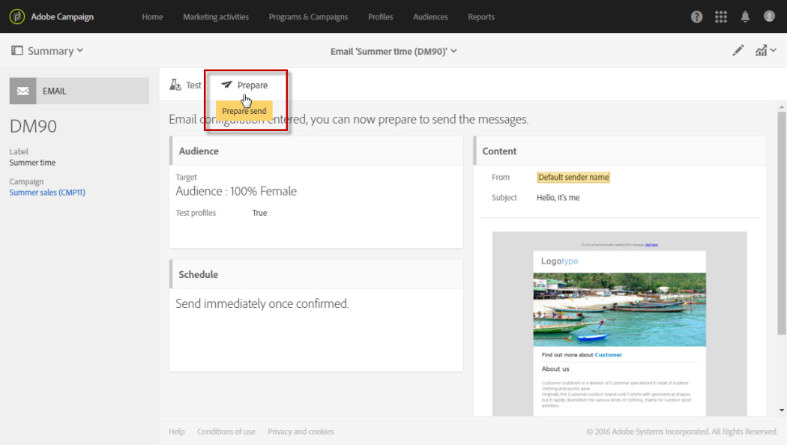

# 보내기 준비{#preparing-the-send}

준비가 대상 인구를 계산하고 대상에 포함된 각 프로필에 대한 메시지 내용을 생성하는 단계에 해당합니다. 준비가 완료되면 즉시 또는 [예약된 날짜와 시간에](../../sending/using/about-scheduling-messages.md)메시지를 보낼 준비가 됩니다.

1. 전송을 준비하려면 작업 **표시줄에서** 준비 단추를 클릭합니다.

   

1. 이 **[!UICONTROL Deployment]** 블록에는 준비 진행률이 표시된 다음 준비 통계가 표시됩니다.타깃팅된 메시지 수, 보낼 메시지 수 등

   타깃팅된 모집단 크기에 따라 이 작업에 시간이 걸릴 수 있습니다.

   

1. 작업 표시줄에 있는 [중지] **단추를 사용하여** 언제든지 준비를 중지합니다.

   준비 단계 중에는 메시지가 전송되지 않습니다. 따라서 어떤 것에 영향을 주지 않고 이 작업을 시작하거나 중지할 수 있습니다.

   

1. 배달 준비 중에 메시지가 자동으로 저장됩니다. 준비 단계 후에 메시지 일정을 변경해야 하는 경우 변경 사항을 고려하려면 **[!UICONTROL Prepare]** 단추를 다시 클릭해야 합니다. 메시지 예약 방법에 대한 자세한 내용은 이 [페이지를](../../sending/using/about-scheduling-messages.md)참조하십시오.

   

1. 준비 로그를 보려면 블록의 오른쪽 하단에 있는 단추를 클릭합니다.

   

1. 창이 열리면 오류를 수정한 다음 준비를 다시 시작합니다. **[!UICONTROL Deployment]**

   마지막 로그 메시지에는 오류 메시지와 오류 수가 표시됩니다. 특정 아이콘은 발생한 오류 유형을 보여줍니다.노란색 아이콘은 중요하지 않은 처리 오류를 나타내며 빨간색 아이콘은 전달이 시작되지 않도록 하는 중요한 오류를 나타냅니다.

   

1. 메시지를 보내기 전에 준비 통계를 확인하십시오. 보낼 메시지 수가 구성에 해당하지 않는 경우 타깃팅된 모집단(메시지에서 [대상자](../../audiences/using/selecting-an-audience-in-a-message.md)선택 참조)을 편집하고 준비를 다시 시작합니다.

준비가 완료되면 메시지를 보낼 준비가 되었습니다. 자세한 내용은 보내기 [확인을](../../sending/using/confirming-the-send.md)참조하십시오.

**유형 규칙**

Adobe Campaign은 메시지 준비 중에 적용되는 빌드-인 유형 규칙 세트와 함께 제공됩니다. 메시지가 유효한지, 품질 기준을 충족하는지 확인하는 데 사용됩니다. 유형 [지정을 참조하십시오](../../sending/using/about-typology-rules.md). 예를 들어, 고유한 유형 규칙을 정의할 수 있습니다. 예를 들어, 캠페인에서 과도한 프로필을 자동으로 제외시키는 전역 크로스 채널 피로 규칙을 설정할 수 있습니다. 피로 [규칙을](../../sending/using/fatigue-rules.md)참조하십시오.

**SMS 메시지 확인**

개인화 필드 또는 조건부 텍스트를 SMS 메시지의 컨텐츠에 삽입한 경우 이러한 요소에는 GSM 인코딩에 의해 고려되지 않는 문자가 포함될 수 있습니다. 준비가 실행되면 메시지 길이가 모니터링되고 제한 값이 전달되면 경고 메시지가 표시됩니다.

자세한 내용은 SMS 인코딩, [길이 및 번역](../../administration/using/configuring-sms-channel.md#sms-encoding--length-and-transliteration) 및 SMS 메시지 [개인화](../../channels/using/personalizing-sms-messages.md) 섹션을 참조하십시오.
