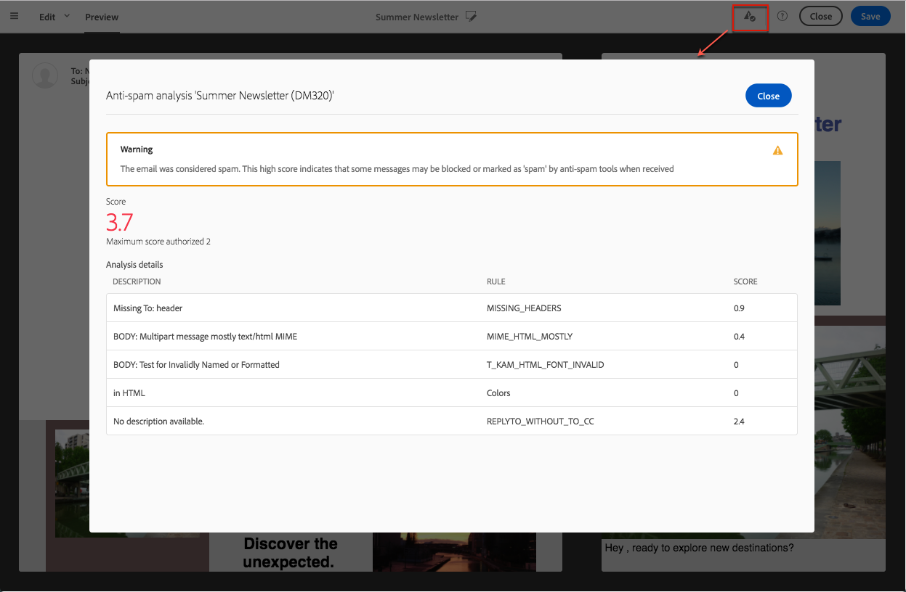
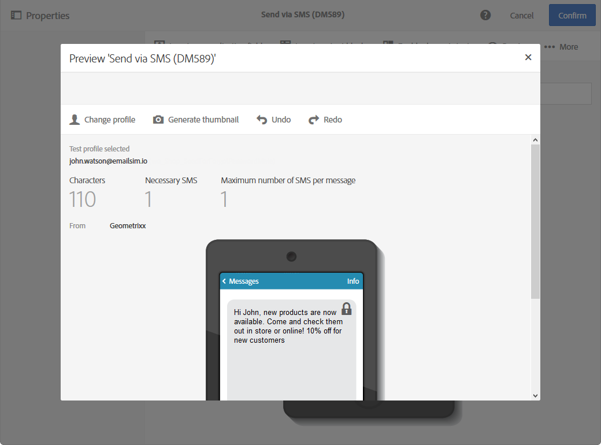
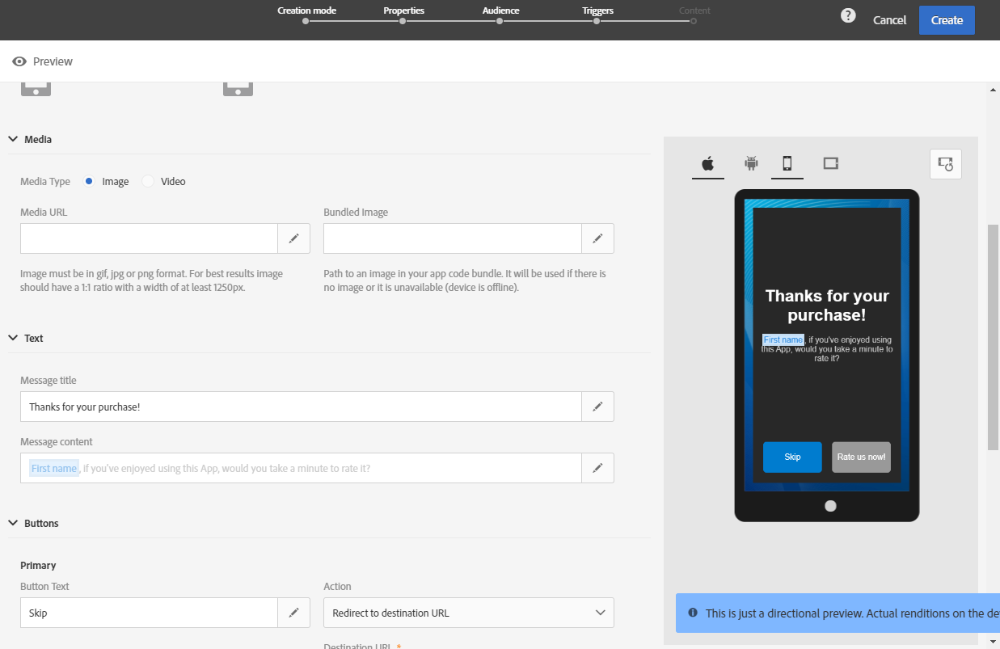

# 게재 미리 보기 {#previewing-messages}

## 이메일 미리 보기 {#previewing-emails}

Campaign Standard을 사용하면 메시지를 보내기 전에 메시지를 미리 볼 수 있으므로 개인화와 수신자가 메시지를 보게 되는 방법을 확인할 수 있습니다.

메시지 미리 보기는 메시지 **의 대상에 추가한** 테스트 프로필을 사용하여 수행됩니다.

Campaign Standard을 사용하면 **이메일** 메시지의 경우 테스트 프로필이 아닌 타깃팅된 프로필을 사용하여 메시지를 미리 볼 수 있습니다. 이를 통해 특정 프로필에서 받게 될 메시지를 정확하게 표현할 수 있습니다. 자세한 내용은 [타겟팅된 프로필을 사용하여 이메일 메시지 테스트](../../sending/using/testing-messages-using-target.md)를 참조하십시오.

테스트 프로필을 사용하여 메시지를 미리 보려면 다음 단계를 수행하십시오.

1. 이메일 [디자이너에서](../../designing/using/designing-content-in-adobe-campaign.md)단추를 **[!UICONTROL Preview]** 클릭합니다.

   

   데스크탑 뷰와 반응형 모바일 보기가 나란히 표시됩니다.

1. 각 미리 보기 중에 스팸 방지 자동 검사가 수행됩니다. 경고에 대한 자세한 내용을 보려면 **[!UICONTROL Anti-spam analysis]** 단추를 클릭하십시오.

   

1. 개인화 요소를 테스트할 테스트 프로필을 선택하려면 **[!UICONTROL Change profile]** 단추를 선택합니다.

   

1. 모드를 **[!UICONTROL Preview]** 종료하려면 화면 왼쪽 상단에 있는 **[!UICONTROL Edit]** 단추를 클릭합니다.

   

**관련 항목**

* [테스트 프로필 관리](../../audiences/using/managing-test-profiles.md)
* [타겟팅된 프로필을 사용하여 이메일 메시지 테스트](../../sending/using/testing-messages-using-target.md)
* [증명 보내기](../../sending/using/sending-proofs.md)

## SMS 메시지 미리 보기 {#previewing-sms}

SMS **메시지의 경우 Campaign Standard을** 사용하면 테스트 프로필을 사용하여 메시지를 미리 볼 수 있습니다. 이를 통해 특정 프로필에서 받게 될 메시지를 정확하게 표현할 수 있습니다. 자세한 내용은 [테스트 프로필 관리](../../audiences/using/managing-test-profiles.md)를 참조하십시오.

테스트 프로필을 사용하여 SMS 메시지를 미리 보려면 다음 단계를 따르십시오.

1. SMS 메시지 **[!UICONTROL Properties]** 를 입력하고 고객을 선택하면 개인화된 방식으로 전달할 수 있습니다. For more information, refer to [section](../../channels/using/personalizing-sms-messages.md).

   

1. 컨텐츠를 개인화한 후 을 클릭하여 창 **[!UICONTROL Create]** 에 **[!UICONTROL Summary]** 액세스합니다.

1. 창에서 **[!UICONTROL Summary]** 을 클릭하여 배달 미리 보기 **[!UICONTROL Content]** 를 시작합니다.

   

1. 도구 모음 **[!UICONTROL Preview]** 에서 을 클릭합니다.

   

1. 테스트 프로필 **[!UICONTROL Change profile]** 을 클릭하여 선택한 다음 을 클릭합니다 **[!UICONTROL Confirm]**.

   

이제 선택한 테스트 프로필에 따라 메시지의 정확한 표현을 볼 수 있습니다.

**관련 항목**

* [SMS 메시지 기본 정보](../../channels/using/about-sms-messages.md)
* [SMS 메시지 만들기](../../channels/using/creating-an-sms-message.md)
* [SMS 메시지 개인화](../../channels/using/personalizing-sms-messages.md)

## 푸시 알림 미리 보기 {#previewing-push}

푸시 **알림의 경우** Campaign Standard을 사용하면 테스트 프로필을 사용하여 메시지를 미리 볼 수 있습니다. 이를 통해 특정 프로필에서 받게 될 메시지를 정확하게 표현할 수 있습니다. 자세한 내용은 [테스트 프로필 관리](../../audiences/using/managing-test-profiles.md)를 참조하십시오.

테스트 프로필을 사용하여 푸시 알림을 미리 보려면 다음 단계를 수행하십시오.

1. 푸시 알림 **[!UICONTROL Properties]** 을 입력하고 고객을 선택하면 개인화된 전달을 제공할 수 있습니다. 자세한 내용은 푸시 알림 [사용자 정의를 참조하십시오](../../channels/using/customizing-a-push-notification.md).

1. 콘텐츠를 개인화한 후 미리 보기 창에서 장치 및 OS에 따라 푸시 알림 렌더링을 직접 확인할 수 있습니다.

   

1. 테스트 프로필을 사용하여 푸시 알림을 미리 보려면 을 클릭합니다 **[!UICONTROL Preview with test profile]**.

   

1. 테스트 프로필을 선택합니다 **[!UICONTROL Confirm]**.

이제 선택한 테스트 프로필에 따라 메시지의 정확한 표현을 볼 수 있습니다.

**관련 항목**

* [푸시 알림 기본 정보](../../channels/using/about-push-notifications.md)
* [푸시 알림 준비 및 보내기](../../channels/using/preparing-and-sending-a-push-notification.md)
* [푸시 알림 사용자 정의](../../channels/using/customizing-a-push-notification.md)

## 인앱 메시지 미리 보기 {#previewing-in-app}

인앱 **의**&#x200B;경우 Campaign Standard을 사용하면 테스트 프로필을 사용하여 메시지를 미리 볼 수 있습니다. 이를 통해 특정 프로필에서 받게 될 메시지를 정확하게 표현할 수 있습니다. 자세한 내용은 [테스트 프로필 관리](../../audiences/using/managing-test-profiles.md)를 참조하십시오.

테스트 프로필을 사용하여 인앱 메시지를 미리 보려면 다음 단계를 수행하십시오.

1. 인앱 메시지 **[!UICONTROL Properties]** 를 채우고 대상을 선택한 다음 설정한 다음 **[!UICONTROL Triggers]**&#x200B;개인화된 전달을 만들 수 있습니다. 자세한 내용은 인앱 메시지 [맞춤화를 참조하십시오](../../channels/using/customizing-an-in-app-message.md).

1. 콘텐츠를 개인화한 후 미리 보기 창의 장치 및 OS에 따라 인앱 메시지 렌더링을 직접 확인할 수 있습니다.

   

1. 테스트 프로필을 사용하여 인앱 메시지를 미리 보려면 을 클릭합니다 **[!UICONTROL Preview]**.

   

1. 테스트 프로필을 선택합니다 **[!UICONTROL Confirm]**.

이제 선택한 테스트 프로필에 따라 메시지의 정확한 표현을 볼 수 있습니다.

**관련 항목**

* [인앱 메시지 기본 정보](../../channels/using/about-in-app-messaging.md)
* [인앱 메시지 준비 및 보내기](../../channels/using/preparing-and-sending-an-in-app-message.md)
* [인앱 메시지 사용자 지정](../../channels/using/customizing-an-in-app-message.md)