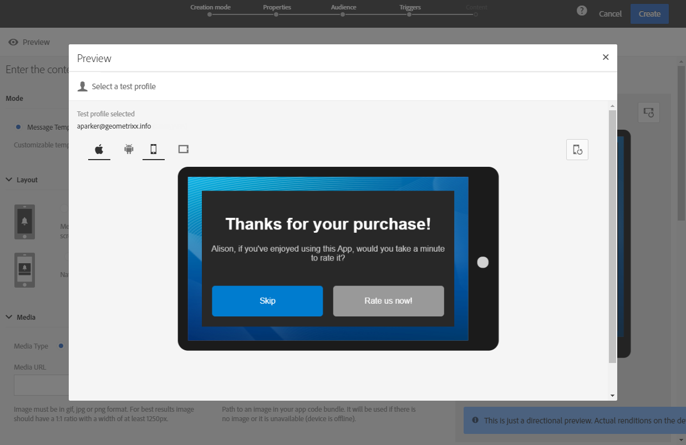

# 게재 미리 보기 {#previewing-messages}

## 이메일 미리 보기 {#previewing-emails}

Campaign Standard을 사용하면 메시지를 보내기 전에 미리 보고 개인화와 받는 사람이 메시지를 보는 방법을 확인할 수 있습니다.

메시지 미리 보기는 다음을 사용하여 수행됩니다. **테스트 프로필** 메시지 타겟에 추가하는 것입니다.

대상 **이메일** 메시지, Campaign Standard을 사용하면 테스트 프로필이 아닌 타겟팅된 프로필을 사용하여 메시지를 미리 볼 수 있습니다. 이를 통해 특정 프로필에서 받게 될 메시지의 정확한 표시를 가져올 수 있습니다. 자세한 내용은 [타겟팅된 프로필을 사용하여 이메일 메시지 테스트](../../sending/using/testing-messages-using-target.md)를 참조하십시오.

테스트 프로필을 사용하여 메시지를 미리 보려면 다음 단계를 수행합니다.

1. 다음에서 [이메일 디자이너](../../designing/using/designing-content-in-adobe-campaign.md)를 클릭하고 **[!UICONTROL Preview]** 단추를 클릭합니다.

   

   이메일의 데스크탑 보기와 반응형 모바일 보기가 나란히 표시됩니다.

1. 각 미리 보기 중에 자동 스팸 방지 검사가 수행됩니다. 다음을 클릭합니다. **[!UICONTROL Anti-spam analysis]** 버튼을 클릭하여 경고에 대한 자세한 내용을 확인합니다.

   

1. 다음 항목 선택 **[!UICONTROL Change profile]** 버튼을 클릭하여 개인화 요소를 테스트할 테스트 프로필을 선택합니다.

   

1. 종료하려면 **[!UICONTROL Preview]** 모드에서 **[!UICONTROL Edit]** 화면의 왼쪽 상단에 있는 단추입니다.

   

**관련 항목**

* [테스트 프로필 관리](../../audiences/using/managing-test-profiles.md)
* [타기팅된 프로필을 사용한 이메일 메시지 테스트](../../sending/using/testing-messages-using-target.md)
* [증명 보내기](../../sending/using/sending-proofs.md)

## SMS 메시지 미리 보기 {#previewing-sms}

대상 **SMS** 메시지, Campaign Standard을 사용하면 테스트 프로필을 사용하여 메시지를 미리 볼 수 있습니다. 이를 통해 특정 프로필에서 받게 될 메시지의 정확한 표시를 가져올 수 있습니다. 자세한 내용은 [테스트 프로필 관리](../../audiences/using/managing-test-profiles.md)를 참조하십시오.

테스트 프로필을 사용하여 SMS 메시지를 미리 보려면 다음 단계를 수행합니다.

1. 을(를) 입력한 후 **[!UICONTROL Properties]** sms 메시지를 만들고 대상자를 선택하면 게재를 개인화할 수 있습니다. 자세한 내용은 다음을 참조하십시오. [섹션](../../channels/using/personalizing-sms-messages.md).

   

1. 콘텐츠를 개인화한 후 을(를) 클릭합니다 **[!UICONTROL Create]** 에 액세스하려면 **[!UICONTROL Summary]** 창.

1. 다음에서 **[!UICONTROL Summary]** 창에서 다음을 클릭: **[!UICONTROL Content]** 게재 미리 보기를 시작합니다.

   

1. 클릭 **[!UICONTROL Preview]** 을 클릭합니다.

   

1. 클릭 **[!UICONTROL Change profile]** 테스트 프로필을 선택하려면 **[!UICONTROL Confirm]**.

   

이제 선택한 테스트 프로필에 따라 메시지의 정확한 표현을 볼 수 있습니다.

**관련 항목**

* [SMS 메시지 기본 정보](../../channels/using/about-sms-messages.md)
* [SMS 메시지 만들기](../../channels/using/creating-an-sms-message.md)
* [SMS 메시지 개인화](../../channels/using/personalizing-sms-messages.md)

## 푸시 알림 미리 보기 {#previewing-push}

대상 **푸시 알림**, Campaign Standard을 사용하면 테스트 프로필을 사용하여 메시지를 미리 볼 수 있습니다. 이를 통해 특정 프로필에서 받게 될 메시지의 정확한 표시를 가져올 수 있습니다. 자세한 내용은 [테스트 프로필 관리](../../audiences/using/managing-test-profiles.md)를 참조하십시오.

테스트 프로필을 사용하여 푸시 알림을 미리 보려면 다음 단계를 수행합니다.

1. 을(를) 입력한 후 **[!UICONTROL Properties]** 푸시 알림 및 선택한 대상자 중에서 게재를 개인화할 수 있습니다. 자세한 내용은 다음을 참조하십시오. [푸시 알림 사용자 정의](../../channels/using/customizing-a-push-notification.md).

1. 콘텐츠를 개인화한 후에는 미리보기 창에서 디바이스 및 OS에 따라 푸시 알림의 렌더링을 직접 확인할 수 있습니다.

   

1. 테스트 프로필을 사용하여 푸시 알림을 미리 보려면 **[!UICONTROL Preview with test profile]**.

   

1. 테스트 프로필을 선택한 다음 **[!UICONTROL Confirm]**.

이제 선택한 테스트 프로필에 따라 메시지의 정확한 표현을 볼 수 있습니다.

**관련 항목**

* [푸시 알림 기본 정보](../../channels/using/about-push-notifications.md)
* [푸시 알림 준비 및 보내기](../../channels/using/preparing-and-sending-a-push-notification.md)
* [푸시 알림 사용자 정의](../../channels/using/customizing-a-push-notification.md)

## 인앱 메시지 미리 보기 {#previewing-in-app}

대상 **인앱**, Campaign Standard을 사용하면 테스트 프로필을 사용하여 메시지를 미리 볼 수 있습니다. 이를 통해 특정 프로필에서 받게 될 메시지의 정확한 표시를 가져올 수 있습니다. 자세한 내용은 [테스트 프로필 관리](../../audiences/using/managing-test-profiles.md)를 참조하십시오.

테스트 프로필을 사용하여 인앱 메시지를 미리 보려면 다음 단계를 수행합니다.

1. 을(를) 입력한 후 **[!UICONTROL Properties]** 에서 인앱 메시지를 선택하고 을(를) **[!UICONTROL Triggers]**, 게재를 개인화할 수 있습니다. 자세한 내용은 다음을 참조하십시오. [인앱 메시지 사용자 지정](../../channels/using/customizing-an-in-app-message.md).

1. 콘텐츠를 개인화한 후에는 미리 보기 창에서 장치 및 OS에 따라 인앱 메시지 렌더링을 직접 확인할 수 있습니다.

   

1. 테스트 프로필을 사용하여 인앱 메시지를 미리 보려면 **[!UICONTROL Preview]**.

   

1. 테스트 프로필을 선택한 다음 **[!UICONTROL Confirm]**.

이제 선택한 테스트 프로필에 따라 메시지의 정확한 표현을 볼 수 있습니다.

**관련 항목**

* [인앱 메시지 기본 정보](../../channels/using/about-in-app-messaging.md)
* [인앱 메시지 준비 및 보내기](../../channels/using/preparing-and-sending-an-in-app-message.md)
* [인앱 메시지 사용자 정의](../../channels/using/customizing-an-in-app-message.md)
