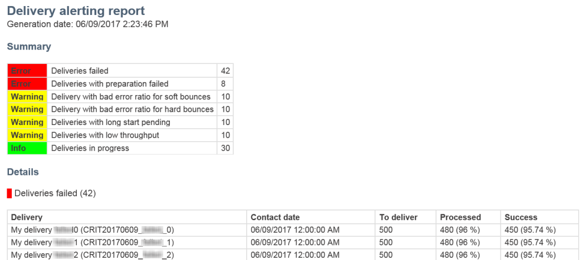
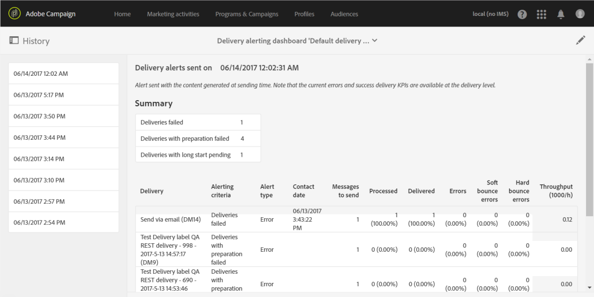
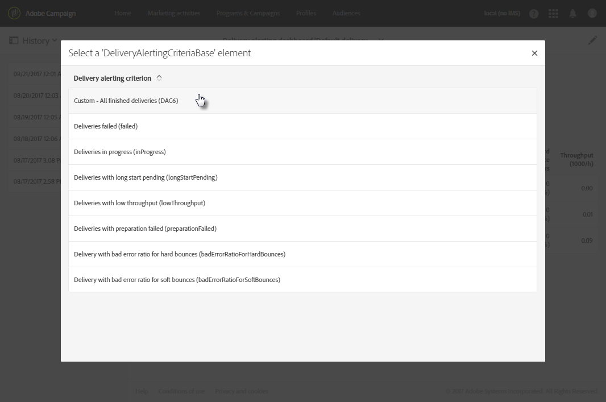

# 게재 실패 시 경고 받기{#receiving-alerts-when-failures-happen}

## 전달 경고 정보 {#about-delivery-alerting}

The **Delivery alerting** feature is an alert management system that enables a group of users to automatically receive notifications containing information on the execution of their deliveries.

전송된 알림에는 기본적으로 다음 기준을 기반으로 한 보고서가 포함됩니다.

* 실패한 배달
* 실패한 준비가 있는 배달
* 소프트 바운스 오류 비율이 낮은 배달
* 하드 바운스 오류 비율이 낮은 배달
* 대기 중인 상태가 평상시보다 긴 배달
* 처리량이 낮은 배달
* 배달 진행 중

경고 받는 사람은 Adobe Campaign에서 처리 중인 전달을 모니터링하고 실행 중에 문제가 있을 때 적절한 조치를 취할 수 있습니다.

이러한 경고 알림은 Adobe Campaign 인터페이스의 대시보드를 통해 정의된 특정 경고 기준에 따라 사용자 지정할 수 있습니다.

>[!NOTE]
>
>경고 알림은 이메일로만 전달됩니다.

전송된 알림은 다음을 포함합니다.

* 정의한 기준과 각 기준에 대해 선택한 레이블/색상을 충족하는 배달 수를 **[!UICONTROL Summary]** 표시하는 것입니다.
* 해당 대시보드에 대해 정의된 모든 배달 기준 및 각 기준에 대한 모든 전달을 나열하는 **[!UICONTROL Details]** 섹션.

## 전달 알림 대시보드 {#delivery-alerting-dashboards}

### 전달 경고 대시보드 정보 {#about-delivery-alerting-dashboards}

알림의 수신자를 관리하려면 경고 기준을 정의하고 경고의 내역에 액세스하려면 대시보드를 사용해야 합니다.

>[!NOTE]
>
>대시보드 및 경고 기준을 액세스하고 구성하려면 관리 권한이 있거나 **배달 관리자** 보안 그룹에 표시되어야 합니다. 표준 사용자는 Adobe Campaign 인터페이스에서 대시보드에 액세스할 수 없습니다. 경고 알림만 받을 수 있습니다. Adobe Campaign의 사용자 및 보안에 대한 자세한 내용은 [사용자](../../administration/using/users-management.md) 유형 및 보안 그룹 [을 참조하십시오](../../administration/using/managing-groups-and-users.md#about-security-groups).

Adobe Campaign 인터페이스에서 다음을 수행할 수 있습니다.

* 전달 경고 대시보드를 만들고 관리합니다. 배달 [경고 대시보드 만들기를 참조하십시오](#creating-a-delivery-alerting-dashboard).
* 각 대시보드에 대한 배달 경고 기준을 정의하고 관리합니다. 예를 들어 실패한 준비 또는 낮은 처리량만 있는 전달을 기반으로 경고를 작성할 수 있습니다. 경고 [기준 정보를 참조하십시오](#about-alerting-criteria).
* 각 대시보드의 기준 매개 변수를 수정합니다. 기준 매개 [변수를 참조하십시오](#criteria-parameters).
* 각 대시보드에 대한 수신자 그룹을 정의합니다.

   예를 들어, 실패한 게재에 대한 관리 권한이 있는 사용자에게 알려주어야 합니다. 그러나 마케팅 사용자가 소프트 바운스 오류 비율이 낮은 게재에 대한 정보를 수신하도록 할 수 있습니다. 따라서 두 개의 서로 다른 대시보드를 만들고 각 수신자 그룹에 대해 원하는 기준을 정의해야 합니다.

* 각 대시보드에 대해 전송된 모든 알림 기록에 액세스합니다.

   대시보드를 선택하면 이 대시보드에 대해 마지막으로 보낸 경고가 기본적으로 표시됩니다. 전송된 모든 경고는 화면 왼쪽에 나열됩니다. 해당 경고에 액세스하려면 **[!UICONTROL History]** 목록에서 항목을 클릭합니다.

### 배달 경고 대시보드 만들기 {#creating-a-delivery-alerting-dashboard}

특정 기준에 따라 여러 사용자 그룹에 알림을 보내려면 여러 대시보드를 사용해야 합니다. 새 대시보드를 만들려면:

1. > **[!UICONTROL Administration]****[!UICONTROL Channels]** > **[!UICONTROL Delivery alerting]**&#x200B;으로 이동합니다.
1. **[!UICONTROL Delivery alerting dashboards]**&#x200B;을(를) 선택하고 **[!UICONTROL Create]**&#x200B;을(를) 클릭합니다 .
1. 현재 대시보드를 활성화하려면 **[!UICONTROL Enabled]** 상자를 선택합니다.

   이 옵션을 비활성화하면 이 대시보드에 연결된 알림이 더 이상 전송되지 않습니다. 이 옵션은 기본적으로 비활성화됩니다.

   

1. 드롭다운 목록에서 알릴 수신자 그룹을 **[!UICONTROL Alert group]** 선택합니다. 그룹을 수정하거나 만들려면 보안 그룹 [만들기 및 사용자 할당을 참조하십시오](../../administration/using/managing-groups-and-users.md#creating-a-security-group-and-assigning-users).
1. 섹션에서 **[!UICONTROL Delivery alerting criteria]** 을 클릭하여 기준 **[!UICONTROL Create element]** 을 추가합니다. 경고 [기준 정보를 참조하십시오](#about-alerting-criteria).
1. **[!UICONTROL Edit properties]** 버튼을 선택합니다. 탭에서 기준을 적용할 방법을 **[!UICONTROL Criteria parameters]** 정의합니다. 기준 매개 [변수를 참조하십시오](#criteria-parameters).
1. Click **[!UICONTROL Create]** to save the dashboard.

이제 배달을 이 대시보드에서 정의한 기준을 충족할 때마다 지정된 사용자 그룹에 알림 메시지가 전송됩니다.

## 전달 경고 기준 {#delivery-alerting-criteria}

### 경고 기준 정보 {#about-alerting-criteria}

전달 경고 기준에 액세스하려면 **[!UICONTROL Administration]** > **[!UICONTROL Channels]** > **[!UICONTROL Delivery alerting]** 으로 이동하여 **[!UICONTROL Delivery alerting criteria]**&#x200B;선택합니다.

배달 경고 대시보드에서 다음 기준을 사용할 수 있습니다.

* **[!UICONTROL Deliveries failed]**:정의된 범위 내에서 잘못된 상태로 예약된 모든 배달.
* **[!UICONTROL Deliveries with preparation failed]**:준비 단계(대상 계산 및 컨텐츠 생성)가 실패한 정의된 범위 내에서 수정된 모든 게재입니다. 자세한 내용은 전송 [준비를 참조하십시오](../../sending/using/preparing-the-send.md).
* **[!UICONTROL Delivery with bad error ratio for soft bounces]**:정의된 범위 내에서 예약된 모든 배달, 최소 상태 **[!UICONTROL In progress]**&#x200B;가 지정된 비율보다 소프트 바운스 오류 비율이 더 큰 배달
* **[!UICONTROL Delivery with bad error ratio for hard bounces]**:정의된 범위 내에 예약된 모든 배달, 최소 상태 **[!UICONTROL In progress]**&#x200B;가, 정의된 비율보다 높은 하드 바운스 오류 비율이 있습니다.
* **[!UICONTROL Deliveries with long start pending]**:정의된 범위 내에서 예약된 모든 배달, **[!UICONTROL Start pending]** 상태가 정의된 기간 이상, **[!UICONTROL Start pending]** 상태는 메시지가 아직 시스템에 의해 고려되지 않았음을 의미합니다.
* **[!UICONTROL Deliveries with low throughput]**:Any delivery started for a defined duration, with a defined percentage of a defined percentage of processed messages, with a defined value.
* **[!UICONTROL Deliveries in progress]**:정의된 범위 내에서 **[!UICONTROL In progress]** 상태가 있는 모든 배달

>[!NOTE]
>
>위의 기준에 적용되는 모든 매개 변수에는 기본값이 있습니다. 이러한 값은 배달 경고 대시보드의 **[!UICONTROL Criteria parameters]** 탭에서 변경할 수 있습니다. 기준 매개 [변수를 참조하십시오](#criteria-parameters).

목록에서 항목을 선택하여 세부 사항에 액세스할 수 **[!UICONTROL Delivery alerting criteria]** 있습니다.

각 기준에 대해 다음 설정을 정의할 수 있습니다.

* **[!UICONTROL Indicators to add in alerts]**, 즉, 선택한 기준에 해당하는 전달에 대한 알림 **[!UICONTROL Details]** 섹션에 표시되는 열을 의미합니다.

   

* **[!UICONTROL Alert type]**, means the label and the color that will appear to the delivery criteria in the summary.

   

* **[!UICONTROL Criteria frequency]**:한 전달에 대한 기준이 충족되면 모니터링 기간 내에 전송된 각 알림에서 반복됩니다. 그렇지 않으면 한 전달에 대한 경고 기준으로 하루(첫 번째 발생 시) 하나의 경고만 전송됩니다.

   기본적으로 이 옵션은 모든 기준에 대해 하루에 한 번씩 설정됩니다.

**관련 항목:**

* [전송 로그](../../sending/using/monitoring-a-delivery.md#sending-logs)
* [경고 빈도](#alerting-frequency)
* [마케팅 활동 아이콘 및 상태](../../start/using/marketing-activities.md#marketing-activity-icons-and-statuses)

### 배달 경고 기준 만들기 {#creating-a-delivery-alerting-criterion}

필요에 맞게 새로운 전달 경고 기준을 만들 수 있습니다.

예를 들어, **[!UICONTROL Finished]** 상태가 있는 모든 게재가 나열된 알림을 전송할 수 있도록 새 기준을 만들 수 있습니다.

이렇게 하려면 먼저 **배달** 리소스를 확장하고 새 필터를 추가하여 **[!UICONTROL Finished]** 상태가 있는 배달만 선택할 수 있습니다.

1. [ **Adobe Campaign** ] > [ **관리** ] > [ **개발** ] **** 사용자 지정 리소스 **[!UICONTROL Create]**> 사용자 지정 리소스및으로 이동합니다.
1. 선택 **[!UICONTROL Extend an existing resource]**&#x200B;을 선택하고 드롭다운 목록에서 **[!UICONTROL Delivery]** 리소스를 선택한 다음 을 클릭하여 **[!UICONTROL Create]** 편집합니다.

   

   기존 리소스 확장에 대한 자세한 내용은 리소스 [정의를 참조하십시오](../../developing/using/creating-or-extending-the-resource.md).

1. 리소스에서 **[!UICONTROL Delivery]** 탭으로 **[!UICONTROL Filter definition]** 이동하고 을 클릭하여 필터 **[!UICONTROL Add an element]** 를 만듭니다.

   

1. 새 필터 정의를 편집합니다.창 **[!UICONTROL Filter definition]** 에서 **[!UICONTROL Status]** 항목을 작업 공간으로 드래그하여 놓고 필터 조건으로 **[!UICONTROL Finished]** 선택합니다.

   

   사용자 정의 필터 만들기 및 편집에 대한 자세한 내용은 필터 [정의를 참조하십시오](../../developing/using/configuring-filter-definition.md).

1. 변경 내용을 저장하고 리소스를 게시합니다. For more on this, see [Publishing a custom resource](../../developing/using/updating-the-database-structure.md#publishing-a-custom-resource).

   필터가 만들어지며 이제 새 배달 경고 기준에서 선택할 수 있습니다.

1. > **[!UICONTROL Administration]****[!UICONTROL Channels]** > **[!UICONTROL Delivery alerting]**&#x200B;로 이동하여 **[!UICONTROL Delivery alerting criteria]** 선택한 후 **[!UICONTROL Create]**&#x200B;클릭합니다.
1. 드롭다운 **[!UICONTROL Delivery filter applied by this criterion]** 목록에서 방금 만든 필터를 선택합니다.

   

   기본 기준과 동일한 방법으로 기준 설정을 정의할 수 있습니다. 경고 [기준 정보를 참조하십시오](#about-alerting-criteria).

이러한 기준을 만든 후에는 전달 경고 대시보드뿐만 아니라 다른 기준에 추가할 수 있습니다. 전달 경고 대시보드 [정보를 참조하십시오](#about-delivery-alerting-dashboards).

**관련 항목:**

[리소스 추가 또는 확장](../../developing/using/key-steps-to-add-a-resource.md)

## 전달 경고 매개 변수 {#delivery-alerting-parameters}

### 기준 매개 변수 {#criteria-parameters}

배달 경고 대시보드 **[!UICONTROL Criteria parameters]** 의 탭 에서 이 대시보드에서 선택한 기준에 적용되는 설정을 정의할 수 있습니다.

* **[!UICONTROL Delivery target minimum size]**:예를 들어, 이 필드에 100을 입력하면 대상이 수신자와 같거나 100명이 넘는 배달에만 알림이 전송됩니다. 이 매개 변수는 모든 기준에 적용됩니다.
* **[!UICONTROL Monitoring period before and after the contact date (in hours)]**:현재 시간 전후의 시간. 이 시간 범위에 연락처 날짜가 있는 배달만 고려됩니다. 이 매개 변수는 모든 기준에 적용됩니다. 기본적으로 이 필드의 값은 24시간으로 설정됩니다.

   연락처 날짜에 대한 자세한 내용은 예약 [정보를 참조하십시오](../../sending/using/about-scheduling-messages.md).

* **[!UICONTROL Maximum ratio of soft bounce errors]**:지정된 값보다 부드러운 바운스 오류 비율이 있는 모든 게재에 대해 알림이 전송됩니다. 기본적으로 이 필드의 값은 0.05(5%)로 설정됩니다.

   소프트 바운스 오류에 대한 자세한 내용은 [바운스 메일 자격](../../sending/using/understanding-delivery-failures.md#bounce-mail-qualification) 및 배달 실패 유형 [목록을 참조하십시오](../../sending/using/understanding-delivery-failures.md#delivery-failure-types-and-reasons).

* **[!UICONTROL Maximum ratio of hard bounce errors]**:지정된 값보다 큰 하드 바운스 오류 비율이 있는 모든 게재에 대해 알림이 전송됩니다. 기본적으로 이 필드의 값은 0.05(5%)로 설정됩니다.

   하드 바운스 오류에 대한 자세한 내용은 [바운스 메일 자격](../../sending/using/understanding-delivery-failures.md#bounce-mail-qualification) 및 배달 실패 유형 [목록을 참조하십시오](../../sending/using/understanding-delivery-failures.md#delivery-failure-types-and-reasons).

* **[!UICONTROL Minimum time threshold for delivery in 'Start pending' status (in minutes)]**:이 필드에 지정된 기간 이상 **[!UICONTROL Start pending]** 상태가 있는 모든 게재에 대해 알림이 전송되며, **[!UICONTROL Start pending]** 상태는 아직 시스템에서 메시지를 고려하지 않았음을 의미합니다.
* **[!UICONTROL Minimum time required for the computation of the throughput (in minutes)]**:지정된 기간 이상 **[!UICONTROL In progress]** 의 시작된 배달만 **[!UICONTROL Deliveries with low throughput]** 기준으로 고려됩니다.
* **[!UICONTROL Maximum percentage of processed messages for the computation of the throughput]**:처리된 메시지 중 지정된 비율보다 낮은 백분율을 가진 배달만 **[!UICONTROL Deliveries with low throughput]** 고려됩니다.
* **[!UICONTROL Minimum expected throughput (in sent messages per hour)]**:처리량이 지정된 값보다 낮은 배달만 **[!UICONTROL Deliveries with low throughput]** 기준에 고려됩니다.
* **[!UICONTROL Minimum processed ratio required for 'Deliveries in progress' criterion]**:처리된 메시지 중 지정된 비율보다 높은 백분율을 가진 배달만 고려됩니다.

### 경고 빈도 {#alerting-frequency}

이 **[!UICONTROL Frequency of delivery alerting]** 옵션을 사용하면 두 경고 전송 간의 지연을 정의할 수 있습니다. 기본적으로 10분으로 설정됩니다.

이 설정은 **[!UICONTROL Administration]** > **[!UICONTROL Application settings]** > **[!UICONTROL Options]** 메뉴를 통해 변경할 수 있습니다.

>[!NOTE]
>
>이 옵션은 Adobe Campaign에 정의된 모든 대시보드에 적용됩니다. 각 대시보드에 대한 특정 빈도를 설정할 수 없습니다.

## 전달 알림 이유 {#delivery-alerting-reasons}

전달 경고 **** 기능은 모든 관련 Adobe Campaign 사용자가 이메일 및 대시보드를 통해 전달 실행 상태에 대해 자동으로 알려 줍니다.

이제 전달 알림 메시지를 수신하면 몇 가지 팁을 얻을 수 있습니다.

먼저 전달 정보 **로그** 탭을 확인하여 전달 및 교정에 관련된 모든 정보를 확인합니다. 빨간색 및 노란색 아이콘을 사용하여 오류 또는 경고를 식별할 수 있습니다. 빨간색 아이콘은 배달을 시작할 수 없는 중요한 오류를 나타냅니다.

게재의 모든 발생 내역을 보려면 **[!UICONTROL Sending logs]** 탭을 선택합니다. 전송된 메시지 목록과 상태 정보가 포함되어 있습니다. 여기에서 각 수신자의 배달 상태를 확인할 수 있습니다(, **[!UICONTROL Sent]****[!UICONTROL Pending]**, **[!UICONTROL Failed]**&#x200B;등). For more on this, see [Sending logs](../../sending/using/monitoring-a-delivery.md#sending-logs).

전달에 대해 충족되는 기준에 따라 경고 알림을 받아야 하는 몇 가지 가능한 이유가 있습니다.

* **[!UICONTROL Deliveries failed]**:이 기준은 잘못된 상태로 모든 배달을 알려줍니다. 다음 때문일 수 있습니다.

   * 배달 서버(MTA, 메시지 전송 에이전트) 문제
   * Adobe Campaign 배달 서버와 수신 서버 간의 연결 시간 초과
   * 전달 가능 문제
   * 잘못된 워크플로우

   워크플로우로 배달을 트리거하는 경우 해당 워크플로우가 올바르게 시작되었는지 확인하십시오. 자세한 내용은 워크플로우 [실행을 참조하십시오](../../automating/using/about-workflow-execution.md). 그렇지 않은 경우 Adobe Campaign 관리자에게 문의하여 문제를 해결하십시오.

* **[!UICONTROL Deliveries with preparation failed]**:다음 경우 배달 준비 중에 오류가 발생할 수 있습니다.

   * 배달에는 주제가 없다.
   * 개인화 필드에 잘못된 구문이 있습니다.
   * 타겟이 없습니다.
   * 배달이 크기 제한을 초과합니다.

   자세한 내용은 전송 [준비를 참조하십시오](../../sending/using/preparing-the-send.md). 하지만 이러한 오류는 일반적으로 메시지 분석 중에 발견되었습니다. 제어 [규칙을 참조하십시오](../../sending/using/control-rules.md).

* 경고의 가능한 원인은 다음과 **[!UICONTROL Delivery with bad error ratio for soft bounces]** 같습니다.

   * 받는 사람의 서버가 다운되었습니다.
   * 받는 사람의 사서함이 가득 찼습니다.

   자세한 내용은 배달 로그의 **[!UICONTROL Exclusion logs]** 및 **[!UICONTROL Exclusion causes]** 탭을 확인하십시오. 제외 [로그를 참조하십시오](../../sending/using/monitoring-a-delivery.md#exclusion-logs).

   경고의 가능한 원인은 다음과 **[!UICONTROL Delivery with bad error ratio for hard bounces]** 같습니다.

   * 받는 사람이에 차단 목록 추가되므로 더 이상 연락을 원하지 않습니다.
   * 받는 사람의 이메일 주소가 없습니다.
   * 받는 사람의 도메인이 없습니다.
   * 받는 사람의 서버가 배달을 막고 있습니다.

   소프트 및 하드 바운스 오류를 방지하려면 아래 우수 사례를 따르십시오.

   * 격리된 받는 사람과 같은 전달 분석 동안 메시지 대상의 한 부분을 제외하는 필터링 유형 규칙을 만듭니다. 필터링 [규칙 만들기를 참조하십시오](../../sending/using/filtering-rules.md).
   * 적절한 격리 관리 프로세스를 유지하기 위해 고객 데이터베이스를 정기적으로 업데이트합니다. 검역을 [참조하십시오](../../sending/using/understanding-quarantine-management.md#about-quarantines).
   * 일반적으로 말해서, 가능한 한 최상의 방법으로 전달 능력을 향상시키십시오. Adobe Campaign [제공](../../sending/using/about-deliverability.md) 기능에 대한 자세한 설명서를 참조하고 Adobe Campaign 관리자에게 문의하십시오.

* **[!UICONTROL Deliveries with long start pending]**:일반적으로 MTA(메시지 전송 에이전트) 수준에서 문제가 있음을 의미합니다. 일부 리소스가 사용 가능한 상태에서 실행 프로세스가 대기 중입니다. MTA가 시작되지 않았을 수 있습니다.

   **[!UICONTROL Deliveries with low throughput]**:다시, 이것은 MTA가 너무 느리다는 것을 의미하는 전달 능력 문제입니다.

   이러한 문제에 대한 자세한 내용은 Adobe Campaign 관리자에게 문의하십시오.

**관련 항목:**

* [게재 실패 이해](../../sending/using/understanding-delivery-failures.md)
* [격리 관리 이해](../../sending/using/understanding-quarantine-management.md)
* [Campaign의 옵트인 및 옵트아웃 기본 정보](../../audiences/using/about-opt-in-and-opt-out-in-campaign.md)

