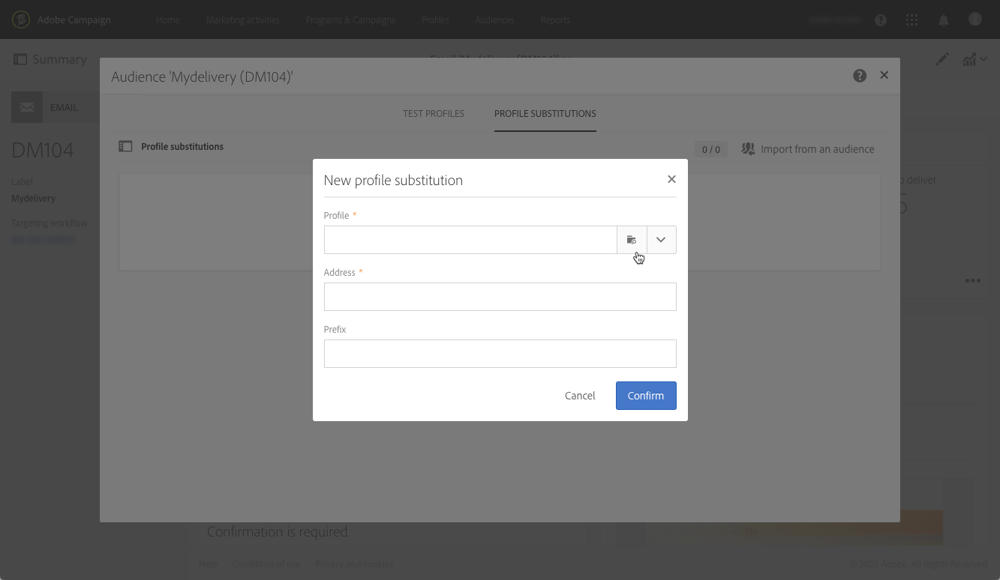

# 타기팅된 프로필을 사용한 이메일 메시지 테스트 {#testing-message-profiles}

## 개요 {#overview}

에 추가 [테스트 프로필](../../audiences/using/managing-test-profiles.md), 타겟팅된 프로필 중 하나의 위치에 자신을 배치하여 이메일 메시지를 테스트할 수 있습니다. 이를 통해 프로필에서 받게 될 메시지의 정확한 표시를 가져올 수 있습니다(사용자 지정 필드, 워크플로우의 추가 데이터를 포함한 동적 및 개인화된 정보...).

>[!IMPORTANT]
>
>이 기능을 사용하면 프로필 개인 정보를 외부 이메일 주소로 보낼 수 있습니다. Campaign Standard에서 개인 정보 요청(GDPR 및 CPA)을 실행하면 해당 요청이 외부에서 실행되지 않습니다.

주요 단계는 다음과 같습니다.

1. 메시지를 구성한 다음 **준비** 단계.
1. **하나 또는 여러 개의 프로필 선택** 이 프로필은 메시지의 타겟팅에 해당하는 프로필입니다.
1. 각 프로필 a와 연결 **대체 주소** 증명을 보낼 대상.
1. (선택 사항) 각 프로필에 대해 **접두사** 증명 제목 줄에 을 추가합니다.
1. **미리 보기** 이메일 디자이너에서 프로필에 대해 메시지가 표시되는 방식을 지정합니다.
1. 증명을 보냅니다.

   >[!IMPORTANT]
   >
   >증명은 다음 방법으로 처리됩니다. [!DNL Campaign Standard] 를 표준 게재로 사용하십시오. 따라서 프로필 대체를 사용하여 증명을 보내면 선택한 프로필의 게재 및 추적 로그에 레코드가 추가됩니다.

 [비디오에서 이 기능 살펴보기](#video)

## 프로필 및 대체 주소 선택 {#selecting-profiles}

테스트에 타깃팅된 프로필을 사용하려면 먼저 프로필을 선택한 다음 증명을 받을 대체 주소를 정의해야 합니다. 이렇게 하려면 다음 중 하나를 수행합니다 [특정 프로필 선택](#selecting-individual-profiles) 타겟팅된 프로필 중 또는 [기존 대상자에서 프로필 가져오기](#importing-from-audience).

>[!NOTE]
>
>테스트를 위해 최대 100개의 프로필을 선택할 수 있습니다.

### 개별 프로필 선택 {#selecting-individual-profiles}

1. 메시지 대시보드에서 메시지가 준비되었는지 확인한 다음 **[!UICONTROL Audience]** 차단합니다.

   

1. 다음에서 **[!UICONTROL Profile substitutions]** 탭을 클릭하고 **[!UICONTROL Create element]** 테스트에 사용할 프로필을 선택하는 단추입니다.

   

1. 프로필 선택 단추를 클릭하여 메시지의 타겟팅된 프로필 목록을 표시합니다.

   

1. 테스트에 사용할 프로필을 선택한 다음 **[!UICONTROL Address]** 원하는 대체 주소를 입력한 다음 **[!UICONTROL Confirm]**. 프로필을 타겟팅하는 모든 증명은 이 프로필의 데이터베이스에 정의된 증명이 아닌 이 이메일 주소로 전송됩니다.

   증명 제목란에 특정 접두사를 추가하려면 **[!UICONTROL Subject line prefix]** 필드.

   >[!NOTE]
   >
   >제목 줄 접두사는 최대 500자를 포함할 수 있습니다.

   

   접두사는 다음과 같이 표시됩니다.

   

1. 프로필이 연결된 대체 주소 및 접두사와 함께 목록에 추가됩니다. 테스트에 사용할 모든 프로필에 대해 위의 단계를 반복한 다음 을 클릭합니다 **[!UICONTROL Confirm]**.

   

   동일한 프로필에 대해 여러 대체 주소로 증명을 보내려면 필요한 횟수만큼 이 프로필을 추가해야 합니다.

   아래 예에서는 John Smith 프로필을 기반으로 한 증명이 두 개의 다른 대체 주소로 전송됩니다.

   

1. 모든 프로필 및 대체 주소가 정의되면 증명을 전송하여 메시지를 테스트할 수 있습니다. 이렇게 하려면 **[!UICONTROL Test]** 단추를 누른 다음 수행할 테스트 유형을 선택합니다.

   테스트 프로필이 메시지 대상에 추가되지 않으면 **[!UICONTROL Email rendering]** 및 **[!UICONTROL Proof + Email rendering]** 옵션을 사용할 수 없습니다.  증명 전송에 대한 자세한 내용은 을 참조하십시오. [이 섹션](../../sending/using/sending-proofs.md).

   

>[!IMPORTANT]
>
>메시지를 변경한 경우 메시지 준비를 다시 시작해야 합니다. 그렇지 않으면 변경 내용이 증명에 반영되지 않습니다.

### 대상자에서 프로필 가져오기 {#importing-from-audience}

Campaign Standard을 사용하면 테스트에 사용할 수 있는 프로필 대상을 가져올 수 있습니다. 예를 들어 다른 프로필을 타겟팅하는 전체 메시지 세트를 고유한 이메일 주소로 보낼 수 있습니다.

또한 대상자가 주소 및 접두사 열로 이미 구성된 경우 **[!UICONTROL Profile substitutions]** 탭. 대체 주소를 사용한 대상자 가져오기의 예는 다음에서 자세히 설명합니다. [이 섹션](#use-case).

>[!NOTE]
>
>대상자를 가져올 때 메시지 대상에 해당하는 프로필만 선택되고 **[!UICONTROL Profile substitutions]** 탭.

대상자로부터 테스트에 사용할 프로필을 가져오려면 다음 단계를 수행합니다.

1. 메시지 대시보드에서 메시지가 준비되었는지 확인한 다음 **[!UICONTROL Audience]** 차단합니다.

   

1. **[!UICONTROL Profile substitutions]** 탭에서 **[!UICONTROL Import from an audience]**&#x200B;을(를) 클릭합니다 .

   

1. 사용할 대상자를 선택한 다음 대상자에게 보내는 증명에 사용할 대체 주소와 접두어를 입력합니다.

   >[!NOTE]
   >
   >제목 줄 접두사는 최대 500자를 포함할 수 있습니다.

   

   사용할 대체 주소 및/또는 접두사가 대상에 이미 정의되어 있으면 **[!UICONTROL From Audience]** 옵션을 선택한 다음 이러한 정보를 검색하는 데 사용할 열을 지정합니다.

   

1. **[!UICONTROL Import]** 버튼을 클릭합니다. 메시지 대상에 해당하는 대상자의 프로필이 **[!UICONTROL Profile substitution]** 탭, 연관된 대체 주소 및 접두사를 포함합니다.

>[!NOTE]
>
>다른 대체 주소 및/또는 접두사를 사용하여 동일한 대상을 다시 가져오면 이전 가져오기의 프로필과 함께 목록에 프로필이 추가됩니다.

## 타겟팅된 프로필로 메시지 미리 보기

>[!NOTE]
>
>미리 보기는 이메일 디자이너에서만 사용할 수 있습니다.

타겟팅된 프로필을 사용하여 메시지를 미리 볼 수 있으려면 다음 프로필을에 추가했습니다. **[!UICONTROL Profile substitution]** 목록(참조) [프로필 및 대체 주소 정의](#selecting-profiles)).

메시지에서 개인화 필드를 사용하려면 추가해야 합니다. **다음 이전** 메시지 준비를 시작합니다. 그렇지 않으면 미리보기에서 고려되지 않습니다. 따라서 개인화 필드가 변경된 경우 메시지 준비를 다시 시작해야 합니다.

프로필 대체를 사용하여 메시지를 미리 보려면 다음 단계를 수행합니다.

1. 메시지 대시보드에서 콘텐츠 스냅숏을 클릭하여 이메일 디자이너에서 메시지를 엽니다.

   

1. 다음 항목 선택 **[!UICONTROL Preview]** 탭을 클릭한 다음 를 클릭합니다 **[!UICONTROL Change profile]**.

   

1. 다음을 클릭합니다. **[!UICONTROL Profile Substitution]** 탭에는 테스트를 위해 추가된 대체 프로필이 표시됩니다.

   미리 보기에 사용할 프로필을 선택한 다음 **[!UICONTROL Select]**.

   

1. 메시지 미리보기가 표시됩니다. 화살표를 사용하여 선택한 프로필 사이를 탐색합니다.

   

## 활용 사례 {#use-case}

이 사용 사례에서는 특정 프로필 집합에 개인화된 이메일 뉴스레터를 보내려고 합니다. 뉴스레터를 전송하기 전에 타겟팅한 프로필 중 일부를 사용하여 미리 보고, 외부 파일에 정의된 내부 이메일 주소로 증명을 보내려고 합니다.

이 사용 사례의 주요 단계는 다음과 같습니다.

1. 테스트에 사용할 대상을 만듭니다.
1. 프로필을 타겟팅하고 뉴스레터를 전송하는 워크플로우를 빌드합니다.
1. 메시지의 프로필 대체를 구성합니다.
1. 타겟팅된 프로필을 사용하여 메시지를 미리 봅니다.
1. 증명을 보냅니다.

### 1단계: 테스트에 사용할 대상 만들기

1. 대상자를 만들려면 가져올 파일을 준비하십시오. 이 예제에서는 증명에 사용할 대체 주소와 증명의 제목 줄에 추가할 접두사를 포함해야 합니다.

   이 예에서 &quot;oliver.vaughan@internal.com&quot; 이메일 주소는 &quot;john.doe@mail.com&quot; 이메일 주소가 있는 프로필을 타겟팅하는 메시지 증명을 수신합니다. 증명 제목 줄에 &quot;JD&quot; 접두사가 추가됩니다.

   

1. 파일에서 대상자를 만드는 워크플로우를 빌드합니다. 이렇게 하려면 아래 활동을 추가하고 구성합니다.

   * **[!UICONTROL Load file]** 활동: CSV 파일을 가져옵니다(이 활동에 대한 자세한 내용은 다음을 참조하십시오.) [이 섹션](../../automating/using/load-file.md)).
   * **[!UICONTROL Reconciliation]** 활동: 파일의 정보를 데이터베이스의 정보에 연결합니다. 이 예제에서는 프로필의 이메일 주소를 조정 필드로 사용합니다(이 활동에 대한 자세한 내용은 다음을 참조하십시오.) [이 섹션](../../automating/using/reconciliation.md)).
   * **[!UICONTROL Save audience]** 활동: 가져온 파일을 기반으로 대상을 만듭니다. 이 활동에 대한 자세한 내용은 다음을 참조하십시오. [이 섹션](../../automating/using/save-audience.md)).

   

1. 워크플로우를 실행한 다음 **[!UICONTROL Audiences]** 탭을 사용하여 원하는 정보로 대상자가 만들어졌는지 확인할 수 있습니다.

   이 예에서 대상자는 세 개의 프로필로 구성됩니다. 각 이메일은 증명을 받을 대체 이메일 주소와 증명 제목 줄에 사용할 접두사와 함께 연결됩니다.

   

### 2단계: 프로필을 타겟팅하고 뉴스레터를 전송하는 워크플로우 구축

1. 추가 **[!UICONTROL Query]** 및 **[!UICONTROL Email delivery]** 활동을 구성한 다음 필요에 따라 활동을 구성합니다(참조) [쿼리](../../automating/using/query.md) 및 [이메일 게재](../../automating/using/email-delivery.md) 섹션).

   

1. 워크플로우를 실행하고 메시지를 성공적으로 준비했는지 확인합니다.

### 3단계: 메시지의 프로필 대체 탭 구성

1. 를 엽니다. **[!UICONTROL Email delivery]** 활동. 메시지 대시보드에서 **[!UICONTROL Audience]** 차단합니다.

   

1. 다음 항목 선택 **[!UICONTROL Profile substitutions]** 탭을 클릭한 다음 를 클릭합니다 **[!UICONTROL Import from an audience]**.

   

1. 다음에서 **[!UICONTROL Audience]**  필드에서 파일에서 만든 대상자를 선택합니다.

   

1. 증명을 보낼 때 사용할 대체 주소 및 제목란 접두사를 정의합니다.

   이렇게 하려면 **[!UICONTROL From audience]** 옵션을 선택한 다음, 정보가 포함된 대상자에서 열을 선택합니다.

   

1. **[!UICONTROL Import]** 버튼을 클릭합니다. 대상자의 프로필이 관련 대체 주소 및 제목 줄 접두사와 함께 목록에 추가됩니다.

   

   >[!NOTE]
   >
   >이 경우 대상의 모든 프로필은 **[!UICONTROL Query]** 활동. 이러한 프로필 중 하나가 메시지 대상의 일부가 아닌 경우 목록에 추가되지 않습니다.

### 4단계: 타겟팅된 프로필을 사용하여 메시지 미리 보기

1. 메시지 대시보드에서 콘텐츠 스냅숏을 클릭하여 이메일 디자이너에서 메시지를 엽니다.

   

1. 다음 항목 선택 **[!UICONTROL Preview]** 탭을 클릭한 다음 를 클릭합니다 **[!UICONTROL Change profile]**.

   

1. 다음을 클릭합니다. **[!UICONTROL Profile Substitution]** 탭에는 이전에 추가한 대체 프로필이 표시됩니다.

   미리 보기에 사용할 프로필을 선택한 다음 **[!UICONTROL Select]**.

   

1. 메시지 미리보기가 표시됩니다. 화살표를 사용하여 선택한 프로필 사이를 탐색합니다.

   

### 5단계: 증명 보내기

1. 메시지 대시보드에서 **[!UICONTROL Test]** 버튼을 누른 다음 확인합니다.

   

1. 에 구성된 내용에 따라 증명이 전송됩니다. **[!UICONTROL Profile substitutions]** 탭.

   

## 튜토리얼 비디오 {#video}

이 비디오는 프로필 대체를 사용하여 이메일 메시지를 테스트하는 방법을 보여 줍니다.

>[!VIDEO](https://video.tv.adobe.com/v/32368?quality=12)

추가 Campaign Standard 방법 비디오를 사용할 수 있습니다 [여기](https://experienceleague.adobe.com/docs/campaign-standard-learn/tutorials/overview.html?lang=ko).
