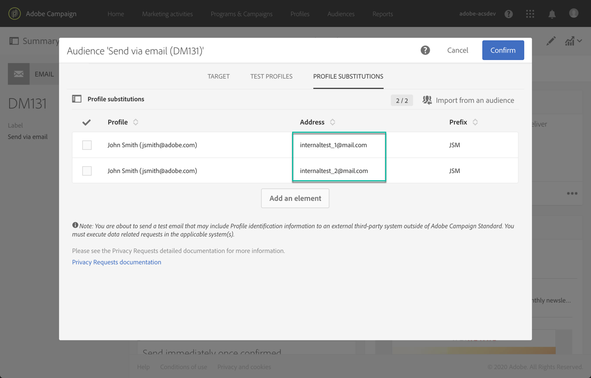

# 타겟팅된 프로필을 사용하여 이메일 메시지 테스트 {#testing-message-profiles}

## 개요 {#overview}

또한 [테스트 프로필](../../audiences/using/managing-test-profiles.md)에 자신을 타깃팅된 프로필 중 하나의 위치에 배치하여 이메일 메시지를 테스트할 수 있습니다. 그러면 프로필에서 받을 메시지(사용자 정의 필드, 동적 및 개인화된 정보, 워크플로우의 추가 데이터 포함..)를 정확하게 표현할 수 있습니다.

>[!NOTE]
>
> 이 기능은 이메일 메시지만 사용할 수 있습니다.

주요 단계는 다음과 같습니다.

1. 메시지를 구성한 다음 **준비** 단계를 시작합니다.
1. **메시지를** 타깃팅한 프로필 중에서 하나 또는 여러 프로필을 선택합니다.
1. 각 프로필에 연결할 **대체 주소**&#x200B;로 교정본을 보낼 수 있습니다.
1. (선택 사항) 각 프로필에 대해 **prefix**&#x200B;을(를) 정의하여 입증 대상 라인에 추가합니다.
1. **이메일** 디자이너는 프로필에 대한 메시지가 표시되는 방식을 미리 봅니다.
1. 교정본을 보내

>[!IMPORTANT]
>
>이 기능을 사용하면 프로필 개인 정보를 외부 이메일 주소로 보낼 수 있습니다. Campaign Standard에서 개인 정보 요청(GDPR 및 CPA)을 실행하면 해당 요청이 외부에서 실행되지 않습니다.

 [비디오에서 이 기능 살펴보기](#video)

## 프로필 및 대체 주소 선택 {#selecting-profiles}

테스트를 위해 대상 프로파일을 사용하려면 먼저 해당 프로파일을 선택한 다음 교정을 받을 대체 주소를 정의해야 합니다. 이렇게 하려면 대상 프로필 중 [특정 프로필](#selecting-individual-profiles)을 선택하거나 기존 대상](#importing-from-audience)에서 프로필 가져오기[

>[!NOTE]
>
>테스트할 프로파일을 최대 100개까지 선택할 수 있습니다.

### 개별 프로필 선택 {#selecting-individual-profiles}

1. 메시지 대시보드에서 메시지 준비가 성공했는지 확인한 다음 **[!UICONTROL Audience]** 블록을 클릭합니다.

   

1. **[!UICONTROL Profile substitutions]** 탭에서 **[!UICONTROL Create element]** 단추를 클릭하여 테스트에 사용할 프로파일을 선택합니다.

   

1. 메시지를 기준으로 하는 프로필 목록을 표시하려면 프로필 선택 단추를 클릭합니다.

   

1. 테스트에 사용할 프로필을 선택한 다음 원하는 대체 주소를 **[!UICONTROL Address]** 필드에 입력한 다음 **[!UICONTROL Confirm]**&#x200B;을 클릭합니다. 프로필을 대상으로 하는 모든 교정은 이 프로필에 대해 데이터베이스에 정의된 교정이 아닌 이 이메일 주소로 전송됩니다.

   교정쇄의 대상 행에 특정 접두사를 추가하려면 **[!UICONTROL Subject line prefix]** 필드를 채웁니다.

   >[!NOTE]
   >
   >제목 줄 접두어는 최대 500자까지 사용할 수 있습니다.

   

   접두사가 다음과 같이 표시됩니다.

   

1. 프로파일이 대체 주소와 접두사와 연결된 채 목록에 추가됩니다. 테스트에 사용할 모든 프로파일에 대해 위 단계를 반복한 다음 **[!UICONTROL Confirm]**&#x200B;을 클릭합니다.

   

   동일한 프로파일에 대한 여러 대체 주소로 교정을 보내려면 이 프로파일을 원하는 횟수만큼 추가해야 합니다.

   아래 예에서 프로필 John Smith를 기반으로 한 자료는 두 개의 다른 대체 주소로 전송됩니다.

   

1. 모든 프로필 및 대체 주소가 정의된 경우 메시지를 테스트하기 위한 증명을 보낼 수 있습니다. 이렇게 하려면 **[!UICONTROL Test]** 단추를 클릭한 다음 수행할 테스트 유형을 선택합니다.

   메시지 대상에 테스트 프로필이 추가되지 않은 경우 **[!UICONTROL Email rendering]** 및 **[!UICONTROL Proof + Email rendering]** 옵션을 사용할 수 없습니다.  교정본을 보내는 방법에 대한 자세한 내용은 [이 섹션](../../sending/using/sending-proofs.md)을 참조하십시오.

   

>[!IMPORTANT]
>
>메시지를 변경하는 경우 메시지 준비를 다시 시작하십시오. 그렇지 않으면 변경 내용이 증명에 반영되지 않습니다.

### 대상 {#importing-from-audience}에서 프로필 가져오기

Campaign Standard을 사용하면 테스트에 사용할 수 있는 프로필 대상을 가져올 수 있습니다. 예를 들어 다른 프로필을 대상으로 하는 전체 메시지 집합과 고유한 이메일 주소로 보낼 수 있습니다.

또한 대상이 주소와 접두사 열로 이미 구성된 경우 **[!UICONTROL Profile substitutions]** 탭에서 이러한 정보를 가져올 수 있습니다. 대체 주소가 있는 대상 가져오기의 예는 [이 섹션](#use-case)에 자세히 설명되어 있습니다.

>[!NOTE]
>
>대상을 가져올 때는 메시지 대상에 해당하는 프로파일만 선택하고 **[!UICONTROL Profile substitutions]** 탭에 추가됩니다.

대상자로부터 테스트에 사용할 프로필을 가져오려면 다음 단계를 수행합니다.

1. 메시지 대시보드에서 메시지 준비가 성공했는지 확인한 다음 **[!UICONTROL Audience]** 블록을 클릭합니다.

   

1. **[!UICONTROL Profile substitutions]** 탭에서 **[!UICONTROL Import from an audience]**&#x200B;을(를) 클릭합니다 .

   

1. 사용할 대상을 선택한 다음, 대용 주소와 사용자에게 전송된 교본에 사용할 접두사를 입력합니다.

   >[!NOTE]
   >
   >제목 줄 접두어는 최대 500자까지 사용할 수 있습니다.

   

   사용할 대체 주소 및/또는 접두사가 이미 대상에 정의되어 있는 경우 **[!UICONTROL From Audience]** 옵션을 선택한 다음 이러한 정보를 검색하는 데 사용할 열을 지정합니다.

   

1. **[!UICONTROL Import]** 버튼을 클릭합니다. 메시지 대상에 해당하는 대상의 프로필은 관련 대체 주소 및 접두사는 물론 **[!UICONTROL Profile substitution]** 탭에 추가됩니다.

>[!NOTE]
>
>동일한 대상을 다시 한 번 불러오고 서로 다른 대체 주소 및/또는 접두사가 있는 경우 이전 가져오기에서 가져온 프로필 외에 프로필이 목록에 추가됩니다.

## 대상 프로파일이 있는 메시지 미리 보기

>[!NOTE]
>
>미리 보기는 이메일 디자이너에서만 사용할 수 있습니다.

대상 프로필을 사용하여 메시지를 미리 보려면 해당 프로필을 **[!UICONTROL Profile substitution]** 목록에 추가해야 합니다([프로필 및 대체 주소 정의](#selecting-profiles) 참조).

메시지에 개인화 필드를 사용하려면 메시지 준비를 시작하기 전에 **을(를) 추가해야 합니다.** 그렇지 않으면 미리 보기에서 고려하지 않습니다. 그 결과, 개인화 필드가 변경되면 메시지 준비를 다시 시작해야 합니다.

프로필 대체를 사용하여 메시지를 미리 보려면 다음 단계를 수행합니다.

1. 메시지 대시보드에서 컨텐츠 스냅샷을 클릭하여 이메일 디자이너에서 메시지를 엽니다.

   

1. **[!UICONTROL Preview]** 탭을 선택한 다음 **[!UICONTROL Change profile]**&#x200B;을 클릭합니다.

   

1. 테스트를 위해 추가된 대체 프로필을 표시하려면 **[!UICONTROL Profile Substitution]** 탭을 클릭합니다.

   미리 보기에 사용할 프로파일을 선택한 다음 **[!UICONTROL Select]**&#x200B;을 클릭합니다.

   

1. 메시지 미리 보기가 표시됩니다. 화살표를 사용하여 선택한 프로필 간을 이동할 수 있습니다.

   

## 사용 사례 {#use-case}

이 경우 특정 프로필 세트에 개인화된 이메일 뉴스레터를 발송합니다. 뉴스레터를 보내기 전에 타깃팅된 프로필 중 일부를 사용하여 뉴스레터를 미리 보고 외부 파일에 정의된 내부 이메일 주소로 교정을 보내려고 합니다.

이 사용 사례에 대한 주요 단계는 다음과 같습니다.

1. 테스트에 사용할 대상을 만듭니다.
1. 프로파일을 타깃팅하고 뉴스레터를 발송하는 워크플로우를 만듭니다.
1. 메시지의 프로필 대체 요소를 구성합니다.
1. 타깃팅된 프로파일을 사용하여 메시지를 미리 봅니다.
1. 증명을 보냅니다.

### 1단계:테스트에 사용할 대상 만들기

1. 가져올 파일을 준비하여 대상을 만듭니다. 본사의 경우, 교본에 사용할 대체 주소와 도표 제목 줄에 추가할 접두사가 포함되어야 합니다.

   이 예에서, &quot;oliver.vaughan@internal.com&quot; 이메일 주소는 &quot;john.doe@mail.com&quot; 이메일 주소로 프로파일을 타깃팅하는 메시지의 증거를 수신합니다. &quot;JD&quot; 접두사가 증빙 제목 줄에 추가됩니다.

   

1. 파일에서 대상을 만드는 워크플로우를 만듭니다. 이렇게 하려면 아래 활동을 추가하고 구성합니다.

   * **[!UICONTROL Load file]** 활동:CSV 파일을 가져옵니다(이 활동에 대한 자세한 내용은  [이 섹션](../../automating/using/load-file.md) 참조).
   * **[!UICONTROL Reconciliation]** 활동:파일의 정보를 데이터베이스의 정보에 연결합니다. 이 예에서는 프로필의 이메일 주소를 조정 필드로 사용합니다(이 활동에 대한 자세한 내용은 [이 섹션](../../automating/using/reconciliation.md) 참조).
   * **[!UICONTROL Save audience]** 활동:가져온 파일을 기반으로 대상자를 만듭니다. 이 활동에 대한 자세한 내용은  [이 섹션을 참조하십시오](../../automating/using/save-audience.md).

   

1. 워크플로우를 실행한 다음 **[!UICONTROL Audiences]** 탭으로 이동하여 대상이 원하는 정보와 함께 작성되었는지 확인합니다.

   이 예에서는 대상이 3개의 프로필로 구성됩니다. 각 이메일은 입증 문서의 제목 줄에 사용할 접두사와 함께 증빙 자료를 수신할 대체 이메일 주소에 연결됩니다.

   

### 2단계:프로파일을 타깃팅하고 뉴스레터를 발송하는 워크플로우를 만듭니다.

1. **[!UICONTROL Query]** 및 **[!UICONTROL Email delivery]** 활동을 추가한 다음 필요에 따라 구성합니다([쿼리](../../automating/using/query.md) 및 [이메일 배달](../../automating/using/email-delivery.md) 섹션 참조).

   

1. 워크플로우를 실행하고 메시지 준비가 성공적으로 완료되었는지 확인합니다.

### 3단계:메시지의 프로필 대체 탭 구성

1. **[!UICONTROL Email delivery]** 활동을 엽니다. 메시지 대시보드에서 **[!UICONTROL Audience]** 블록을 클릭합니다.

   

1. **[!UICONTROL Profile substitutions]** 탭을 선택한 다음 **[!UICONTROL Import from an audience]**&#x200B;을 클릭합니다.

   

1. **[!UICONTROL Audience]** 필드에서 파일에서 만든 대상을 선택합니다.

   

1. 교정을 보낼 때 사용할 대체 주소와 제목 줄 접두사를 정의합니다.

   이렇게 하려면 **[!UICONTROL From audience]** 옵션을 선택한 다음 정보가 포함된 대상의 열을 선택합니다.

   

1. **[!UICONTROL Import]** 버튼을 클릭합니다. 대상 프로필의 관련 대체 주소와 제목 줄 접두사와 함께 목록에 추가됩니다.

   

   >[!NOTE]
   >
   >이 경우 대상의 모든 프로필은 **[!UICONTROL Query]** 활동의 대상이 됩니다. 이러한 프로필 중 하나가 메시지 대상에 속하지 않으면 목록에 추가되지 않습니다.

### 4단계:대상 프로필을 사용하여 메시지 미리 보기

1. 메시지 대시보드에서 컨텐츠 스냅샷을 클릭하여 이메일 디자이너에서 메시지를 엽니다.

   

1. **[!UICONTROL Preview]** 탭을 선택한 다음 **[!UICONTROL Change profile]**&#x200B;을 클릭합니다.

   

1. 이전에 추가된 대체 프로필을 표시하려면 **[!UICONTROL Profile Substitution]** 탭을 클릭합니다.

   미리 보기에 사용할 프로파일을 선택한 다음 **[!UICONTROL Select]**&#x200B;을 클릭합니다.

   

1. 메시지 미리 보기가 표시됩니다. 화살표를 사용하여 선택한 프로필 간을 이동할 수 있습니다.

   

### 5단계:교정본 보내기

1. 메시지 대시보드에서 **[!UICONTROL Test]** 단추를 클릭한 다음 확인합니다.

   

1. 교정본은 **[!UICONTROL Profile substitutions]** 탭에서 구성한 내용에 따라 전송됩니다.

   

## 자습서 비디오 {#video}

이 비디오에서는 프로필 대체를 사용하여 이메일 메시지를 테스트할 수 있는 방법을 보여줍니다.

>[!VIDEO](https://video.tv.adobe.com/v/32368?quality=12)

추가 Campaign Standard 방법 비디오는 [여기](https://experienceleague.adobe.com/docs/campaign-standard-learn/tutorials/overview.html?lang=ko)에서 사용할 수 있습니다.
