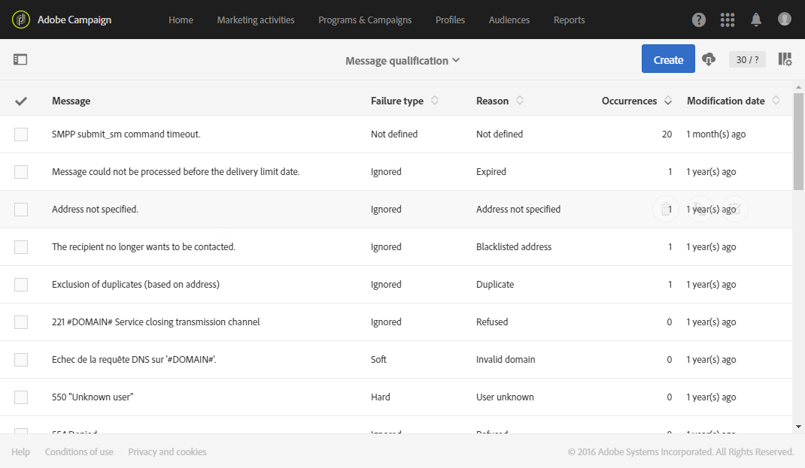

# 게재 실패 이해{#understanding-delivery-failures}

## 배달 실패 정보 {#about-delivery-failures}

게재를 프로필로 보낼 수 없는 경우 원격 서버는 오류 메시지를 자동으로 보냅니다. 오류 메시지는 Adobe Campaign 플랫폼에서 선택되었고 이메일 주소 또는 전화 번호를 격리해야 하는지 여부를 결정할 수 있습니다. 바운스 [메일 자격을](#bounce-mail-qualification)참조하십시오.

>[!NOTE]
>
>**이메일** 오류 메시지(또는 &quot;바운스 수&quot;)는 inMail 프로세스에서 사용할 수 있습니다. **SMS** 오류 메시지(또는 &quot;상태 보고서&quot;의 경우 &quot;SR&quot;)는 MTA 프로세스에서 인증합니다.

주소가 격리되거나 프로필이 차단되는 경우 배달 준비 중에 메시지를 제외할 수도 있습니다. 제외된 메시지는 배달 대시보드의 **[!UICONTROL Exclusion logs]**탭에 나열됩니다([이 섹션](../../sending/using/monitoring-a-delivery.md#exclusion-logs)참조).

**관련 항목:**

* [스팸 차단 관리 이해](../../sending/using/understanding-quarantine-management.md)
* [Campaign에서 블랙 목록 관리](../../audiences/using/about-opt-in-and-opt-out-in-campaign.md)

## 메시지에 대한 배달 실패 식별 {#identifying-delivery-failures-for-a-message}

배달을 전송하면 **[!UICONTROL Sending logs]**탭([이 섹션](../../sending/using/monitoring-a-delivery.md#sending-logs)참조)을 통해 각 프로필에 대한 배달 상태, 연관된 실패 유형 및 이유를 볼 수 있습니다(배달 실패 유형 및 이유참조).

전용 특별 할인 보고서를 사용할 수도 있습니다. 이 보고서는 바운스 자동 처리와 배달 중에 발생한 전체 하드 및 소프트 오류에 대해 자세히 설명합니다. For more on this, refer to [this section](../../reporting/using/bounce-summary.md).

## 배달 실패 유형 및 이유 {#delivery-failure-types-and-reasons}

배달이 실패할 경우 다음 세 가지 유형의 오류가 있습니다.

* **하드**:&quot;하드&quot; 오류는 잘못된 주소를 나타냅니다. 여기에는 다음과 같이 주소가 잘못되었음을 명시적으로 표시하는 오류 메시지가 포함됩니다.&quot;알 수 없는 사용자&quot;입니다.
* **소프트**:이것은 일시적인 오류이거나 다음과 같이 분류할 수 없는 오류일 수 있습니다.&quot;잘못된 도메인&quot; 또는 &quot;사서함 꽉 참&quot;입니다.
* **무시됨**:이것은 &quot;부재 중&quot;과 같이 임시적인 것으로 알려진 오류이거나, 예를 들어, 발신자 유형이 &quot;postmaster&quot;인 경우 기술 오류입니다.

배달 실패의 가능한 원인은 다음과 같습니다.

* **[!UICONTROL User unknown]**(하드 유형):주소가 없습니다. 이 프로필에 대해 추가 배달을 시도하지 않습니다.
* **[!UICONTROL Quarantined address]**(하드 유형):그 주소는 검역소에 보관되었다.
* **[!UICONTROL Unreachable]**(소프트/하드 유형):메시지 배달 체인에 오류가 발생했습니다(SMTP 중계에서의 장애, 도메인에 일시적으로 연결할 수 없음 등). 공급자가 반환한 오류에 따라 주소가 직접 격리 상태로 전송되거나 Campaign이 격리 상태를 강제 적용하거나 오류 수가 5개가 될 때까지 배달을 다시 시도합니다.
* **[!UICONTROL Address empty]**(하드 유형):주소가 정의되지 않았습니다.
* **[!UICONTROL Mailbox full]**(소프트 유형):이 사용자의 사서함이 가득 찼으므로 더 많은 메시지를 받을 수 없습니다. 이 주소를 격리 목록에서 제거하여 다시 시도할 수 있습니다. 30일 후 자동으로 제거됩니다.

   In order for the address to be automatically removed from the list of quarantined addresses, the **[!UICONTROL Database cleanup]**technical workflow must be started.

* **[!UICONTROL Refused]**(소프트/하드 유형):스팸 보고서로 보안 피드백이 발생하여 주소가 격리되었습니다. 공급자가 반환한 오류에 따라 주소가 직접 격리 상태로 전송되거나 Campaign이 격리 상태를 강제 적용하거나 오류 수가 5개가 될 때까지 배달을 다시 시도합니다.
* **[!UICONTROL Duplicate]**:세그먼테이션에서 주소가 이미 감지되었습니다.
* **[!UICONTROL Not defined]**(소프트 유형):오류가 아직 증가하지 않았기 때문에 주소가 적격 상태입니다.

   이 유형의 오류는 서버에서 새 오류 메시지를 보낼 때 발생합니다.격리된 오류일 수 있지만 다시 발생하면 오류 카운터가 증가하여 기술 팀에 경고가 표시됩니다.

* **[!UICONTROL Error ignored]**:주소는 허용 목록에 있으며 어떤 경우든 전자 메일이 발송됩니다.
* **[!UICONTROL Blacklisted address]**:발송 당시 주소가 차단되었다.
* **[!UICONTROL Account disabled]**(소프트/하드 유형):IAP(Internet Access Provider)가 장기간 동안 사용되지 않는 경우 사용자의 계정을 닫을 수 있습니다.그러면 사용자의 주소로 배달할 수 없습니다. 소프트 또는 하드 유형은 받은 오류 유형에 따라 달라집니다.계정이 6개월 동안 비활성화되어 계속 활성화될 수 있는 경우 상태가**[!UICONTROL Erroneous]** 할당되고 배달이 다시 시도됩니다. 오류가 수신되면 계정이 영구적으로 비활성화됨을 나타내는 메시지가 표시되면 즉시 격리로 보내집니다.
* **[!UICONTROL Not connected]**:메시지가 전송될 때 프로필의 휴대 전화가 꺼져 있거나 네트워크에 연결되지 않습니다.
* **[!UICONTROL Invalid domain]**(소프트 유형):이메일 주소의 도메인이 잘못되었거나 더 이상 존재하지 않습니다. 이 프로필은 오류 수가 5에 도달할 때까지 다시 타깃팅됩니다. 이후 레코드는 격리 상태로 설정되며 다시 시도하지 않습니다.
* **[!UICONTROL Text too long]**:sms 메시지의 문자 수가 제한을 초과합니다. 자세한 내용은 SMS[인코딩, 길이 및 음역법을 참조하십시오](../../administration/using/configuring-sms-channel.md#sms-encoding--length-and-transliteration).
* **[!UICONTROL Character not supported by encoding]**:sms 메시지에 인코딩에서 지원되지 않는 문자가 하나 이상 포함되어 있습니다. 자세한 내용은 문자[표 - GSM Standard를 참조하십시오](../../administration/using/configuring-sms-channel.md#table-of-characters---gsm-standard).

## 배달 임시 실패 후 다시 시도 {#retries-after-a-delivery-temporary-failure}

무시됨 유형의 일시적인 오류로 인해 메시지가 **실패하면** 배달 기간 동안 재시도가 수행됩니다. 오류 유형에 대한 자세한 내용은 배달 [실패 유형 및 이유를](#delivery-failure-types-and-reasons)참조하십시오.

배달 기간을 수정하려면 배달 또는 배달 템플릿의 고급 매개 변수로 이동하여 해당 필드에 원하는 기간을 지정합니다. 고급 배달 속성은 [이 섹션에](../../administration/using/configuring-email-channel.md#validity-period-parameters)있습니다.

기본 구성을 사용하면 1시간 간격으로 5회 재시도 후 4일 동안 하루에 1회 재시도를 할 수 있습니다. 전체(Adobe 기술 관리자에게 문의) 또는 각 배달 또는 배달 템플릿의 재시도 횟수( [이 섹션](../../administration/using/configuring-email-channel.md#sending-parameters)참조)를 변경할 수 있습니다.

## 동기 및 비동기 오류 {#synchronous-and-asynchronous-errors}

배달이 전송되면 즉시(동기 오류) 또는 나중에(비동기 오류)에 도달할 수 있습니다.

* **동기 오류**:adobe Campaign 게재 서버에 의해 연결된 원격 서버에서 오류 메시지가 즉시 표시되었습니다. 게재를 프로필의 서버로 보낼 수 없습니다.
* **비동기 오류**:수신 서버에서 나중에 바운스 메일 또는 SR을 다시 보냈습니다. 배달을 보낸 후 1주일까지 비동기 오류가 발생할 수 있습니다.

## 바운스 메일 자격 조건 {#bounce-mail-qualification}

배달 실패 오류 메시지(또는 &quot;SMTP 바운스 응답&quot;)는 Adobe Campaign 플랫폼에서 선택한 다음 **데이터베이스를**&#x200B;사용하여 **하드**, **소프트** 또는 **[!UICONTROL Delivery log qualification]**무시됨으로 처리되고적격상태가 됩니다.

<!--Delivery failure error messages (or "bounces") are picked up by the Adobe Campaign platform and qualified by the inMail process to enrich the list of email management rules.(applies to asynchronous (out-of-band) bounces)-->

이 목록은 관리자만 사용할 수 있으며 Adobe Campaign에서 게재 실패를 검증하기 위해 사용하는 모든 규칙을 포함합니다.

액세스하려면 **[!UICONTROL Adobe Campaign]**로고를 클릭하고 왼쪽 상단에 있는 을**[!UICONTROL Administration > Channels > Email > Email processing rules]**&#x200B;선택합니다.

For more on this, refer to this [section](../../administration/using/configuring-email-channel.md#email-processing-rules).

>[!IMPORTANT]
>
>향상된 MTA로 업그레이드하면 캠페인 테이블의 바운스 자격 **[!UICONTROL Message qualification]**조건은 더 이상 사용되지 않습니다. 동기 배달 실패 오류 메시지의 경우, 향상된 MTA는 바운스 유형 및 자격을 결정하고 해당 정보를 Campaign으로 다시 전송합니다. 비동기 바운스는 여전히 inMail 프로세스에서 자격을 갖습니다.
>
>Adobe Campaign 향상된 MTA에 대한 자세한 내용은 이 [문서를](https://helpx.adobe.com/campaign/kb/campaign-enhanced-mta.html)참조하십시오.

바운스는 다음 자격 상태를 가질 수 있습니다.

* **[!UICONTROL To qualify]**:바운스 메일을 자격을 부여해야 합니다. 플랫폼 제공 기능이 제대로 작동하는지 확인하려면 배달 능력 팀이 검증을 수행해야 합니다. 자격이 없는 경우 바운스 메일은 이메일 처리 규칙 목록을 보완하는 데 사용되지 않습니다.
* **[!UICONTROL Keep]**:바운스 메일은 자격을 얻었으며 기존 이메일 처리**&#x200B;규칙과 비교하고 목록을 보완하기 위해 업데이트&#x200B;**워크플로우에 사용됩니다.
* **[!UICONTROL Ignore]**:바운스 메일은 자격을 얻었지만 배달**&#x200B;가능&#x200B;**워크플로우에 대해서는 업데이트가 사용하지 않습니다. 따라서 클라이언트 인스턴스로 전송되지 않습니다.

다양한 바운스 및 관련 오류 유형 및 이유를 나열하려면 왼쪽 상단에 있는 **[!UICONTROL Adobe Campaign]**로고를 클릭한 다음 선택합니다**[!UICONTROL Administration > Channels > Quarantines > Message qualification]**.

## 이중 옵트인 메커니즘을 사용하여 메일 배달 최적화 {#optimizing-mail-deliverability-with-double-opt-in-mechanism}

이중 옵트인 메커니즘은 이메일을 보낼 때 가장 좋은 방법입니다. 플랫폼이 잘못되거나 유효하지 않은 이메일 주소, 스팸 메일 주소 등을 보호하고 스팸 불만 사항을 방지합니다.

기본 사항은 방문자의 계약을 &#39;프로필&#39;으로 저장하기 전에 확인 이메일을 Campaign 데이터베이스에 보내는 것입니다.방문자가 온라인 랜딩 페이지를 작성한 다음 이메일을 수신하고 확인 링크를 클릭하여 구독을 완료해야 합니다.

For more on this, refer to [this section](../../channels/using/setting-up-a-double-opt-in-process.md).
