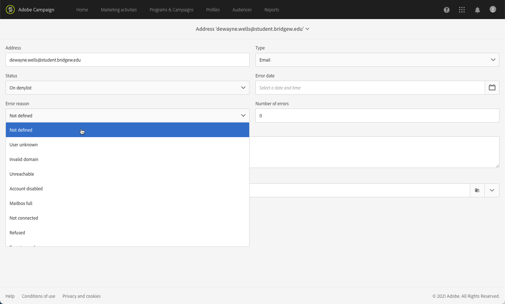

# 격리 관리 이해{#understanding-quarantine-management}

## 격리 기본 정보 {#about-quarantines}

이메일 주소나 전화번호를 격리하기도 합니다. 예를 들어 사서함이 가득 찼거나 주소가 존재하지 않는 경우가 있습니다.

어떤 경우든, 격리 절차는 이 [섹션](#conditions-for-sending-an-address-to-quarantine)에서 설명하는 특정한 규칙을 준수합니다.

### 격리를 통한 게재 최적화 {#optimizing-your-delivery-through-quarantines}

이메일 주소나 전화번호가 격리된 프로필은 메시지를 준비하는 동안 자동으로 제외됩니다([게재에 대해 격리된 주소 확인](#identifying-quarantined-addresses-for-a-delivery) 참조). 이를 통해 게재 속도를 높일 수 있습니다. 오류율은 게재 속도에 상당한 영향을 미치기 때문입니다.

일부 인터넷 액세스 제공 업체는 잘못된 주소의 비율이 너무 높은 경우 이메일을 자동으로 스팸으로 간주합니다. 따라서 격리 를 사용하면 이러한 제공 업체에 의해 차단 목록에 추가되지 않습니다.

또한 격리를 통해 잘못된 전화번호를 게재에서 제외하면 SMS를 보내는 비용을 줄이는 데 도움이 됩니다.

게재 보안 향상 및 최적화 모범 사례를 더 알아보려면 [이 페이지](../../sending/using/delivery-best-practices.md)를 참조하십시오.

### 격리와 차단 목록 {#quarantine-vs-denylist}

격리 및차단 목록은 동일한 객체에 적용되지 않습니다.

* **격리** 에만 적용 **주소** (또는 전화 번호 등)가 아닌 프로필 자체가 아닌 다른 프로필로 전송됩니다. 예를 들어, 프로필의 이메일 주소가 격리되면 프로필을 업데이트하여 새 주소를 입력하면 게재 작업 시 다시 타겟팅될 수 있습니다. 마찬가지로, 두 프로필에 동일한 전화 번호가 있는 경우 해당 번호가 격리되면 두 프로필 모두에 영향을 줍니다.

   격리된 주소 또는 전화 번호는 [제외 로그](#identifying-quarantined-addresses-for-a-delivery) (게재의 경우) 또는 [격리 목록](#identifying-quarantined-addresses-for-the-entire-platform) (전체 플랫폼에 대해)

* 설정 **차단 목록**&#x200B;반면에, 은 **프로필** 지정된 채널에 대해 구독 취소(옵트아웃) 후와 같이, 더 이상 게재의 타깃팅되지 않습니다. 예를 들어 이메일 채널에 대한차단 목록에 두 개의 이메일 주소가 있는 경우 두 주소가 모두 게재에서 제외됩니다. 프로세스에 대한 자세한 차단 목록 내용은 [Campaign의 옵트인 및 옵트아웃 기본 정보](../../audiences/using/about-opt-in-and-opt-out-in-campaign.md).

   프로필이에서 하나 이상차단 목록의 채널에 있는지 확인할 수 있습니다 **[!UICONTROL No longer contact (on denylist)]** 프로필의 섹션 **[!UICONTROL General]** 탭. [이 섹션](../../audiences/using/managing-opt-in-and-opt-out-in-campaign.md#managing-opt-in-and-opt-out-from-a-profile)을 참조하십시오.

>[!NOTE]
>
>격리에 **차단 목록** 상태: 수신자가 메시지를 스팸으로 보고하거나 &quot;STOP&quot; 등의 키워드를 사용하여 SMS 메시지에 회신할 때 적용됩니다. 이 경우 프로필의 관련 주소 또는 전화 번호는 **[!UICONTROL On denylist]** 상태. STOP SMS 메시지 관리에 대한 자세한 내용은 [이 섹션](../../channels/using/managing-incoming-sms.md#managing-stop-sms).

<!--When a user replies to an SMS message with a keyword such as STOP in order to opt-out from SMS deliveries, his profile is not added to the denylist like in the email opt-out process. Instead, the profile's phone number is sent to quarantine with the **[!UICONTROL On denylist]** status. This status refers to the phone number only, meaning that the profile will continue receiving email messages.<!-- Also, if the profile has another phone number, he can still receive SMS messages on the other number. For more on this, refer to [this section](../../channels/using/managing-incoming-sms.md#managing-stop-sms).-->

## 격리된 주소 확인 {#identifying-quarantined-addresses}

특정 게재 또는 플랫폼 전체에 대해 격리된 주소를 표시할 수 있습니다.

<!--
If you need to remove an address from quarantine, contact your technical administrator.
-->

### 게재에 대해 격리된 주소 확인 {#identifying-quarantined-addresses-for-a-delivery}

특정 게재에 대해 격리된 주소 목록은 게재 준비 단계 중 게재 대시보드의 **[!UICONTROL Exclusion logs]** 탭에서 확인할 수 있습니다([이 섹션](../../sending/using/monitoring-a-delivery.md#exclusion-logs) 참조). 게재 준비에 대한 자세한 정보는 [이 섹션](../../sending/using/preparing-the-send.md)을 참조하십시오.

### 플랫폼 전체에 대해 격리된 주소 확인 {#identifying-quarantined-addresses-for-the-entire-platform}

관리자는 **[!UICONTROL Administration > Channels > Quarantines > Addresses]** 메뉴 아래의 제품에서 사용할 수 있습니다.

<!--
This menu lists quarantined elements for **Email**, **SMS** and **Push notification** channels.
-->

>[!NOTE]
>
>격리 수의 증가는 데이터베이스의 &quot;소모&quot;와 관련된 정상적인 현상입니다. 예를 들어 이메일 주소의 수명을 3년으로 보고 수신자 표가 매년 50%씩 증가할 경우, 격리 증가는 다음과 같이 계산할 수 있습니다. 첫 해가 끝나는 시점: (1*0.33)/(1+0.5)=22% 두 번째 해가 끝나는 시점: ((1.22*0.33)+0.33)/(1.5+0.75)=32.5% 

필터를 사용하여 목록을 탐색할 수 있습니다. 주소, 상태 및/또는 채널을 필터링할 수 있습니다.

또는 를 편집할 수 있습니다 [delete](#removing-a-quarantined-address) 각 항목을 만들고 새 항목을 만듭니다.

항목을 편집하려면 해당 행을 클릭하고 필요에 따라 필드를 수정합니다.

새 항목을 수동으로 추가하려면 **[!UICONTROL Create]** 버튼을 클릭합니다.

주소(또는 전화 번호 등)를 정의합니다. 및 채널 유형을 지정합니다. 격리 목록에 있을 상태와 오류 이유를 설정할 수 있습니다. 오류가 발생한 날짜, 오류 수를 지정하고 오류 텍스트를 입력할 수도 있습니다. 필요한 경우 드롭다운 목록에서 주소로 전송된 마지막 배달을 선택합니다.

### 격리된 주소 제거 {#removing-a-quarantined-address}

필요한 경우 격리 목록에서 주소를 수동으로 제거할 수 있습니다. 또한 특정 조건과 일치하는 주소는 격리 목록에서 **[!UICONTROL Database cleanup]** 워크플로우. (기술 워크플로우에 대한 자세한 내용은 [이 섹션](../../administration/using/technical-workflows.md#list-of-technical-workflows))

격리 목록에서 주소를 수동으로 제거하려면 아래 작업 중 하나를 수행합니다.

>[!IMPORTANT]
격리 시 이메일 주소를 수동으로 삭제하는 것은 이 주소로 다시 배달하기 시작함을 의미합니다. 따라서 게재 능력과 IP 평판에 심각한 영향을 줄 수 있으므로 IP 주소 또는 전송 도메인이 차단될 수 있습니다. 격리된 주소 제거를 고려할 때 추가 주의가 필요합니다. 확실하지 않은 경우 게재 가능성 전문가에게 문의하십시오.

* 에서 주소를 선택합니다 **[!UICONTROL Administration > Channels > Quarantines > Addresses]** 목록 및 선택 **[!UICONTROL Delete element]**.

   

* 주소를 선택하고 주소 변경 **[!UICONTROL Status]** to **[!UICONTROL Valid]**.

   

   상태를 **[!UICONTROL On allowlist]**. 이 경우 주소는 격리 목록에 남아 있지만 오류가 발생하는 경우에도 체계적으로 타겟팅됩니다.

다음과 같은 경우 주소가 격리 목록에서 자동으로 제거됩니다.

* 의 주소 **[!UICONTROL Erroneous]** 게재가 성공하면 상태가 격리 목록에서 제거됩니다.
* 의 주소 **[!UICONTROL Erroneous]** 10일 이상 전에 마지막 소프트 바운스가 발생한 경우 상태가 격리 목록에서 제거됩니다. 소프트 오류 관리에 대한 자세한 내용은 [이 섹션](#soft-error-management).
* 의 주소 **[!UICONTROL Erroneous]** 다음으로 바운스된 상태 **[!UICONTROL Mailbox full]** 30일 후 격리 목록에서 오류가 제거됩니다.

그러면 상태가 **[!UICONTROL Valid]**.

>[!IMPORTANT]
주소가 있는 수신자 **[!UICONTROL Quarantine]** 또는 **[!UICONTROL On denylist]** 상태는 이메일을 수신하더라도 자동으로 제거되지 않습니다.

다음 경우에 수행할 최대 다시 시도 횟수입니다 **[!UICONTROL Erroneous]** 상태 및 다시 시도 사이의 최소 지연은 IP가 과거 및 현재 지정된 도메인에서 얼마나 성과가 있는지 기준으로 합니다.

## 주소를 격리하는 조건 {#conditions-for-sending-an-address-to-quarantine}

Adobe Campaign은 게재 실패 유형 및 오류 메시지 자격 중에 할당된 이유에 따라 격리를 관리합니다([게재 실패 유형 및 이유](../../sending/using/understanding-delivery-failures.md#delivery-failure-types-and-reasons)와 [반송 메일 자격](../../sending/using/understanding-delivery-failures.md#bounce-mail-qualification) 참조).

* **무시된 오류**: 오류가 무시된 경우 주소가 격리되지 않습니다.
* **하드 오류**: 해당 이메일 주소가 즉시 격리됩니다.
* **소프트 오류**: 소프트 오류의 경우 주소가 즉시 격리되지는 않지만, 오류 카운터가 증가합니다. 자세한 내용은 [소프트 오류 관리](#soft-error-management).

   <!--
  When the error counter reaches the limit threshold, the address goes into quarantine. In the default configuration, the threshold is set at five errors, where two errors are significant if they occur at least 24 hours apart. The address is placed in quarantine at the fifth error. The error counter threshold can be modified. For more on this, refer to this [page](../../administration/using/configuring-email-channel.md#email-channel-parameters).
  When a delivery is successful after a retry, the error counter of the address which was prior to that quarantined is reinitialized. The address status changes to **[!UICONTROL Valid]** and it is deleted from the list of quarantines after two days by the **[!UICONTROL Database cleanup]** workflow.
  -->

사용자가 이메일을 스팸 처리하면([피드백 루프](https://experienceleague.adobe.com/docs/deliverability-learn/deliverability-best-practice-guide/transition-process/infrastructure.html#feedback-loops)). 메시지는 Adobe에서 관리하는 기술 사서함으로 자동 리디렉션됩니다. 그러면 사용자의 이메일 주소가 자동으로 **[!UICONTROL On denylist]** 상태로 격리됩니다. 이 상태는 주소만 참조하고, 프로필은에 차단 목록 없습니다. 따라서 사용자는 계속해서 SMS 메시지와 푸시 알림을 수신합니다.

>[!NOTE]
Adobe Campaign의 격리는 대소문자를 구분합니다. 이메일 주소를 소문자로 가져와야 이후에 다시 타겟팅되지 않습니다.

격리된 주소 목록([플랫폼 전체에 대해 격리된 주소 확인](#identifying-quarantined-addresses-for-the-entire-platform) 참조)의 **[!UICONTROL Error reason]** 필드에 선택한 주소가 격리된 이유가 표시됩니다.

### 소프트 오류 관리 {#soft-error-management}

하드 오류와 달리 소프트 오류의 경우 주소가 즉시 격리되지는 않지만, 오류 카운터가 증가합니다.

다음 기간 동안 다시 시도가 수행됩니다 [게재 기간](../../administration/using/configuring-email-channel.md#validity-period-parameters). 오류 카운터가 제한 임계값에 도달하면 주소가 격리됩니다. 자세한 내용은 [일시적 게재 실패 후 다시 시도](understanding-delivery-failures.md#retries-after-a-delivery-temporary-failure).

<!--In the default configuration, the threshold is set at five errors, where two errors are significant if they occur at least 24 hours apart. The address is placed in quarantine at the fifth error.
The error counter threshold can be modified.-->

10일 이전에 마지막으로 중요한 오류가 발생한 경우 오류 카운터는 다시 초기화됩니다. 그러면 주소 상태가 **유효한** 그리고 격리 목록에서 **데이터베이스 정리** 워크플로우. (기술 워크플로우에 대한 자세한 내용은 [이 섹션](../../administration/using/technical-workflows.md#list-of-technical-workflows))
