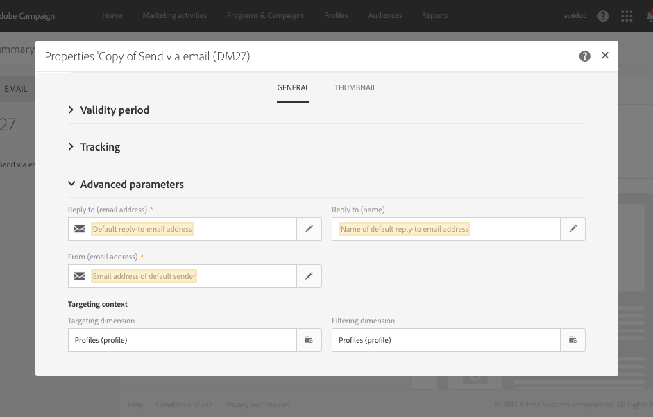

# 템플릿 사용 {#use-templates}

전달 템플릿을 사용하면 대부분의 일반적인 유형의 활동에 대해 미리 만들어진 시나리오를 제공하여 효율성을 높일 수 있습니다. 템플릿을 사용하면 마케터는 짧은 시간에 맞춤화를 최소화하면서 새로운 캠페인을 배포할 수 있습니다.

이 섹션에서 배달 템플릿에 대한 자세한 내용 [을 살펴보십시오](../../start/using/marketing-activity-templates.md).

## 전달 템플릿 시작하기 {#gs-templates}

배달 템플릿을 [사용하면](../../start/using/marketing-activity-templates.md#creating-a-new-template) 사용자의 요구 사항에 부합하고 향후 게재에 재사용할 수 있는 기술 및 기능 속성 세트를 한 번 정의할 수 있습니다. 그런 다음 시간을 절약하고 필요에 따라 배달을 표준화할 수 있습니다.

Adobe Campaign에서 여러 브랜드를 관리하는 경우, Adobe은 브랜드당 하나의 하위 도메인을 가질 것을 권장합니다. 예를 들어 은행은 각 지역 기관에 해당하는 여러 하위 도메인을 가질 수 있습니다. 은행이 bluebank.com 도메인을 보유하고 있는 경우 해당 하위 도메인은 @ny.bluebank.com, @ma.bluebank.com, @ca.bluebank.com 등이 될 수 있습니다. 하위 도메인당 하나의 배달 템플릿을 사용하면 항상 각 브랜드에 대해 사전 구성된 올바른 매개 변수를 사용할 수 있으므로 오류를 방지하고 시간을 절약할 수 있습니다.

**팁**: Campaign에서 구성 오류를 방지하려면 새 템플릿을 만드는 대신 기본 템플릿을 복제하고 해당 속성을 변경하는 것이 좋습니다.

## 주소 구성

* 보낸 사람의 주소는 이메일을 보낼 수 있도록 허용해야 합니다.

* 일부 ISP(Internet Service Providers)는 메시지를 수락하기 전에 발신자 주소의 유효성을 확인합니다.

* 형식이 잘못되면 수신 서버에서 주소가 거부될 수 있습니다. 정확한 주소를 입력해야 합니다.

* 주소는 발신자를 명시적으로 식별해야 합니다. 도메인은 발신자가 소유해야 하며 발신자에게 등록되어 있어야 합니다.

* Adobe은 배달 및 답글에 대해 지정된 주소에 해당하는 이메일 계정을 만드는 것을 권장합니다. 메시징 시스템 관리자에게 문의하십시오.

이메일 템플릿 속성 **[!UICONTROL Advanced parameters]** 섹션 **[!UICONTROL From (email address)]** 에서 필드는 보낸 사람의 주소에 해당합니다.

주소 도메인은 사용자가 구성한 하위 도메인과 같아야 합니다.

필드는 답글에 사용되는 이메일 주소 및 이름에 해당합니다. **[!UICONTROL Reply to]**

**팁** - Adobe은 브랜드의 고객 지원 센터와 같은 기존 실제 주소를 사용하는 것이 좋습니다. 이 경우 수신자가 응답을 보낼 경우 고객 지원 센터에서 이 응답을 처리할 수 있습니다.

보낸 메시지 헤더에 표시될 보낸 사람의 이름을 변경하려면 이메일 디자이너 홈 페이지(홈 아이콘을 통해 액세스 가능)의 **[!UICONTROL Properties]** 탭으로 이동한 후 **[!UICONTROL Default sender name]** 블록을 클릭합니다.

배송 비율을 높이려면 브랜드 이름과 같이 받는 사람이 쉽게 식별할 수 있는 이름을 사용하는 것이 좋습니다.

**팁** - 수신자의 경험을 더 개선하기 위해 &quot;메가스토어의 엠마&quot;와 같은 이름을 추가할 수 있습니다.

보낸 사람 이름을 개인화하는 방법에 대한 자세한 내용은 [이메일 보낸 사람을 참조하십시오](../../designing/using/subject-line.md#email-sender).

## SMS 발신자 이름 개인화

SMS 템플릿 속성의 **고급 매개 변수** 섹션에서 **보낸 사람** 옵션을 사용하면 문자열을 사용하여 SMS 메시지 보낸 사람의 이름을 개인화할 수 있습니다. 발신자명이란 수신자의 휴대전화에서 SMS 메시지를 보낸 사람으로 표시되는 이름입니다.

이 필드가 비어 있는 경우 외부 계정에서 제공하는 소스 번호가 표시됩니다. 소스 번호가 제공되지 않는 경우 짧은 코드가 사용됩니다. 자세한 내용은 [SMS 구성](../../administration/using/configuring-sms-channel.md)을 참조하십시오.

**팁** - 발신자 주소 수정과 관련하여 해당 국가의 법률을 확인하십시오. 또한 SMS 서비스 공급자에게 문의하여 이 기능을 제공하는지 확인하십시오.

## 컨트롤 그룹 설정

배달을 전송하면 제외된 받는 사람의 동작을 배달을 받은 받는 사람과 비교할 수 있습니다. 그런 다음 캠페인의 효율성을 측정할 수 있습니다. 제어 그룹에 대해 자세히 [알아보십시오](../../sending/using/control-group.md).

## 필터 또는 컨트롤 규칙을 적용하려면 유형 지정 기능을 사용하십시오.

유형학 유형에는 메시지를 보내기 전에 분석 단계 동안 적용되는 확인 규칙이 포함됩니다.

템플릿 속성의 **[!UICONTROL Advanced parameters]** > **[!UICONTROL Preparation]** 섹션에서 필요에 따라 기본 유형을 변경합니다.

예를 들어 아웃바운드 트래픽을 보다 잘 제어하기 위해 하위 도메인당 하나의 관련성을 정의하고 선호도 당 하나의 유형을 만들어 사용할 수 있는 IP 주소를 정의할 수 있습니다. 인스턴스의 구성 파일에 친화성이 정의됩니다. Adobe Campaign 관리자에게 문의하십시오.

For more on typologies, refer to [this section](../../sending/using/managing-typologies.md).

## 브랜드와 템플릿 연결

브랜드 ID와 관련된 보낸 이메일의 매개 변수(예: 브랜드 로고 또는 발신자 주소)는 Adobe Campaign에서 중앙에서 관리됩니다. 하나 또는 여러 개의 브랜드를 만들어 전달 템플릿에 연결할 수 있습니다.

Adobe Campaign에서 브랜드 사용 및 구성에 대한 자세한 내용은 브랜딩을 참조하십시오.

배달 템플릿에 지정된 브랜드를 표시하거나 변경하려면 템플릿의 속성 편집 버튼을 선택하고 브랜드의 세부 정보로 이동합니다.

브랜드와 템플릿을 연결하는 방법에 대한 자세한 내용은 이메일 [에 브랜드 할당을 참조하십시오](../../administration/using/branding.md#assigning-a-brand-to-an-email).

이 섹션 [에서 브랜드를 구성하는 방법을 알아봅니다](../../administration/using/branding.md#creating-a-brand).
