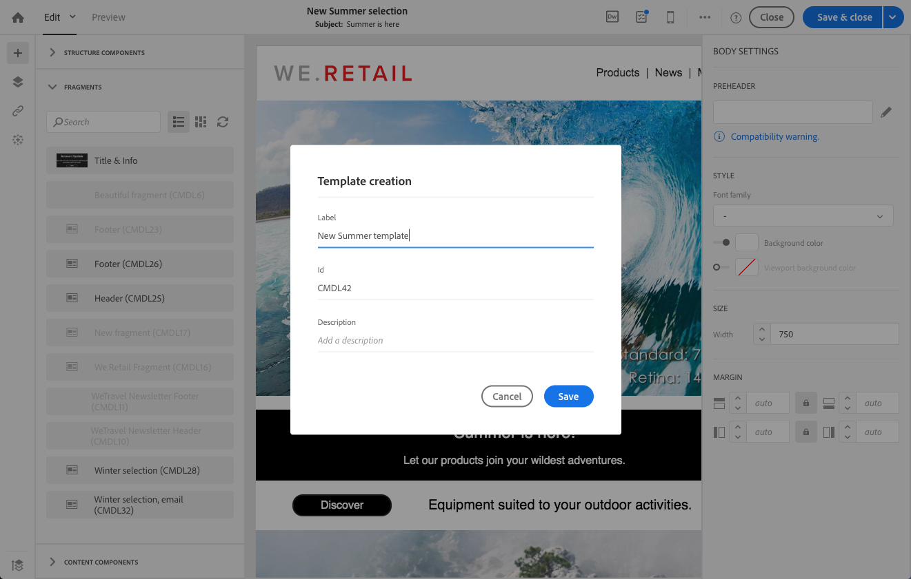

# 템플릿 정보{#about-templates}

## 마케팅 활동 템플릿 {#marketing-activity-templates}

새 마케팅 활동을 만들 때 마법사의 첫 번째 화면에 유형 또는 템플릿을 선택하라는 메시지가 표시됩니다. 템플릿을 사용하면 필요에 따라 특정 매개 변수를 미리 구성할 수 있습니다. 템플릿은 마케팅 활동의 전체 또는 부분 구성을 포함할 수 있습니다. 템플릿 관리는 기능 관리자가 수행합니다.

최종 사용자에게는 간소화된 인터페이스가 있습니다. 새 마케팅 활동을 만들 때 사용하려는 템플릿을 선택하기만 하면 됩니다. 기술 구성에 대해 걱정할 필요가 없습니다. 이 기능은 템플릿의 기능 관리자가 미리 미리 구성했습니다.

예를 들어 이메일 템플릿의 경우 HTML 콘텐츠, 대상 및 배달의 다른 매개 변수를 미리 채울 수 있습니다. 예약, 테스트 프로필, 게재 일반 속성, 고급 매개 변수 등을 이렇게 하면 새 활동을 만들 때 시간을 절약할 수 있습니다.

각 마케팅 활동 유형에 대해 최소 구성으로 하나 또는 여러 개의 기본 템플릿을 사용할 수 있습니다. 이러한 기본 템플릿은 수정하거나 삭제할 수 없습니다.

템플릿은 다음 마케팅 활동에 사용할 수 있습니다.

* 프로그램
* 캠페인
* 이메일 배달
* SMS 배달
* 푸시 알림
* 랜딩 페이지
* 워크플로우
* 서비스
* 가져오기
* 트랜잭션 메시지

이러한 템플릿은 **[!UICONTROL Resources]** &gt; **[!UICONTROL Templates]** 화면에서 관리됩니다.

>[!NOTE]
>
>브랜드 구성은 이메일 또는 랜딩 페이지 템플릿에서 미리 구성할 수 있습니다. 자세한 내용은 [브랜딩](../../administration/using/branding.md) 섹션을 참조하십시오.

## 콘텐츠 템플릿 {#content-templates}

HTML 컨텐츠 템플릿은 고급 메뉴의 **[!UICONTROL Resources]** &gt; **[!UICONTROL Content templates & fragments]** 화면에서 액세스할 수 있습니다. 여기에서 랜딩 페이지 컨텐츠 템플릿, 이메일 컨텐츠 템플릿 및 조각을 관리할 수 있습니다.

기본 컨텐츠 템플릿은 읽기 전용입니다. 이 중 하나를 편집하려면 먼저 복제해야 합니다.

새 템플릿 또는 조각을 만들고 고유한 컨텐츠를 정의할 수 있습니다. 이에 대한 자세한 내용은 컨텐츠 템플릿 [만들기](../../start/using/about-templates.md#creating-a-content-template) 및 컨텐츠 조각 [만들기를](../../designing/using/defining-the-email-structure.md#creating-a-content-fragment)참조하십시오.

이메일 디자이너와 함께 컨텐츠를 편집할 때 컨텐츠를 조각 또는 템플릿으로 저장하여 컨텐츠 템플릿을 만들 수도 있습니다. 이에 대한 자세한 내용은 템플릿으로 컨텐츠 [저장](../../start/using/about-templates.md#saving-content-as-template) 및 [컨텐츠를 조각으로 저장을 참조하십시오](../../designing/using/defining-the-email-structure.md#saving-content-as-a-fragment).

### 즉시 사용 가능한 이메일 콘텐츠 템플릿 {#email-content-templates}

이메일 디자이너 홈 페이지의 **[!UICONTROL Templates]** 탭에서 제공되는 HTML 콘텐츠를 [관리할](../../designing/using/about-email-content-design.md#about-the-email-designer) 수 있습니다.

기본적으로 제공되는 이메일 컨텐츠 템플릿에는 18 개의 모바일용으로 최적화된 레이아웃과 Behance 아티스트가 디자인한 동급 최강의 반응형 템플릿이 포함되어 있습니다. 이것은 고객 환영 메시지, 뉴스레터 및 재참여 이메일과 같은 최신 사용에 해당합니다. 브랜드 콘텐츠를 손쉽게 맞춤화하여 처음부터 이메일을 디자인하는 프로세스를 손쉽게 진행할 수 있습니다.

**관련 항목:**

* 이 비디오에서 콘텐츠 템플릿을 [개인화하는](https://helpx.adobe.com/campaign/kt/acs/using/acs-email_content_templates-feature-video-use.html)방법을 살펴봅니다.
* 컨텐츠 편집에 대한 자세한 내용은 이메일 컨텐츠 디자인을 [참조하십시오](../../designing/using/about-email-content-design.md).

### 컨텐츠 템플릿 만들기 {#creating-a-content-template}

고유한 컨텐츠 템플릿을 만들어 필요에 따라 여러 번 사용할 수 있습니다.

다음 예에서는 이메일 콘텐츠 템플릿을 만드는 방법을 보여 줍니다.

1. 이동 **[!UICONTROL Resources]** &gt; **[!UICONTROL Content templates & fragments]****[!UICONTROL Create]**&#x200B;를 클릭합니다.
1. 이메일 디자이너의 탭에 **[!UICONTROL Properties]** 액세스하려면 이메일 레이블을 클릭합니다.
1. 인식 가능한 레이블을 지정하고 다음 매개 변수를 선택하여 이메일에서 이 템플릿을 사용할 수 있습니다.

   * 드롭다운 **[!UICONTROL Shared]****[!UICONTROL Delivery]** 목록에서 **[!UICONTROL Content type]** 또는을 선택합니다.
   * 드롭다운 **[!UICONTROL Template]** 목록에서 **[!UICONTROL HTML type]** 선택합니다.
   

1. 필요한 경우 템플릿의 썸네일로 사용될 이미지를 설정할 수 있습니다. 템플릿 속성의 **[!UICONTROL Thumbnail]** 탭에서 선택합니다.

   

   이 축소판은 **[!UICONTROL Templates]**[이메일 디자이너](../../designing/using/about-email-content-design.md#about-the-email-designer) 홈 페이지의 탭에 표시됩니다.

1. **[!UICONTROL Properties]** 탭을 닫아 기본 작업 영역으로 돌아갑니다.
1. 필요에 따라 사용자 지정할 수 있는 구성 요소 및 컨텐츠 구성 요소를 추가합니다.
   >[!NOTE]
   >
   > 개인화 필드 또는 조건부 컨텐츠는 컨텐츠 템플릿에 삽입할 수 없습니다.
1. 편집된 후에는 템플릿을 저장합니다.

이제 이 템플릿을 이메일 디자이너로 작성한 모든 이메일에 사용할 수 있습니다. 이메일 **[!UICONTROL Templates]**[디자이너](../../designing/using/about-email-content-design.md#about-the-email-designer) 홈 페이지의 탭에서 선택합니다.

### 컨텐츠를 템플릿으로 저장 {#saving-content-as-template}

이메일 디자이너와 함께 이메일을 편집할 때 해당 이메일의 콘텐트를 템플릿으로 직접 저장할 수 있습니다.

<!--[!CAUTION]
>
>You cannot save as template a structure containing personalization fields or dynamic content.-->

1. 이메일 **[!UICONTROL Save as template]** 디자이너 기본 도구 모음에서를 선택합니다.

   

1. 필요한 경우 레이블 및 설명을 추가한 다음을 클릭합니다 **[!UICONTROL Save]**.

   

1. 방금 만든 템플릿을 찾으려면 **[!UICONTROL Resources]** &gt; **[!UICONTROL Content templates & fragments]**&#x200B;로 이동합니다.

1. 새 템플릿을 사용하려면 **[!UICONTROL Templates]**[이메일 디자이너](../../designing/using/about-email-content-design.md#about-the-email-designer) 홈 페이지의 탭에서 템플릿을 선택합니다.

   

