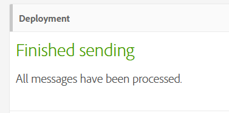
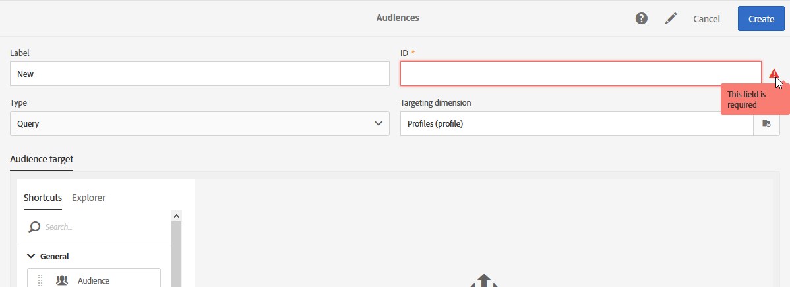
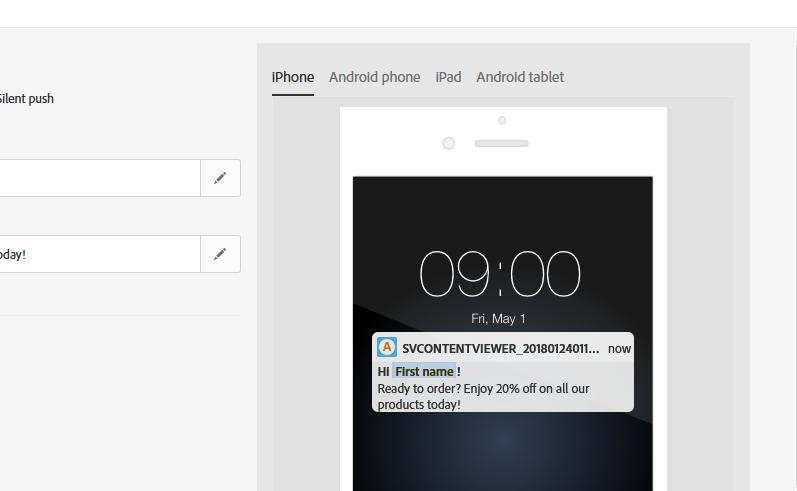
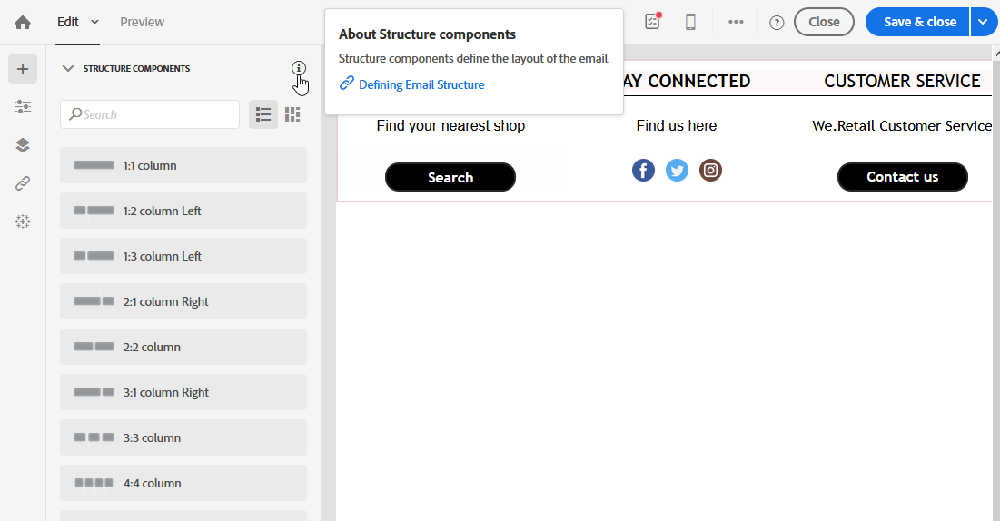

# Adobe Campaign Standard의 접근성 {#accessibility-acs}

Adobe Campaign Standard Workspace의 접근성 지원에 대해 알아봅니다.

접근성이란 시각, 청각, 인지 또는 기타 장애가 있거나 거동이 불편한 사용자가 제품을 사용할 수 있게 하는 것을 의미합니다. 소프트웨어 제품의 액세서빌러티 기능의 예로는 의미있게 구조화된 컨텐츠, 화면 판독기 지원, 그래픽에 상응하는 텍스트, 키보드 단축키 등이 있습니다.

Adobe Campaign Standard은 대비, 레이블, 구조화된 컨텐츠, 키보드 탐색 및 상황에 맞는 도움말과 같은 액세스 가능한 기능을 제공합니다.

## 접근성 기능 {#accessibility-features}

### 대비 및 색상 {#contrast}

Adobe Campaign Standard 유저 인터페이스는 시력이 낮거나 색상이 부족한 사용자가 쉽게 볼 수 있도록 애플리케이션의 충분한 대비를 제공하기 위해 노력하고 있습니다.

* 대조 대비 비율이 3:1인 큰 텍스트와 제목이 향상되었습니다.

   

* 애플리케이션의 도움말 내용과 본문 텍스트가 4.5:1 대비 비율로 업데이트되었습니다.

* 배경색과 전경색의 대비를 개선하기 위해 워크플로우의 일시 중지 및 취소 아이콘이 업데이트되었습니다.

   

* 색상, 모양 및 위치는 애플리케이션에서 정보 또는 계층 구조를 전달하는 데 사용되는 유일한 방법이 아닙니다.

### 사용자 인터페이스 {#user-interface}

Adobe Campaign Standard 유저 인터페이스를 사용하면 시각적 요소에 대체 텍스트를 추가하고 의미 체계 구조를 사용하여 시각적으로 프로그래밍 방식으로 정보를 전달함으로써 모든 사용자가 컨텐츠와 보다 쉽게 상호 작용할 수 있습니다.

* 사용자가 필수 ID 필드를 비워 둘 때 그래픽은 오류 메시지 텍스트와 함께 오류가 있는 필드를 시각적으로 표시하고 화면 판독기와 같은 보조 기술이 있는 사용자에게 동일한 정보를 프로그래밍 방식으로 전달합니다.

   

* 마우스로 가리키거나 초점이 맞춰진 콘텐츠는 사용자가 해제할 수 있으며 다른 콘텐츠를 가리지 않습니다.

   

* 이미지의 대체 텍스트 및 버튼 액세스 가능한 이름에 대한 텍스트가 추가되었으며 요소를 식별하기 위한 시각적 큐에만 의존하지 않고 보조 기술로 큰 소리로 읽을 수 있습니다.

<!--
### Create responsive resize for multiple devices {#resize-devices}

When designing for multiple devices and platforms, it's important to create a seamless experience for screen sizes across mobile and desktop resolutions.

Adobe Campaign Standard allows you to design and test emails and push notifications on different devices such as: iPhone, Android devices, iPad, Android tablet and desktop.

-->

## 상황별 도움말 {#contextual-help}

상황에 맞는 도움말은 필요한 다양한 필드와 기능을 이해하는 데 도움이 됩니다. 또한 선택된 기능의 자세한 내용을 알아보기 위한 제품 설명서로 안내합니다.

이메일을 디자인할 때 기능 설명 및 제품 설명서에 대한 링크를 제공하는 도구 설명에 액세스할 수 있습니다.

## 보조 기술 지원 {#screen-magnifiers}

Adobe는 Adobe Campaign Standard 애플리케이션을 수정된 키보드, 화면 확대경 소프트웨어, 화면 판독기, 음성 인식 소프트웨어 및 기타 보조 디바이스를 비롯한 다양한 보조 기술을 통해 가능한 한 사용할 수 있도록 하기 위해 노력하고 있습니다.

## 원하는 언어로 작업 {#languages}

Adobe Campaign Standard는 영어, 프랑스어 및 독일어의 다양한 언어로 제공됩니다.

설치 시 언어가 설정되어 있으므로 나중에 변경할 수 없습니다.

## 단축키{#shortcuts}

### 홈페이지 {#homepage-shortcuts}

| 단축키 | 작업 |
|:-:|:-:|
| 탭 | 사용자 인터페이스의 개별 요소 탐색 |
| Enter 키 또는 스페이스바 | 선택한 항목 활성화 |

### 이메일 디자이너 {#email-designer-shortcuts}

| 단축키 | 작업 |
|:-:|:-:|
| CTRL + Z | 실행 취소 |
| CTRL + Y | 다시 실행 |

### 동적 보고서 {#report-shortcuts}

| 단축키 | 작업 |
|:-:|:-:|
| CTRL + O | 프로젝트 열기 |
| CTRL + S | 저장. |
| Shift + CTRL + S | 다른 이름으로 저장 |
| Alt + R | 프로젝트 새로 고침 |
| Shift + CTRL + V | CSV 다운로드 |
| Alt + P | 인쇄 |
| CTRL + Z | 실행 취소 |
| CTRL + Shift + Z | 다시 실행 |
| Alt + B | 새 빈 패널 |
| Alt + A | 새 자유형 |
| Alt + 1 | 새 자유형 테이블 |
| Alt + 2 | 새 줄 |
| Alt + 3 | 새 막대 |
| Alt + S | 지금 보고서 전송 |
| Shift + Alt + S | 일정에 따라 보고서 전송 |
| Shift = Alt + L | 예약된 보고서 |

## 추가 읽기{#further-reading}

Adobe Campaign Standard는 모든 사용자가 쉽게 사용할 수 있도록 항상 증가하는 접근성 수준을 제공하기 위해 노력하고 있습니다.

개선 사항 제안 및 사용 중인 접근성의 문제를 Adobe에 보내려면 [Adobe 접근성 피드백 양식](https://www.adobe.com/accessibility/feedback.html)을 사용하는 것이 좋습니다.

최신 개선 사항 및 기능을 따라가려면 [Adobe Campaign Standard 릴리스 노트](https://experienceleague.adobe.com/docs/campaign-standard/using/release-notes/release-notes.html?lang=ko#release-notes)를 참조할 수도 있습니다.