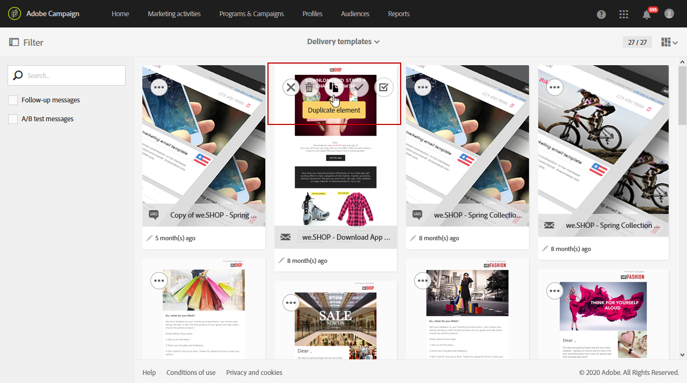

# Creating a new template{#creating-a-new-template}

Message templates can be managed by the functional administrator of the platform, under the **[!UICONTROL Resources > Templates]** menu. 기본 템플릿은 수정하거나 삭제할 수 없습니다. 새 템플릿을 만들려면 기존 템플릿을 복제해야 합니다.

1. 기존 템플릿을 선택합니다. **[!UICONTROL Delivery template]**&#x200B;이 예에서는 A를 선택했습니다.

   

1. Hover over it with the mouse, then select the **[!UICONTROL Duplicate element]** option.

   

1. Configure any settings you want, just like you would do when [creating a new marketing activity](../../start/using/marketing-activities.md#creating-a-marketing-activity) from scratch.

   

그러면 마케팅 활동을 만드는 동안 마법사의 첫 화면에서 표준 사용자가 만든 템플릿을 선택할 수 있습니다.

**관련 항목:**

* [브랜딩](../../administration/using/branding.md)
* [컨텐츠 디자인](../../designing/using/about-email-content-design.md)

