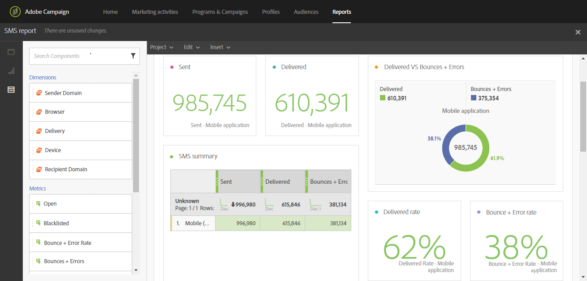

# 메시지 디자인 및 보내기

<table>
<tr>
    <td valign="top">
        
    </td>
    <td valign="top">
        
    </td>
    <td valign="top">
        
    </td>
    <td valign="top">
        
    </td>
    <td valign="top">
        
    </td>
</tr>
<tr>
<td>배달 디자인</td>
<td>배달 만들기</td>
<td>다이내믹한 전달 방식 개인화</td>
<td>배달 추적 및 모니터링</td>
<td>설정 보고서</td>
</tr>
</table>

## 배달 디자인

Lorem ipsum dolor sit amet, consectetur adipiscing elit. &#39;전생의 사피엔플라케라스 모리시&#39; 정수 Luctus blandit 합자입니다. Nulla quis vehicea augue, lacinia risus. Nunc phaertra fringilla enim eu suscipit. Mauris consectetur maximus euismod. Cras et vehicela nulla. Aenean tellus quam, tristique quis risus consectetur, pulvinar elementum dui.

**자세한 내용**

* xxxx
* xxxx

## 배달 만들기

Lorem ipsum dolor sit amet, consectetur adipiscing elit. &#39;전생의 사피엔플라케라스 모리시&#39; 정수 Luctus blandit 합자입니다. Nulla quis vehicea augue, lacinia risus. Nunc phaertra fringilla enim eu suscipit. Mauris consectetur maximus euismod. Cras et vehicela nulla. Aenean tellus quam, tristique quis risus consectetur, pulvinar elementum dui.

**자세한 내용**

* xxxx
* xxxx

## 다이내믹한 전달 방식 개인화

프로필, 선호도 및 활동에 따라 개인화된 컨텐츠와 헤더를 사용하여 고객의 관심을 유도하고 응답률을 향상시킬 수 있습니다. 모든 클라이언트 정보는 Adobe Campaign에 중앙에서 관리되므로 다양한 채널을 통해 수정된 컨텐츠가 포함된 메시지를 제공할 수 있습니다.

개인화된 메시지는 관련 컨텐츠를 전송하고 개인화된 경험을 제공하며 공개 및 전환율을 높이는 데 중요합니다. Adobe Campaign이 전달하는 크로스채널 메시지는 다양한 방식으로 개인화할 수 있습니다. 이러한 방법을 프로필에 따라 기준과 결합할 수 있습니다. 다음을 수행할 수 있습니다.

* 메시지에 [동적 개인화 필드](../../designing/using/personalization.md#inserting-a-personalization-field) 삽입
* Insert [predefined personalization blocks](../../designing/using/personalization.md#adding-a-content-block)
* [이메일 또는 SMS의 발신자를](../../designing/using/subject-line.md) 개인화합니다.
* [이메일 제목](../../designing/using/subject-line.md) 맞춤화 또는 [예측 제목 라인](../../designing/using/subject-line.md#subject-line) 기능을 사용하여 이메일 최적화
* 이메일 [또는 랜딩 페이지](../../designing/using/personalization.md#defining-dynamic-content-in-an-email) [에서 조건부 컨텐츠 만들기](../../channels/using/designing-a-landing-page.md#defining-dynamic-content-in-a-landing-page)
* SMS [메시지](../../channels/using/defining-dynamic-text.md) 또는 푸시 알림에 동적 텍스트 삽입

**자세한 내용**

* 완벽한 [샘플을 통해 이메일 개인화 발견](../../designing/using/personalization.md#example-email-personalization)
* [URL 개인화](../../designing/using/personalization.md#personalizing-urls)
* [이미지의 개인화 설정](../../designing/using/personalization.md#personalizing-an-image-source)

## 배달 추적 및 모니터링

기본적으로 제공되는 강력한 보고 템플릿 외에도, Adobe Campaign을 사용하면 배달, 캠페인, 사용자 또는 세그먼트 수준에서 사용자 지정 보고서를 만들 수 있습니다. 프로파일 데이터를 점진적으로 개선하여 메시지를 추적하고 고객의 행동을 파악할 수 있습니다. 보고 및 분석 툴을 사용하면 각각의 새로운 캠페인을 활용할 수 있고 마케팅 활동을 효과적으로 타겟팅할 수 있으며 마케팅 효과 및 ROI를 최적화할 수 있습니다.

그래픽 인터페이스를 통해 주요 지표 및 전달 통계에 빠르고 손쉽게 액세스할 수 있습니다.

캠페인 보고 사용자 인터페이스는 동적 보고서를 쉽게 만듭니다. 드래그 앤 드롭 변수를 사용하여 보고서를 사용자 정의하고 캠페인의 성공을 분석할 수 있습니다. 쿼리 및 계산의 복잡성에 따라 데이터를 목록 보기로 집계하거나 마케팅 분석 보고서를 쉽게 생성할 수 있는 형식으로 액세스할 수 있습니다.

Adobe Campaign을 사용하면 각 전달을 개별적으로 모니터링하고 추적할 수 있습니다. 메시지 대시보드에는 후속 프로세스, 규칙 및 가능한 오류 및 경고를 식별하는 전용 로그가 표시됩니다.

**자세한 내용**

* [보고서 액세스](../../reporting/using/about-dynamic-reports.md)
* [게재 모니터링](../../sending/using/monitoring-a-delivery.md)
* [메시지 추적](../../sending/using/tracking-messages.md)

## 설정 보고서

Lorem ipsum dolor sit amet, consectetur adipiscing elit. &#39;전생의 사피엔플라케라스 모리시&#39; 정수 Luctus blandit 합자입니다. Nulla quis vehicea augue, lacinia risus. Nunc phaertra fringilla enim eu suscipit. Mauris consectetur maximus euismod. Cras et vehicela nulla. Aenean tellus quam, tristique quis risus consectetur, pulvinar elementum dui.

**자세한 내용**

* xxxx
* xxxx
