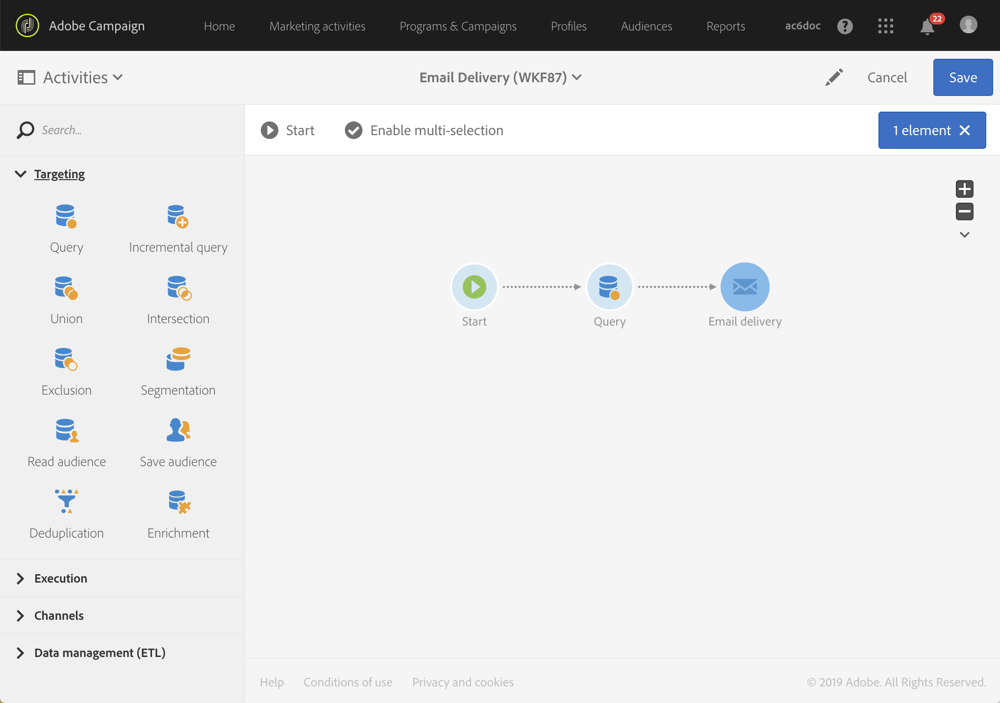
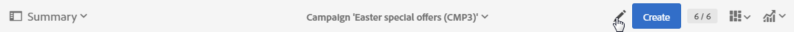

# 인터페이스 설명{#interface-description}

Adobe Campaign을 사용하면 다양한 메뉴와 화면을 통해 캠페인을 관리할 수 있습니다.

모든 Adobe Campaign 화면은 다음 요소로 구성됩니다.

* 탐색용 상단 표시줄
* 특정 기능 및 구성에 액세스할 수 있는 고급 메뉴
* 특정 요소를 작업할 수 있는 중앙 영역
* 컨텍스트에 따라 표시된 요소 내에서 필터링하거나 검색할 수 있는 측면 패널.

## 홈페이지 {#home-page}

홈페이지는 주요 Adobe Campaign 기능에 빠르게 액세스할 수 있는 카드 세트로 구성되어 있습니다. Campaign 홈페이지에서 볼 수 있는 기능 목록은 사용자 권한 및 조직에 대해 구성된 옵션에 따라 다릅니다.

* **[!UICONTROL Create an email]** 카드를 통해 이메일 생성 도우미로 이동할 수 있습니다. 이 도우미에서 이메일 유형을 선택하고, 메시지 수신자를 선택하고, 콘텐츠를 정의할 수 있습니다. [이메일 만들기](../../channels/using/creating-an-email.md) 섹션을 참조하십시오.
* **[!UICONTROL Create an SMS]** 카드를 통해 SMS 생성 도우미로 이동할 수 있습니다. 이 도우미에서 SMS 유형을 선택하고, 메시지 수신자를 선택하고, 콘텐츠를 정의할 수 있습니다. [SMS 만들기](../../channels/using/creating-an-sms-message.md) 섹션을 참조하십시오.
* **[!UICONTROL Create a Direct mail]** 카드를 통해 다이렉트 메일 생성 도우미로 이동할 수 있습니다. [다이렉트 메일 만들기](../../channels/using/creating-the-direct-mail.md) 섹션을 참조하십시오.
* **[!UICONTROL Create a push notification]** 카드를 통해 알림 생성 도우미로 이동할 수 있습니다. 이 도우미에서 푸시 알림 유형을 선택하고, 메시지 수신자를 선택하고, 콘텐츠를 정의할 수 있습니다. [푸시 알림 만들기](../../channels/using/preparing-and-sending-a-push-notification.md) 섹션을 참조하십시오.
* **[!UICONTROL Create an InApp message]** 카드를 통해 인앱 생성 도우미로 이동할 수 있습니다. 이 도우미에서 생성할 인앱 메시지 유형을 선택하고, 해당 속성, 대상자 및 콘텐츠를 정의할 수 있습니다. [인앱 메시지 만들기](../../channels/using/about-in-app-messaging.md) 섹션을 참조하십시오.
* **[!UICONTROL Marketing activities]** 카드를 통해 모든 활동, 프로그램 및 캠페인, 특히 이메일, SMS, 워크플로우 및 랜딩 페이지의 전체 목록으로 이동할 수 있습니다. 여기에서 이름, 날짜, 상태 또는 활동 유형별로 검색하여 요소를 필터링할 수 있습니다. 자세한 내용은 [마케팅 활동 목록](../../start/using/marketing-activities.md#about-marketing-activities) 섹션을 참조하십시오.
* **[!UICONTROL Programs & campaigns]** 카드를 통해 캠페인을 만들고 관리할 수 있는 프로그램 목록으로 이동할 수 있습니다. [프로그램 목록](../../start/using/programs-and-campaigns.md#about-plans--programs-and-campaigns)을 참조하십시오.
* **[!UICONTROL Timeline]** 카드를 통해 마케팅 활동의 대화형 타임라인으로 바로 이동하여 진행 중인 프로그램 및 해당 콘텐츠를 참조할 수 있습니다. [타임라인](../../start/using/timeline.md)을 참조하십시오.
* **[!UICONTROL Customer profiles]** 카드를 통해 프로필 목록으로 바로 이동할 수 있습니다. 여기에서 목록의 각 프로필에 대한 이벤트를 참조할 수 있습니다. [프로필 관리](../../audiences/using/about-profiles.md)를 참조하십시오.
* **[!UICONTROL Audiences]** 카드를 통해 대상자 목록으로 바로 이동할 수 있습니다. 여기에서 기존 대상자에 액세스하고 새 대상자를 만들 수 있습니다. [대상자 관리](../../audiences/using/about-audiences.md)를 참조하십시오.

## 상단 표시줄 {#top-bar}

상단 표시줄은 모든 화면에 표시되며 Adobe Campaign 기능을 탐색할 수 있을 뿐만 아니라 연결된 Adobe 프로필, 알림, 기타 Adobe Experience Cloud 서비스 및 솔루션, 설명서에 액세스할 수 있습니다.

탐색 원칙은 다음과 같습니다.

* 페이지 왼쪽 상단 모서리에 있는 **[!UICONTROL Adobe Campaign]** 로고는 고급 기능 및 구성에 대한 액세스를 제공합니다. 메뉴는 프로필 및 권한에 따라 다릅니다.

   고급 메뉴는 [고급 메뉴](#advanced-menu) 섹션에 표시됩니다.

* **[!UICONTROL Home]** 링크를 통해 Adobe Campaign 홈페이지를 표시할 수 있습니다.
*  **[!UICONTROL Marketing activities]**, **[!UICONTROL Programs & Campaigns]**, **[!UICONTROL Profiles]**, **[!UICONTROL Audiences]** 및 **[!UICONTROL Reports]** 링크를 통해 이러한 기능에 연결된 보기에 액세스할 수 있습니다.
* **[!UICONTROL Help]** 버튼은 제품 설명서 및 상황별 도움말, 릴리스 정보, 버전 번호, 법적 고지 사항에 대한 액세스 뿐만 아니라 Adobe Experience Cloud 커뮤니티 및 고객 지원 센터에 대한 링크도 제공합니다.

   

* **솔루션 선택** 아이콘을 사용하면 다른 Adobe Experience Cloud 솔루션 및 프로필 설정으로 전환할 수 있습니다.
* **알림** 아이콘에 최신 알림 또는 정보가 표시됩니다.
* **사용자** 아이콘을 사용하면 프로필에 연결된 정보를 표시할 수 있습니다. **[!UICONTROL Sign out]** 버튼에 대한 액세스를 제공합니다.

## 고급 메뉴 {#advanced-menu}

각 화면의 왼쪽 상단 모서리에 있는 **Adobe Campaign** 아이콘을 클릭하면 고급 메뉴가 표시됩니다. 고급 메뉴는 계약 및 사용자 권한에 따라 다를 수 있습니다.

이 메뉴를 사용하면 특정 기능 및 설정을 탐색할 수 있습니다.

### 마케팅 계획 {#marketing-plans}

**[!UICONTROL Marketing plans]** 아이콘을 사용하면 다음 기능에 액세스할 수 있습니다.

* **[!UICONTROL Marketing activities]** - 자세한 내용은 [마케팅 활동 목록](../../start/using/marketing-activities.md#about-marketing-activities) 섹션을 참조하십시오.
* **[!UICONTROL Programs & Campaigns]** - 자세한 내용은 [프로그램 목록](../../start/using/programs-and-campaigns.md#about-plans--programs-and-campaigns) 섹션을 참조하십시오.
* **[!UICONTROL Timeline]** - 자세한 내용은 [타임라인](../../start/using/timeline.md) 섹션을 참조하십시오.
* **[!UICONTROL Deliveries]** 및 **[!UICONTROL Event configuration]** 하위 메뉴를 포함하는 **[!UICONTROL Transactional messages]** - 자세한 내용은 [트랜잭션 메시지](../../channels/using/about-transactional-messaging.md) 섹션을 참조하십시오.

### 프로필 및 대상자 {#profiles-e-audiences}

**[!UICONTROL Profiles & audiences]** 아이콘을 사용하면 다음 기능에 액세스할 수 있습니다.

* **[!UICONTROL Profiles]** - 자세한 내용은 [프로필 관리](../../audiences/using/about-profiles.md) 섹션을 참조하십시오.
* **[!UICONTROL Test profiles]** - 자세한 내용은 [테스트 프로필 관리](../../audiences/using/managing-test-profiles.md) 섹션을 참조하십시오 .
* **[!UICONTROL Audiences]** - 자세한 내용은 [대상자 관리](../../audiences/using/about-audiences.md) 섹션을 참조하십시오 .
* **[!UICONTROL Services]** - 자세한 내용은 [서비스 만들기](../../audiences/using/creating-a-service.md) 섹션을 참조하십시오.

### 리소스 {#resources}

**[!UICONTROL Resources]** 아이콘을 사용하면 다음 기능에 액세스할 수 있습니다.

* 각 템플릿 유형에 대한 하위 메뉴를 포함하는 **[!UICONTROL Templates]** - 자세한 내용은 [템플릿 관리](../../start/using/marketing-activity-templates.md) 섹션을 참조하십시오.
* **[!UICONTROL Content blocks]** - 자세한 내용은 [콘텐츠 블록 추가](../../designing/using/personalization.md#adding-a-content-block) 섹션을 참조하십시오.
* **[!UICONTROL Content templates & fragments]** - 자세한 내용은 [콘텐츠 템플릿](../../designing/using/using-reusable-content.md#content-templates) 섹션을 참조하십시오.

### 관리 {#administration}

**[!UICONTROL Administration]** 아이콘을 사용하면 기능 관리자만 실행할 수 있는 고급 기능에 액세스할 수 있습니다. 자세한 내용은 [관리](../../administration/using/get-started-campaign-administration.md) 섹션을 참조하십시오.

## 중앙 영역 {#central-zone}

사용자 인터페이스의 중앙 영역은 요소 목록이나 카드 세트 등이 포함된 동적 영역입니다. 기존 요소를 편집하고 리소스를 만들 수 있습니다.

중앙 영역의 콘텐츠 및 표시 포맷은 다를 수 있습니다.

* 프로그램, 캠페인, 프로필 등과 같은 다양한 요소를 보여주는 **목록** . 이러한 요소는 **[!UICONTROL Card]** 또는 **[!UICONTROL List]** 모드에서 볼 수 있습니다. 모드 변경 버튼을 사용하여 모드 간 전환합니다. 각 요소는 표시기를 표시합니다.

   

   카운터에서 요소의 수를 알 수 있습니다. 이 숫자가 30을 초과하는 경우 총 개수를 얻으려면 이 카운터를 클릭해야 합니다. 

* 활동에 연결된 모든 매개 변수의 개요를 보여주는 **대시보드**. 이 화면에는 서로 다른 개념을 별도로 구분하고 구성할 수 있는 대화형 영역이 포함되어 있습니다.

   

* 요소를 만들 때 여러 오퍼가 가능한 경우 **선택 화면**&#x200B;을 사용하면 추가할 요소 유형(캠페인, 게재)을 선택할 수 있습니다. 이 선택 화면은 보고서에 액세스하기 위해 제공됩니다.

   

* 워크플로우 및 쿼리 편집기의 경우 팔레트가 있는 **작업 영역**&#x200B;을 사용하여 개체를 디자인할 수 있습니다.

   팔레트에서 요소를 작업 영역으로 끌어다 놓아 해당 요소를 구성할 수 있습니다.

   

## 작업 표시줄 {#action-bar}

표시되는 화면 유형에 따라 화면에 연결된 작업이 포함된 표시줄이 맨 위에 나타납니다.

이 표시줄에는 검색 및 필터링과 같은 일반적인 작업 뿐만 아니라 표시되는 화면과 관련된 작업도 포함됩니다.

* **작업 영역** 유형 화면과 관련된 작업은 워크플로우의 [작업 표시줄](../../automating/using/workflow-interface.md#action-bar) 섹션을 참조하십시오.
* **대시보드** 화면과 관련된 작업의 자세한 정보는 [메시지 대시보드](../../channels/using/message-dashboard.md) 섹션을 참조하십시오.
* **목록** 유형 화면과 관련된 작업은 아래의 [목록 사용자 지정](../../start/using/customizing-lists.md) 섹션을 참조하십시오.
