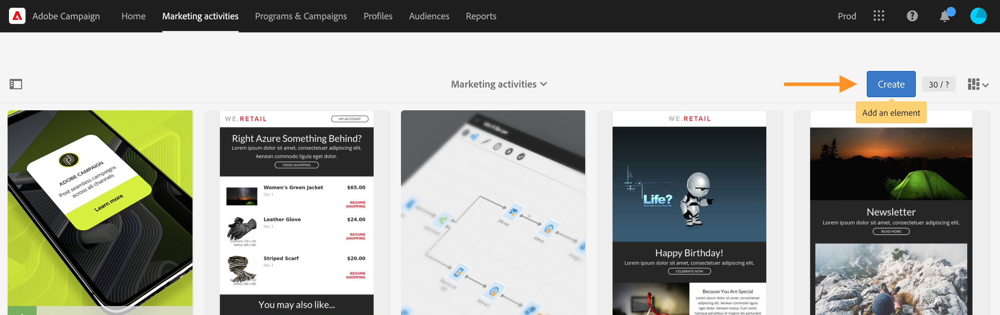

# 마케팅 활동{#marketing-activities}

## 마케팅 활동 정보 {#about-marketing-activities}

마케팅 활동이 속한 프로그램 및 캠페인이나 마케팅 활동 목록을 통해 마케팅 활동을 만들고 관리할 수 있습니다.

마케팅 활동 목록은 프로그램 또는 캠페인이 만들어진 모든 활동을 중앙 집중화합니다. 프로그램, 캠페인, 게재(전자 메일, SMS 메시지 및 푸시 알림), 랜딩 페이지 및 워크플로우는 특정 계층적이지 않은 순서로 항목별로 분류됩니다.

마케팅 활동 목록에 액세스하려면 상단 막대에서 **[!UICONTROL Marketing activities]** 링크를 선택합니다.

>[!NOTE]
>
>홈페이지에서 **[!UICONTROL Marketing activities]** 카드를 선택하여 마케팅 활동에 액세스할 수도 있습니다.

**[!UICONTROL Search]** 창에서는 이름(레이블 및 ID), 날짜, 상태 또는 활동 유형과 같은 다양한 기준에 따라 요소를 필터링할 수 있습니다. 기본적으로 프로그램을 제외한 모든 활동 유형이 선택됩니다.

각 활동의 콘텐츠에 직접 액세스하려면 목록에서 요소 중 하나를 선택합니다.

**[!UICONTROL Create]** 버튼은 새 활동을 만드는 데 사용할 수 있습니다. 자세한 내용은 [마케팅 활동 만들기](#creating-a-marketing-activity) 섹션을 참조하십시오 .

## 마케팅 활동 아이콘 및 상태 {#marketing-activity-icons-and-statuses}

주 영역에서 목록의 각 활동 유형에는 다음 아이콘이 있습니다.

*  : 프로그램
*  : 캠페인
*  : 전자 메일
*  : SMS
*  : 푸시 알림
*  : 인앱 메시지
*  : 랜딩 페이지
*  : 워크플로우

유효 기간 및 상태에 따라 이 아이콘과 연관된 색상은 해당 활동의 실행 상태를 나타냅니다.

* 회색: 활동이 아직 시작되지 않았음 - **[!UICONTROL Editing]** 상태.
* 파란색: 활동이 진행 중 - **[!UICONTROL In progress]** 상태.
* 녹색: 활동이 완료 됨 - **[!UICONTROL Finished]** 상태.
* 노란색: 활동이 경고를 받음 - **[!UICONTROL Warning]** 상태.
* 빨간색: 오류가 발생 함 - **[!UICONTROL Erroneous]** 상태.

## 마케팅 활동 만들기 {#creating-a-marketing-activity}

기존 캠페인에서 다른 유형의 메시지(**전자 메일**, **SMS**, **푸시 알림**&#x200B;등), 워크플로우 및 랜딩 페이지를 만들 수 있습니다.

기존 프로그램에서 다른 프로그램, 캠페인, 워크플로우 및 랜딩 페이지를 만들 수 있습니다.

>[!NOTE]
>
>캠페인 내에서 바로 워크플로우를 만드는 것이 좋습니다. 프로그램 내에서 워크플로우를 만들면 나중에 해당 워크플로우를 캠페인으로 이동할 수 없습니다.

프로그램 및 캠페인은 [프로그램 및 캠페인](../../start/using/programs-and-campaigns.md) 섹션에 제공됩니다.

1. 프로그램 또는 캠페인의 대시보드에서 **[!UICONTROL Create]** 버튼을 사용하여 새 마케팅 활동을 만듭니다.

   

1. 만들려고 하는 활동 유형을 선택합니다.

   

컨텍스트에 따라 다음을 수행할 수 있습니다.

* [전자 메일 만들기](../../channels/using/creating-an-email.md)
* [SMS 만들기](../../channels/using/creating-an-sms-message.md)
* [푸시 알림 만들기](../../channels/using/preparing-and-sending-a-push-notification.md)
* [인앱 메시지 만들기](../../channels/using/about-in-app-messaging.md)
* [워크플로우 만들기](../../automating/using/building-a-workflow.md#creating-a-workflow)
* [랜딩 페이지 만들기](../../channels/using/getting-started-with-landing-pages.md)
* [캠페인 만들기](../../start/using/programs-and-campaigns.md#creating-a-campaign)
* [프로그램 만들기](../../start/using/programs-and-campaigns.md#creating-a-program)

>[!NOTE]
>
>마케팅 활동 목록에서 마케팅 활동을 만들 수도 있습니다. 이 경우 모든 유형의 활동을 만들 수 있습니다. 활동의 속성을 통해 마케팅 활동을 부모 캠페인(또는 프로그램을 만드는 경우 부모 프로그램)에 연결하도록 선택할 수 있습니다.

