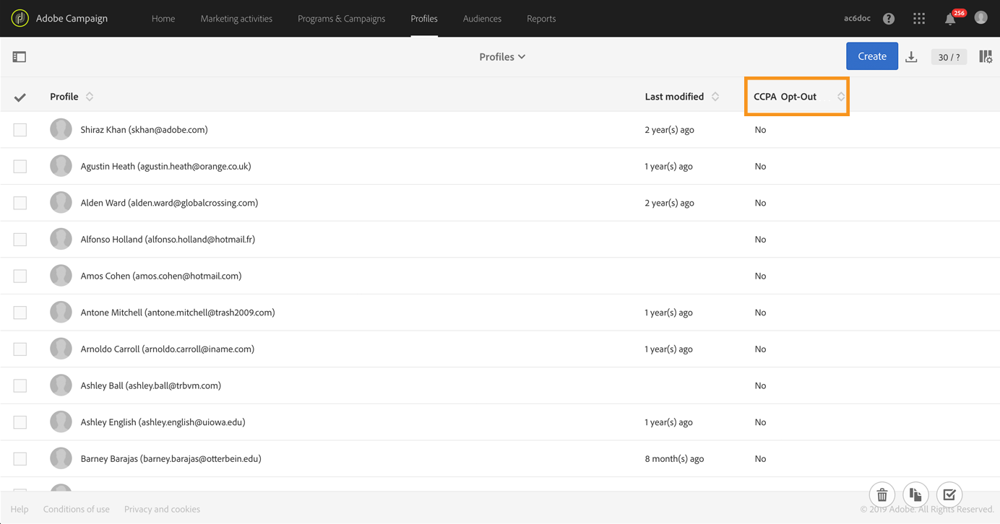

# 개인 정보 요청 관리 {#privacy-requests}

개인 정보 관리에 대한 일반 프레젠테이션은 [이 섹션을 참조하십시오](../../start/using/privacy-management.md).

이 정보는 GDPR, CPA, PDPA 및 LGPD에 적용됩니다. For more on these regulations, see [this section](../../start/using/privacy-management.md#privacy-management-regulations).

CPA에만 해당되는 개인 정보 판매 옵트아웃은 [이 섹션에 설명되어 있습니다](#sale-of-personal-information-ccpa).

>[!IMPORTANT]
>
>19.4부터 액세스 및 삭제 요청에 대한 캠페인 API 및 인터페이스 사용은 더 이상 사용되지 않습니다. GDPR, CPA, PDPA 또는 LGPD 액세스 및 삭제 요청의 경우 [개인정보 보호 핵심 서비스](#create-privacy-request) 통합 방법을 사용해야 합니다.

## 개인 정보 요청 정보 {#about-privacy-requests}

Adobe Campaign을 사용하면 개인정보 보호 준비를 용이하게 하기 위해 액세스 및 삭제 요청을 처리할 수 있습니다. 액세스 **권한** 및 **잊혀질** 권리(요청 삭제)는 [이 섹션에 설명되어 있습니다](../../start/using/privacy-management.md#right-access-forgotten).

이러한 요청을 수행하려면 **개인정보 보호 핵심 서비스** 통합을 사용해야 합니다. 개인 정보 핵심 서비스에서 모든 Experience Cloud 솔루션으로 푸시된 개인 정보 요청은 전용 워크플로우를 통해 Campaign에서 자동으로 처리됩니다.

### 사전 요구 사항 {#prerequesites}

Adobe Campaign은 Adobe Campaign에 저장된 데이터에 대한 개인 정보 요청을 작성하고 처리할 수 있는 데이터 관리자 도구를 제공합니다. 그러나 데이터 주체(이메일, 고객 지원 센터 또는 웹 포털)와의 관계를 처리하는 것은 데이터 관리자의 책임입니다.

따라서 요청을 하는 데이터 주체의 ID를 확인하고 요청자에게 반환되는 데이터가 데이터 주체의 정보임을 확인하는 것은 데이터 관리자로서 귀하의 책임입니다.

>[!NOTE]
>
>개인 데이터 및 데이터를 관리하는 다른 개체(데이터 컨트롤러, 데이터 프로세서 및 데이터 주체)에 대한 자세한 내용은 [개인 데이터 및 개인 정보를 참조하십시오](../../start/using/privacy.md#personal-data).

### 네임스페이스 {#namesspaces}

개인 정보 요청을 만들기 전에 사용할 네임스페이스를 정의해야 합니다. 네임스페이스는 Adobe Campaign 데이터베이스에서 데이터 제목을 식별하는 데 사용되는 키입니다. 바로 사용 가능한 네임스페이스는 다음과 같습니다.이메일 및 모바일 폰에 액세스할 수 있습니다. 다른 네임스페이스(예: 프로필 사용자 정의 필드)가 필요한 경우 다음 단계를 따르십시오.

네임스페이스를 만드는 방법에 대한 이 [자습서를](https://experienceleague.adobe.com/docs/campaign-standard-learn/tutorials/privacy/namespaces-for-privacy-requests.html?lang=en#privacy) 참조하십시오.

>[!NOTE]
>
>여러 네임스페이스를 사용하는 경우 네임스페이스당 하나의 개인 정보 요청을 만들어야 합니다.

1. Click the Adobe Campaign logo in the top left corner, then select **[!UICONTROL Administration]** > **[!UICONTROL Namespaces]**.

   

1. 네임스페이스 목록에서 을 클릭합니다 **[!UICONTROL Create]**.

   

1. a를 **[!UICONTROL Label]**&#x200B;입력합니다.

   

1. 기존 ID 서비스 네임스페이스를 사용하려면 목록에서 네임스페이스 **[!UICONTROL Map from Identity Namespace Service]** 를 선택하고 **[!UICONTROL Identity Service Namespaces]** 선택합니다.

   

   새 네임스페이스를 만들어 Campaign **[!UICONTROL Identity Service]** 에 매핑하려면 필드 **[!UICONTROL Create new]** 에 이름을 선택하고 **[!UICONTROL Identity namespace name]** 입력합니다.

   

   ID 네임스페이스에 대한 자세한 내용은 [Experience Platform](https://experienceleague.adobe.com/docs/experience-platform/identity/namespaces.html?lang=en) 설명서를 참조하십시오.

1. 하나의 ID 서비스 네임스페이스가 Campaign의 한 네임스페이스에 매핑됩니다. Campaign에서 네임스페이스가 조정되는 방법을 지정해야 합니다.

   대상 매핑(**[!UICONTROL Recipients]**&#x200B;또는 **[!UICONTROL Real-time event]****[!UICONTROL Subscriptions to an application]**)을 선택합니다. 여러 대상 매핑을 사용하려면 대상 매핑당 하나의 네임스페이스를 만들어야 합니다.

   

1. 원하는 **[!UICONTROL Reconciliation key]**&#x200B;항목을 선택합니다. 이 필드는 Adobe Campaign 데이터베이스의 데이터 제목을 식별하는 데 사용됩니다.

   

1. **[!UICONTROL Create]**&#x200B;을(를) 클릭합니다. 이제 새 네임스페이스에 따라 개인 정보 요청을 만들 수 있습니다. 여러 네임스페이스를 사용하는 경우 네임스페이스당 하나의 개인 정보 요청을 만들어야 합니다.

### Creating a Privacy request {#create-privacy-request}

>[!IMPORTANT]
>
>개인정보 **보호 핵심 서비스** 통합은 모든 액세스 및 삭제 요청에 사용해야 하는 방법입니다.
>
>19.4부터 액세스 및 삭제 요청에 대한 캠페인 API 및 인터페이스 사용은 더 이상 사용되지 않습니다. GDPR, CPA, PDPA 또는 LGPD 액세스 및 삭제 요청에 대해 코어 Privacy Service을 사용하십시오.

개인정보 보호 코어 서비스 통합을 통해 단일 JSON API 호출을 통해 다중 솔루션 컨텍스트에서 개인정보 보호 요청을 자동화할 수 있습니다. 개인 정보 핵심 서비스에서 모든 Experience Cloud 솔루션으로 푸시된 개인 정보 요청은 전용 워크플로우를 통해 Campaign에서 자동으로 처리됩니다.

개인정보 보호 코어 서비스에서 개인정보 보호 요청을 만드는 방법에 대해 알아보려면 [Experience Platform Privacy Service](https://experienceleague.adobe.com/docs/experience-platform/privacy/home.html?lang=en) 설명서를 참조하십시오.

각 개인 정보 핵심 서비스 작업은 사용 중인 네임스페이스의 수를 기준으로 Campaign에서 여러 개인 정보 요청으로 분할되며, 하나의 요청은 하나의 네임스페이스에 해당합니다. 또한 하나의 작업은 여러 인스턴스에 대해 실행할 수 있습니다. 따라서 하나의 작업에 대해 여러 파일이 만들어집니다. 예를 들어, 요청에 두 개의 네임스페이스가 있고 세 개의 인스턴스에서 실행 중인 경우 총 6개의 파일이 전송됩니다. 네임스페이스 및 인스턴스당 하나의 파일

파일 이름의 패턴: `<InstanceName>-<NamespaceId>-<ReconciliationKey>.xml`

* **InstanceName**:캠페인 인스턴스 이름
* **NamespaceId**:사용된 네임스페이스의 ID 서비스 네임스페이스 ID
* **조정 키**:인코딩 조정 키

### 리소스 목록 {#list-of-resources}

Adobe Campaign은 삭제 또는 액세스 개인 정보 요청을 수행할 때 프로필 리소스(고유 유형)에 대한 링크가 있는 모든 리소스의 **조정** 값을 기준으로 모든 데이터 주체의 데이터를 검색합니다.

다음은 개인 정보 요청을 수행할 때 고려할 수 있는 기본 리소스 목록입니다.

* 프로필(수신자)
* 프로필 배달 로그(broadLogRcp)
* 프로필 추적 로그(trackingLogRcp)
* 배달 로그(응용 프로그램에 대한 구독)(broadLogAppSubRcp)
* 추적 로그(응용 프로그램에 대한 구독)(trackingLogAppSubRcp)
* 응용 프로그램 구독(appSubscriptionRcp)
* 프로필 구독 내역(subHistoRcp)
* 프로필 구독(subscriptionRcp)
* 방문자(방문자)

프로필 리소스(고유 유형)에 대한 링크가 있는 사용자 지정 리소스를 만든 경우 이러한 리소스도 고려됩니다. 예를 들어 프로필 리소스와 트랜잭션 세부 정보 리소스가 트랜잭션 리소스에 연결된 트랜잭션 리소스가 있는 경우 이 두 자원 모두 고려됩니다.

사용자 지정 리소스를 수정하는 방법에 대한 [이 자습서를](https://experienceleague.adobe.com/docs/campaign-standard-learn/tutorials/privacy/custom-resources-for-privacy-requests.html?lang=en#privacy) 참조하십시오.

이를 수행하려면 사용자 지정 리소스에서 옵션을 선택해야 **[!UICONTROL Deleting the target record implies deleting records referenced by the link]** 합니다.

1. Click the Adobe Campaign logo in the top left corner, then select **[!UICONTROL Administration]** > **[!UICONTROL Development]** > **[!UICONTROL Custom resources]**.

1. 프로필 리소스(자체 유형)에 대한 링크가 있는 사용자 지정 리소스를 선택합니다.

1. 섹션을 **[!UICONTROL Links]** 클릭합니다.

1. 각 링크에 대해 연필 아이콘(**[!UICONTROL Edit properties]**)을 클릭합니다.

1. In the **[!UICONTROL Behavior if deleted/duplicated]** section, select the **[!UICONTROL Deleting the target record implies deleting records referenced by the link]** option.

   

### 개인 정보 요청 상태 {#privacy-request-statuses}

개인정보 보호 요청에 대한 다른 상태는 다음과 같습니다.

* **[!UICONTROL New]** / **[!UICONTROL Retry pending]**:진행 중인 워크플로우는 아직 요청을 처리하지 않았습니다.
* **[!UICONTROL Processing]** / **[!UICONTROL Retry in progress]**:워크플로가 요청을 처리하고 있습니다.
* **[!UICONTROL Delete pending]**:워크플로우는 삭제할 모든 수신자 데이터를 식별했습니다.
* **[!UICONTROL Delete in progress]**:워크플로우가 삭제를 처리하고 있습니다.
   <!--**[!UICONTROL Delete Confirmation Pending]** (Delete request in 2-steps process mode): the workflow has processed the Access request. Manual confirmation is requested to perform the deletion. The button is available for 15 days.-->
* **[!UICONTROL Complete]**:요청 처리가 오류 없이 끝났습니다.
* **[!UICONTROL Error]**:워크플로우에서 오류가 발생했습니다. 이유는 열의 개인 정보 요청 목록에 **[!UICONTROL Request status]** 표시됩니다. 예를 들어 데이터 주체의 데이터와 일치하는 수신자 데이터가 데이터베이스에 **[!UICONTROL Error data not found]** **[!UICONTROL Reconciliation value]** 없음을 의미합니다.

### 2단계 프로세스 비활성화 {#disabling-two-step-process}

코어 Privacy Service은 2단계 프로세스를 지원하지 않습니다.

>[!IMPORTANT]
>
>핵심 Privacy Service 통합을 사용하여 개인 정보 요청을 관리하려면 먼저 Campaign Standard 인터페이스에서 요청 삭제 프로세스를 비활성화해야 합니다.

이 옵션이 비활성화되지 않으면 Privacy Core Service로 관리되는 모든 삭제 요청은 보류 중인 상태로 유지되며 완료되지 않습니다.

기본적으로 2단계 프로세스가 활성화됩니다.

이 모드를 변경하려면 화면 **[!UICONTROL Edit properties]**&#x200B;의 오른쪽 상단 모서리에서 을(를) 클릭하고 **[!UICONTROL Privacy Requests]** 옵션을 선택 **[!UICONTROL Activate the 2-step process]** 취소합니다.

## 개인 정보 판매 옵트아웃 (CCPA) {#sale-of-personal-information-ccpa}

The **California Consumer Privacy Act** (CCPA) provides California residents new rights in regards to their personal information and imposes data protection responsibilities on certain entities whom conduct business in California.

액세스 및 삭제 요청의 구성 및 사용은 GDPR과 CPA에 공통입니다. 이 섹션에서는 CPA에만 해당되는 개인 데이터 판매에 대한 옵트아웃을 제공합니다.

Adobe Campaign이 제공하는 [동의 관리](../../start/using/privacy-management.md#consent-management) 도구 외에도, 귀하는 소비자가 개인 정보 판매를 수신 거부했는지 여부를 추적할 수 있습니다.

소비자는 귀하의 시스템을 통해 자신의 개인 정보가 제3자에게 판매되는 것을 허용하지 않기로 합니다. Adobe Campaign에서 이 정보를 저장하고 추적할 수 있습니다.

>[!NOTE]
>
>캠페인 인터페이스와 API를 통해 개인 정보 판매에 대한 옵트아웃을 활용할 수 있습니다. 개인정보 보호 코어 서비스를 통해 사용할 수 없습니다.

>[!IMPORTANT]
>
>데이터 주체의 요청을 받고 CPA에 대한 요청 날짜를 추적하는 것은 데이터 관리자로서 귀하의 책임입니다. 기술 제공업체에서는 수신 거부 방법만 제공합니다. 데이터 관리자로서 귀하의 역할에 대한 자세한 내용은 [개인 데이터 및 개인 정보를 참조하십시오](../../start/using/privacy.md#personal-data).

### 사용자 정의 테이블에 대한 사전 요구 사항 {#ccpa-prerequisite}

19.4부터, 이 **[!UICONTROL CCPA Opt-Out]** 필드는 캠페인 인터페이스 및 API에서 기본적으로 제공됩니다. 기본적으로 이 필드는 표준 **[!UICONTROL Profile]** 리소스에 대해 사용할 수 있습니다.

사용자 지정 프로필 리소스를 사용하는 경우 리소스를 확장하고 필드를 추가해야 합니다. 기본적으로 제공되는 필드가 아닌 다른 이름을 사용하는 것이 좋습니다. **[!UICONTROL Opt-Out for CCPA]** (optopcpa). 새 필드를 만들면 캠페인 API에서 자동으로 지원됩니다.

프로필 리소스 확장 방법에 대한 자세한 내용은 [이 섹션을 참조하십시오](../../developing/using/extending-the-profile-resource-with-a-new-field.md).

>[!NOTE]
>
>리소스 수정은 전문가 사용자만 수행해야 하는 중요한 작업입니다.

1. > **[!UICONTROL Administration]****[!UICONTROL Development]** > **[!UICONTROL Custom Resources]**&#x200B;으로 이동합니다. 사용자 지정 프로필 리소스를 클릭합니다. 리소스 확장에 대한 자세한 내용은 [이 섹션을 참조하십시오](../../developing/using/creating-or-extending-the-resource.md).

   

1. 를 **[!UICONTROL Add field]** 클릭하거나 **[!UICONTROL Create Element]**&#x200B;레이블, ID를 추가하고 유형을 **[!UICONTROL Boolean]** 선택합니다. 이름은 CPA용 **옵트아웃을 사용합니다**. ID의 경우 다음을 사용하십시오. **optOutCpa**.

   

1. 탭 **[!UICONTROL Screen definition]** 아래에서 **[!UICONTROL Detail screen configuration]**&#x200B;필드를 추가하고 선택합니다 **[!UICONTROL Input field]**. 그러면 프로필 목록 및 세부 정보에 있는 필드를 사용할 수 있습니다.  화면 정의 구성에 대한 자세한 내용은 [이 섹션을 참조하십시오](../../developing/using/configuring-the-screen-definition.md).

   

1. > **[!UICONTROL Administration]****[!UICONTROL Development]** > **[!UICONTROL Publishing]**&#x200B;로 이동하여 게시를 준비하고 수정 내용을 게시합니다. 리소스 게시에 대한 자세한 내용은 [이 섹션을 참조하십시오](../../developing/using/updating-the-database-structure.md).

   

1. 프로필 세부 정보에 필드를 사용할 수 있는지 확인합니다. 자세한 내용은 [이 섹션](#usage)을 참조하십시오.

### 사용 {#usage}

필드의 값을 채우고 데이터 판매에 관한 CPA 지침 및 규칙을 따르는 것은 데이터 관리자의 책임입니다.

값을 채우려면 몇 가지 방법을 사용할 수 있습니다.

* 수신자의 세부 사항을 편집하여 캠페인 인터페이스 사용(아래 참조)
* 캠페인 개인 정보 API 사용( [API 설명서 참조](../../api/using/managing-ccpa-opt-out.md))
* 데이터 가져오기 작업 과정을 통해

그런 다음 옵트아웃한 프로필의 개인 정보를 제3자에게 팔지 않도록 해야 합니다.

1. 캠페인 인터페이스에서 옵트아웃 상태를 변경하려면 프로필을 편집합니다.

   

1. 필드의 값이 이면 프로필 세부 사항 **[!UICONTROL True]**&#x200B;에 정보가 표시됩니다.

   

1. 프로필 목록이 아웃 열을 표시하도록 구성할 수 있습니다. 목록 구성 방법을 알려면 [이 섹션을 참조하십시오](../../start/using/customizing-lists.md).

   

1. 이 열을 클릭하여 옵트아웃 정보에 따라 수신자를 정렬할 수 있습니다.

   
