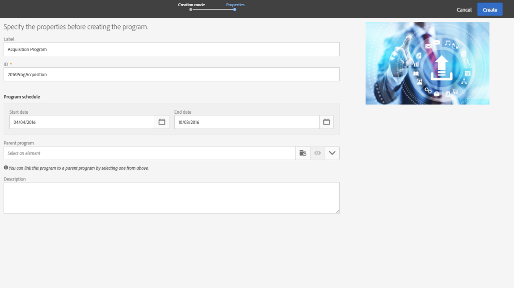

# 프로그램 및 캠페인{#programs-and-campaigns}

## 계획, 프로그램 및 캠페인 기본 정보 {#about-plans--programs-and-campaigns}

Adobe Campaign에서는 마케팅 캠페인을 계획하여 이메일, SMS 메시지, 푸시 알림, 워크플로우, 랜딩 페이지 등 다양한 유형의 활동을 만들고 관리할 수 있습니다. 캠페인 및 그 콘텐츠를 프로그램으로 모을 수 있습니다.

프로그램 및 캠페인에 연결된 다양한 마케팅 활동을 다시 그룹화하고 볼 수 있습니다.

* **프로그램**&#x200B;에는 캠페인, 워크플로우 및 랜딩 페이지뿐만 아니라 다른 프로그램도 넣을 수 있습니다. 이는 타임라인에 표시되며 마케팅 활동을 정리하는 데 도움이 됩니다. 국가, 브랜드, 단위 등을 기준으로 분류할 수 있습니다.
* **캠페인**&#x200B;을 사용하면 원하는 모든 마케팅 활동을 단일 엔터티 아래에 모을 수 있습니다. 캠페인에는 이메일, SMS, 푸시 알림, DM, 워크플로우 및 랜딩 페이지가 포함될 수 있습니다.

마케팅 계획을 보다 효율적으로 구성하려면 다음 계층을 사용하는 것을 추천합니다. 프로그램 > 하위 프로그램 > 캠페인 > 워크플로우 > 게재.

프로그램 및 캠페인에 대한 보고서를 통해 그 효과를 분석할 수 있습니다. 예를 들어 캠페인 수준에서 보고서를 작성하여 해당 캠페인에 포함된 모든 게재의 데이터에 대한 합계를 도출할 수 있습니다.

**관련 항목:**

* [타임라인](../../start/using/timeline.md)
* [동적 보고서 기본 정보](../../reporting/using/about-dynamic-reports.md)

## 프로그램 만들기 {#creating-a-program}

프로그램은 조직의 첫 번째 단계입니다. 프로그램에는 하위 프로그램, 캠페인, 워크플로우 또는 랜딩 페이지를 넣을 수 있습니다.

1. Adobe Campaign 홈페이지에서 **[!UICONTROL Programs & Campaigns]** 카드를 선택합니다.
1. **[!UICONTROL Create]** 버튼을 클릭합니다.
1. **[!UICONTROL Creation mode]** 화면에서 프로그램 유형을 선택합니다.

   

   사용 가능한 프로그램 유형은 **[!UICONTROL Resources]** > **[!UICONTROL Templates]** > **[!UICONTROL Program templates]** 섹션에 정의된 템플릿을 기준으로 합니다. 자세한 내용은 [템플릿 관리](../../start/using/marketing-activity-templates.md) 섹션을 참조하십시오.

1. **[!UICONTROL Properties]** 화면에서 프로그램의 이름과 ID를 입력합니다.

   

1. 프로그램의 시작 및 종료 날짜를 선택합니다. 이 날짜는 프로그램 자체에만 적용됩니다.

   상위 프로그램 내에 프로그램을 만들 수 있습니다. 이렇게 하려면 기존 프로그램에서 상위 프로그램을 선택합니다.

1. **[!UICONTROL Create]**&#x200B;을(를) 클릭하여 프로그램 만들기를 확인합니다.

프로그램이 만들어지고 표시됩니다. **[!UICONTROL Create]** 버튼을 사용하여 하위 프로그램, 캠페인, 워크플로우 또는 랜딩 페이지를 추가할 수 있습니다.

>[!NOTE]
>
>마케팅 활동 목록에서 프로그램을 만들 수도 있습니다.

## 캠페인 만들기 {#creating-a-campaign}

프로그램 및 하위 프로그램에서 캠페인을 추가할 수 있습니다. 캠페인에는 이메일, SMS, 푸시 알림, 워크플로우 및 랜딩 페이지 등 마케팅 활동을 넣을 수 있습니다.

1. Adobe Campaign 홈페이지에서 **[!UICONTROL Programs & Campaigns]** 카드를 선택하고 프로그램 또는 하위 프로그램에 액세스합니다.
1. **[!UICONTROL Create]** 버튼을 클릭하고 **[!UICONTROL Campaign]**&#x200B;을(를) 선택합니다.
1. **[!UICONTROL Creation mode]** 화면에서 캠페인 유형을 선택합니다.

   

   사용 가능한 캠페인 유형은 **[!UICONTROL Resources]** > **[!UICONTROL Templates]** > **[!UICONTROL Campaign templates]**&#x200B;에 정의된 템플릿을 기준으로 합니다. 자세한 내용은 [템플릿 관리](../../start/using/marketing-activity-templates.md) 섹션을 참조하십시오.

1. **[!UICONTROL Properties]** 화면에서 캠페인의 이름과 ID를 입력합니다.
1. 캠페인의 시작 및 종료 날짜를 선택합니다. 이 날짜는 캠페인 자체에만 적용됩니다.

   

1. **[!UICONTROL Create]**&#x200B;을(를) 클릭하여 캠페인 만들기 확인합니다.

캠페인이 만들어지고 표시됩니다. **[!UICONTROL Create]** 버튼을 사용하여 캠페인에 마케팅 활동을 추가할 수 있습니다.

>[!NOTE]
>
>라이선스 계약에 따라 이러한 활동 중 일부에 대해서만 액세스 권한이 주어질 수도 있습니다.

마케팅 활동 목록에서 캠페인을 만들 수도 있습니다. 캠페인의 속성 창을 통해 마케팅 활동을 상위 프로그램 또는 하위 프로그램에 연결할 수도 있습니다.

## 프로그램 및 캠페인의 아이콘 및 상태 {#programs-and-campaigns-icons-and-statuses}

목록에 있는 각 프로그램 및 캠페인에는 시각적 심벌과 아이콘이 있어 그 색상으로 실행 상태를 나타냅니다. 이 상태는 프로그램 또는 캠페인의 유효 기간에 따라 다릅니다.

* 회색: 프로그램/캠페인이 아직 시작되지 않음 - **[!UICONTROL Editing]** 상태
* 파란색: 프로그램/캠페인 진행 중 - **[!UICONTROL In progress]** 상태
* 녹색: 프로그램/캠페인 종료됨 - **[!UICONTROL Finished]** 상태 기본적으로 현재 날짜가 자동으로 유효성 시작 날짜로 표시되며, 종료 날짜는 시작 날짜에 따라 계산됩니다(**시작 186일 후**). 프로그램 또는 캠페인 속성에서 이 날짜를 변경할 수 있습니다.

